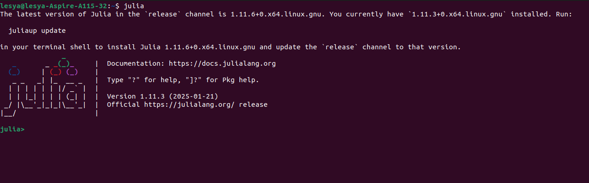
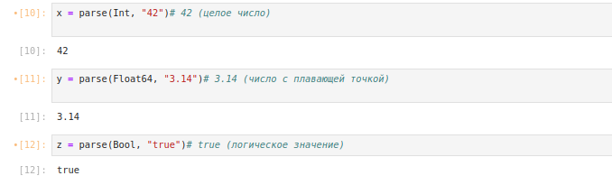

---
## Front matter
lang: ru-RU
title: Лабораторная работа № 1. Julia. Установка и настройка. Основные принципы.
author:
  - Абакумова О. М.
institute:
  - Российский университет дружбы народов, Москва, Россия

## i18n babel
babel-lang: russian
babel-otherlangs: english

## Formatting pdf
toc: false
toc-title: Содержание
slide_level: 2
aspectratio: 169
section-titles: true
theme: metropolis
header-includes:
 - \metroset{progressbar=frametitle,sectionpage=progressbar,numbering=fraction}
mainfont: Open Sans Light
---

# Информация

## Докладчик

:::::::::::::: {.columns align=center}
::: {.column width="70%"}

  * Абакумова Олеся Максимовна
  * Студентка
  * Российский университет дружбы народов
  * 1132220832@pfur.ru
  * <https://github.com/omabakumova>

:::
::: {.column width="30%"}

:::
::::::::::::::

# Цель работы

Основная цель работы -- подготовить рабочее пространство и инструментарий для
работы с языком программирования Julia, на простейших примерах познакомиться
с основами синтаксиса Julia.

# Задания 

1. Установите под свою операционную систему Julia, Jupyter.

2. Используя Jupyter Lab, повторите примеры из разделов.

3. Выполните задания для самостоятельной работы.

# Выполнение лабораторной работы

## Подготовка инструментария к работе

{#fig:001 width=60%}

## Подготовка инструментария к работе

{#fig:002 width=40%}

## Подготовка инструментария к работе

{#fig:003 width=40%}

## Подготовка инструментария к работе

{#fig:004 width=50%}

## Подготовка инструментария к работе

{#fig:005 width=50%}

## Подготовка инструментария к работе

{#fig:006 width=50%}

## Основы работы в блокноте Jupyter

{#fig:007 width=50%}

## Основы работы в блокноте Jupyter

{#fig:008 width=50%}

## Основы работы в блокноте Jupyter

{#fig:009 width=40%}

## Основы работы в блокноте Jupyter

{#fig:010 width=25%}

## Основы синтаксиса Julia на примерах

{#fig:011 width=60%}

## Основы синтаксиса Julia на примерах

{#fig:012 width=40%}

## Основы синтаксиса Julia на примерах

{#fig:013 width=40%}

## Основы синтаксиса Julia на примерах

{#fig:014 width=40%}

## Основы синтаксиса Julia на примерах

{#fig:015 width=40%}

## Задания для самостоятельной работы

1. Изучите документацию по основным функциям Julia для чтения / записи / вывода информации на экран: **read(), readline(), readlines(), readdlm(), print(), println(), show(), write()**. Приведите свои примеры их использования, поясняя особенности их применения.

## Задания для самостоятельной работы

{#fig:016 width=40%}

## Задания для самостоятельной работы

{#fig:017 width=40%}

## Задания для самостоятельной работы

2. Изучите документацию по функции **parse()**. Приведите свои примеры её использования, поясняя особенности её применения.

## Задания для самостоятельной работы

{#fig:018 width=50%}

## Задания для самостоятельной работы

3. Изучите синтаксис Julia для базовых математических операций с разным типом переменных: сложение, вычитание, умножение, деление, возведение в степень, извлечение корня, сравнение, логические операции. Приведите свои примеры с пояснениями по особенностям их применения.

## Задания для самостоятельной работы

{#fig:019 width=25%}

## Задания для самостоятельной работы

{#fig:020 width=25%}

## Задания для самостоятельной работы

4. Приведите несколько своих примеров с пояснениями с операциями над матрицами и векторами: сложение, вычитание, скалярное произведение, транспонирование, умножение на скаляр.

## Задания для самостоятельной работы

{#fig:021 width=25%}

# Выводы

В процессе выполнения данной лабораторной работы подготовила рабочее пространство и инструментарий для с языком программирования Julia, на простейших примерах познакомиться
с основами синтаксиса Julia.
