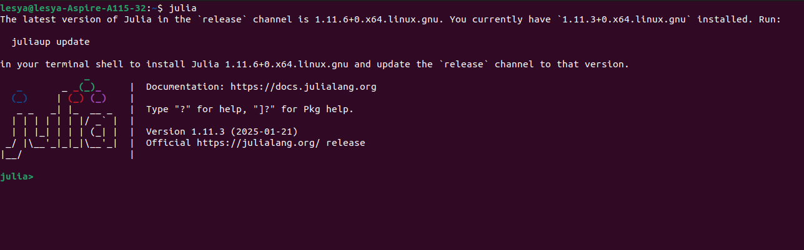
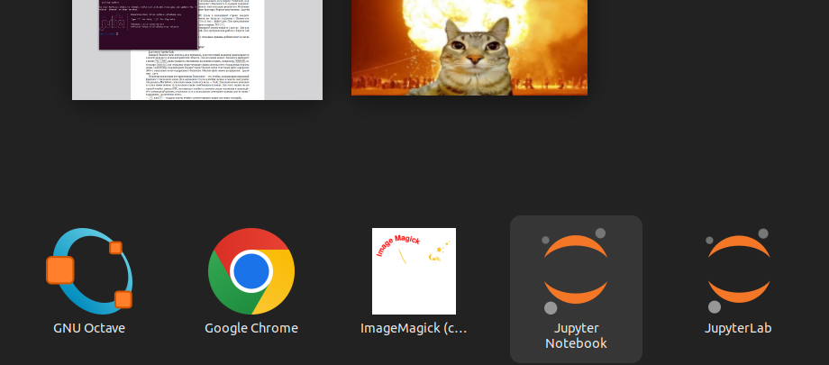
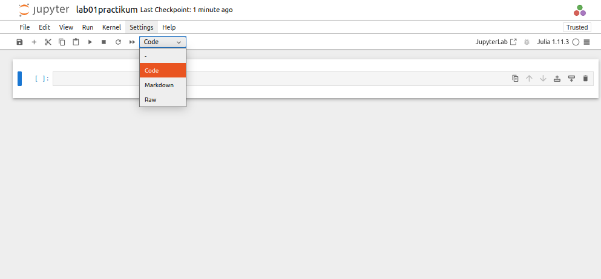
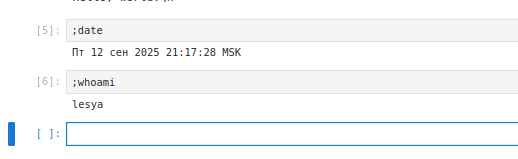
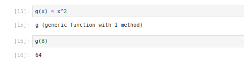
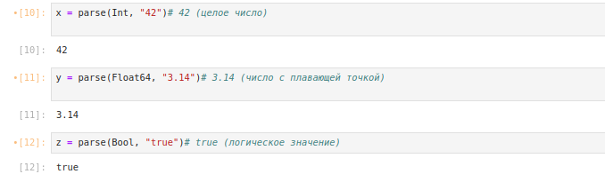
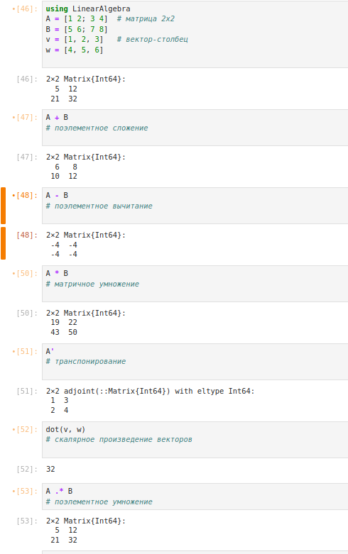

---
## Front matter
title: "Лабораторная работа № 1. Julia. Установка и настройка. Основные
принципы."
author: "Абакумова Олеся Максимовна, НФИбд-02-22"

## Generic otions
lang: ru-RU
toc-title: "Содержание"

## Bibliography
bibliography: bib/cite.bib
csl: pandoc/csl/gost-r-7-0-5-2008-numeric.csl

## Pdf output format
toc: true # Table of contents
toc-depth: 2
lof: true # List of figures
lot: true # List of tables
fontsize: 12pt
linestretch: 1.5
papersize: a4
documentclass: scrreprt
## I18n polyglossia
polyglossia-lang:
  name: russian
  options:
	- spelling=modern
	- babelshorthands=true
polyglossia-otherlangs:
  name: english
## I18n babel
babel-lang: russian
babel-otherlangs: english
## Fonts
mainfont: IBM Plex Serif
romanfont: IBM Plex Serif
sansfont: IBM Plex Sans
monofont: IBM Plex Mono
mathfont: STIX Two Math
mainfontoptions: Ligatures=Common,Ligatures=TeX,Scale=0.94
romanfontoptions: Ligatures=Common,Ligatures=TeX,Scale=0.94
sansfontoptions: Ligatures=Common,Ligatures=TeX,Scale=MatchLowercase,Scale=0.94
monofontoptions: Scale=MatchLowercase,Scale=0.94,FakeStretch=0.9
mathfontoptions:
## Biblatex
biblatex: true
biblio-style: "gost-numeric"
biblatexoptions:
  - parentracker=true
  - backend=biber
  - hyperref=auto
  - language=auto
  - autolang=other*
  - citestyle=gost-numeric
## Pandoc-crossref LaTeX customization
figureTitle: "Рис."
tableTitle: "Таблица"
listingTitle: "Листинг"
lofTitle: "Список иллюстраций"
lotTitle: "Список таблиц"
lolTitle: "Листинги"
## Misc options
indent: true
header-includes:
  - \usepackage{indentfirst}
  - \usepackage{float} # keep figures where there are in the text
  - \floatplacement{figure}{H} # keep figures where there are in the text
---


# Цель работы

Основная цель работы -- подготовить рабочее пространство и инструментарий для
работы с языком программирования Julia, на простейших примерах познакомиться
с основами синтаксиса Julia.

# Задание

1. Установите под свою операционную систему Julia, Jupyter.

2. Используя Jupyter Lab, повторите примеры из разделов.

3. Выполните задания для самостоятельной работы.

# Выполнение лабораторной работы
## Подготовка инструментария к работе

Для выполнения данной лабораторной работы нам необходимы Julia и Jupyter. Так, как они установлены у меня уже изначально, то могу продемонстрировать их наличие на моей ОС (рис. [-@fig:001]):

{#fig:001 width=70%}

{#fig:002 width=70%}

{#fig:003 width=70%}

Зайдя в Jupyter Notebook, создадим блокнот для работы с Julia (рис. [-@fig:004]):

{#fig:004 width=70%}

{#fig:005 width=70%}

{#fig:006 width=70%}

## Основы работы в блокноте Jupyter

Каждый блокнот (или консоль, или терминал, или текстовый редактор) располагается
в своей вкладке в основной рабочей области. Для создания нового блокнота выбирается в меню File (рис. [-@fig:004]) , далее указывается, что именно мы хотим создать. Для открытия существующего файла используютс стандартные пункты меню и навигатор. Каждый файл-блокнот представляет собой текстовый файл в формате
JSON с описанием всего содержимого блокнота. Обычно файл имеет расширение .ipynb или .ipyn.
Основная концепция интерактивных блокнотов — это ячейка, содержащая отдельный
фрагмент текста (или кода). Для написания текста в ячейке нужно в панели инструментов указать Markdown, для написания элемента кода -- Code (рис. [-@fig:006]). Для изменения режимов
вставки ячеек можно использовать также комбинации клавиш. Для этого нужно на активной ячейке нажать **ESC** , что выведет ячейку из режима редактирования и переведёт
её в командный режим, в котором есть специальные сочетания клавиш для вставки/вырезания/изменения ячеек:

- **a** или **b** -- создать новую ячейку соответственно выше или ниже текущей;

- **x** -- удалить ячейку;

- **z** -- отмена удаления ячейки;

- **m** -- перевести ячейку в режим текста;

- **y** -- перевести ячейку в режим набора кода.

Для выполнения кода внутри ячейки выберите эту ячейку и нажмимается **Shift + Enter** или
кнопку со значком **Run** на панели инструментов. Если ячейка содержит несколько строк
кода, то при выполнении этой ячейки отобразится только результат последней строки
(операции). Вывод результата можно подавить, завершив строку знаком «точка с запятой».

Выполним примеры кода  простейшей операцией сложения в блокноте Jupyter  (рис. [-@fig:007]):

{#fig:007 width=70%}

Если необходимо получить информацию по работе с какой-то незнакомой для вас
функцией Julia, то можно поставить в ячейке перед названием этой функции знак
вопроса (рис. [-@fig:008]):

{#fig:008 width=70%}

Если требуется использовать команды из командной оболочки операционной
системы, то перед соответствующей командой нужно поставить знак «точка с запятой».
Например, для пользователей ОС Linux можно вывести текущую дату и имя пользователя,
используя последовательно команды date и whoami. Для пользователей других
ОС следует использовать команды оболочки соответствующей операционной системы (рис. [-@fig:009]):

{#fig:009 width=70%}

Для очистки результатов выполнения ячеек следует использовать меню **Edit**(рис. [-@fig:010]):

{#fig:010 width=70%}

## Основы синтаксиса Julia на примерах

Далее приведены простейшие примеры с использованием синтаксиса Julia, выполненные в блокноте Jupyter Lab.
Определение типа числовой величины можно реализовать с помощью команды **typeof(Number)** (рис. [-@fig:011]).
Здесь Number -- конкретное число, например, $3$ или $3.5$, или числовой результат какой-либо операции, например,$3/3.5$, $\sqrt{3 + 4𝑖}$, значение числа $\pi$.
В Julia введены специальные значения **Inf**, **-Inf**, **NaN**, обозначающие бесконечность
и отсутствие какого-либо значения. Такие значения могут получаться в результате операций типа деления на ноль, а также могут быть допустимой частью выражений, поскольку в языке имеют тип вещественного числа.
Для определения крайних значений диапазонов целочисленных числовых величин
можно воспользоваться следующим кодом (рис. [-@fig:011]):

{#fig:011 width=70%}

В результате получим минимальные и максимальные значения целочисленных типов.

В Julia преобразование типов можно реализовать или прямым указанием, например
вещественное число 2.0 преобразовать в целое, а число 2 в символ: **Int64(2.0)**, **Char(2)**
или использовать обобщённый оператор преобразования типов **convert()**, например:
**convert(Int64, 2.0)**, **convert(Char,2)**
Преобразование 1 в булевое **true**, 0 -- в булевое **false**:
**Bool(1)**, **Bool(0)**.
Для приведения нескольких аргументов к одному типу, если это возможно, используется оператор **promote()**, например:
**promote(Int8(1)**, **Float16(4.5)**, **Float32(4.1))**
В данном выражении все аргументы оператора **promote()** в результате будут иметь
тип **Float32**, в чём можно убедиться, воспользовавшись функцией определения типа **typeof** (рис. [-@fig:012]):

{#fig:012 width=70%}

Базовый синтаксис определения функции:

```
function <Имя> (<СписокПараметров>)
	<Действия>
end

```


Например, определим функцию $f(x)$ возведения переменной $x$ в квадрат и возведём в квадрат число 4 (рис. [-@fig:013]):

```
function f(x)
	x^2
end
f(4)

```
Другой способ определения несложных функций (рис. [-@fig:014]:

```
<Имя> (<СписокПараметров>) = <Выражение>

```

Пример определения одномерных массивов (вектор-строка и вектор-столбец) и обращение к их вторым элементам (рис. [-@fig:013]):

```
a = [4 7 6] # вектор-строка
b = [1, 2, 3] # вектор-столбец
a[2], b[2] # вторые элементы векторов a и b

```

{#fig:013 width=70%}

{#fig:014 width=70%}

Пример определения двумерного массива (матрицы) и обращение к его элементам (рис. [-@fig:015]):

```
a = 1; b = 2; c = 3; d = 4 # присвоение значений
Am = [a b; c d] # матрица 2 х 2
Am[1,1], Am[1,2], Am[2,1], Am[2,2] # элементы матрицы

```

Пример выполнения операций над массивами (aa' -- транспонирование вектора) (рис. [-@fig:015]):

```
aa = [1 2]
AA = [1 2; 3 4]
aa*AA*aa

```
{#fig:015 width=70%}

## Задания для самостоятельной работы

1. Изучите документацию по основным функциям Julia для чтения / записи / вывода информации на экран: **read(), readline(), readlines(), readdlm(), print(), println(), show(), write()**. Приведите свои примеры их использования, поясняя особенности их применения.

{#fig:016 width=70%}

- **read()** читает весь файл, как массив байтов;

- **readline()** читает только одну строку;

- **readlines()** читает все строки.

{#fig:017 width=70%}

- **readlm()** читает с разделителем;

- **print()** вывод текста по частям;

- **println()** вывод в отдельных строках.

- **show()** выводит текстовые данные;

- **write()** выводит двоичные данные.

2. Изучите документацию по функции **parse()**. Приведите свои примеры её использования, поясняя особенности её применения.

{#fig:018 width=70%}

- **parse()** используется для преобразования строки в число определенного типа

3. Изучите синтаксис Julia для базовых математических операций с разным типом переменных: сложение, вычитание, умножение, деление, возведение в степень, извлечение корня, сравнение, логические операции. Приведите свои примеры с пояснениями по особенностям их применения.

{#fig:019 width=70%}

{#fig:020 width=70%}

4. Приведите несколько своих примеров с пояснениями с операциями над матрицами и векторами: сложение, вычитание, скалярное произведение, транспонирование, умножение на скаляр.

{#fig:021 width=70%}


# Выводы

В процессе выполнения данной лабораторной работы подготовила рабочее пространство и инструментарий для с языком программирования Julia, на простейших примерах познакомиться
с основами синтаксиса Julia.
