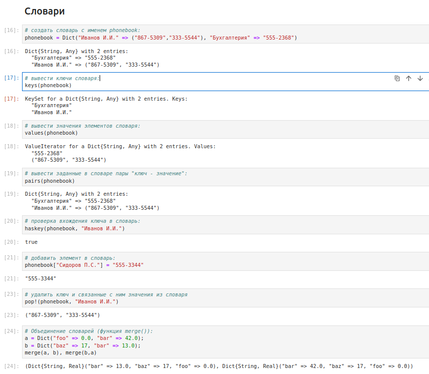
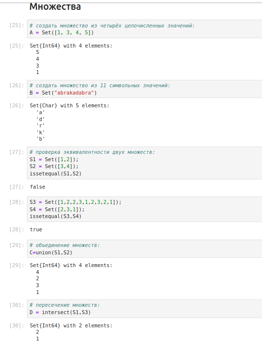
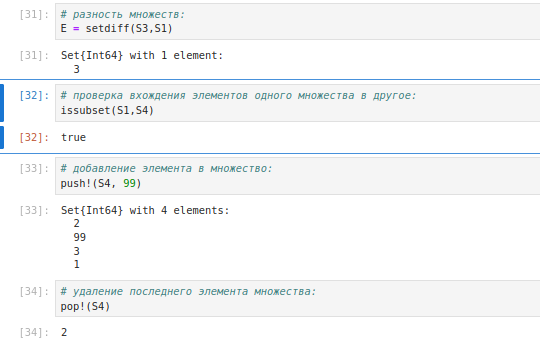
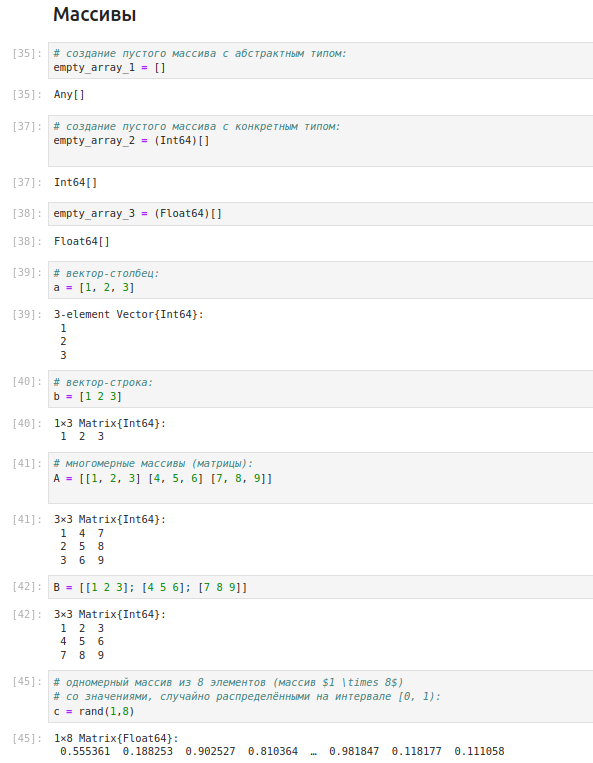
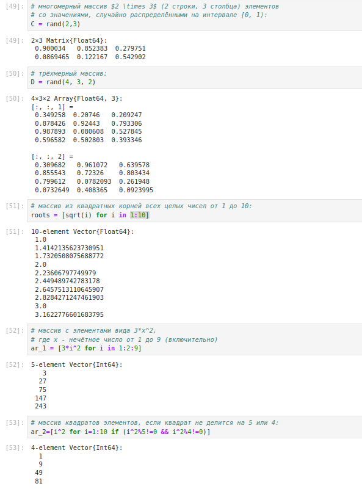
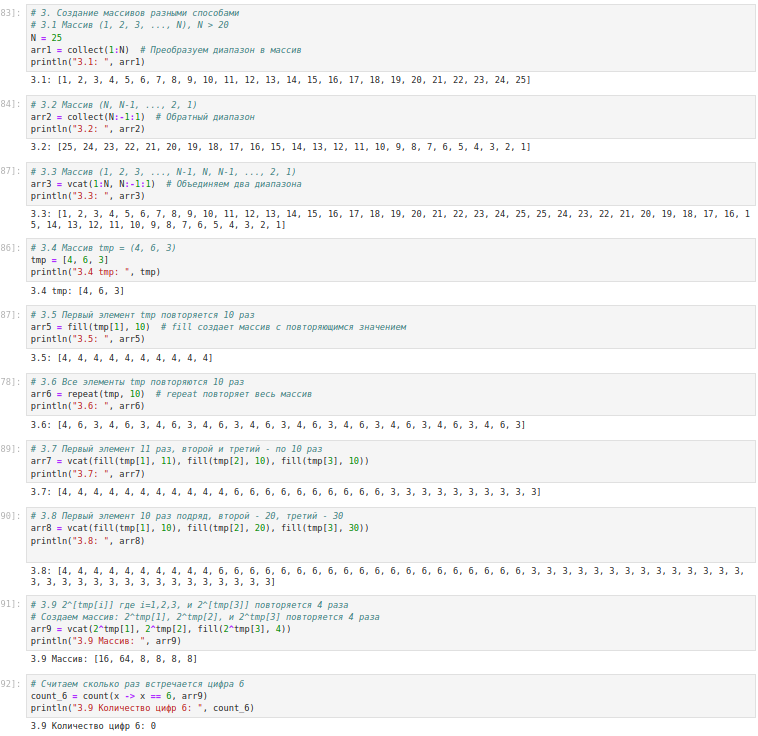
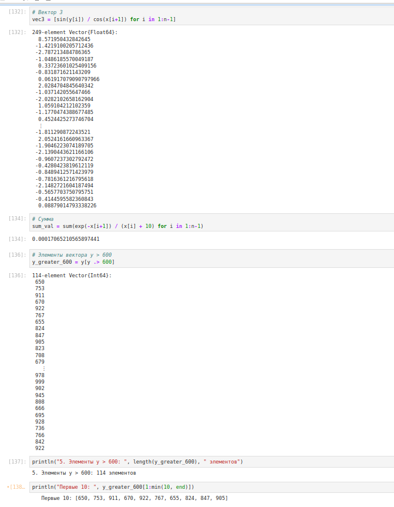
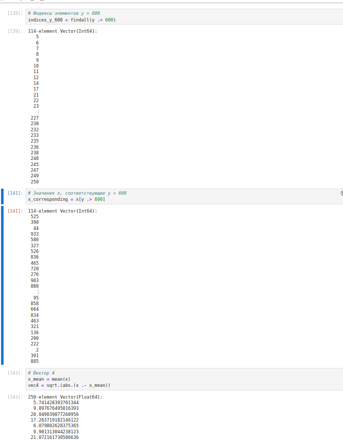
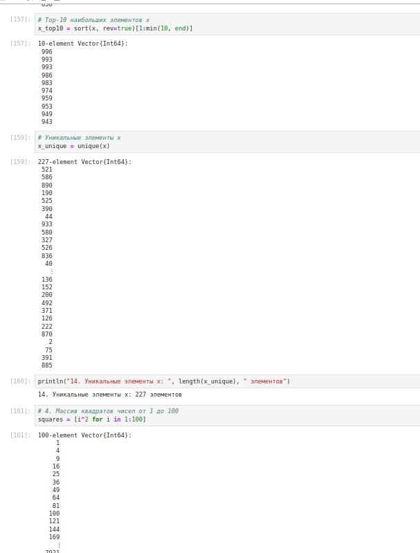

---
## Front matter
lang: ru-RU
title: Лабораторная работа № 2. Структуры данных.
author:
  - Абакумова О. М.
institute:
  - Российский университет дружбы народов, Москва, Россия


## i18n babel
babel-lang: russian
babel-otherlangs: english

## Formatting pdf
toc: false
toc-title: Содержание
slide_level: 2
aspectratio: 169
section-titles: true
theme: metropolis
header-includes:
 - \metroset{progressbar=frametitle,sectionpage=progressbar,numbering=fraction}
mainfont: Open Sans Light
---

# Информация

## Докладчик

:::::::::::::: {.columns align=center}
::: {.column width="70%"}

  * Абакумова Олеся Максимовна
  * Студентка
  * Российский университет дружбы народов
  * 1132220832@pfur.ru
  * <https://github.com/omabakumova>

:::
::: {.column width="30%"}


:::
::::::::::::::

# Цель работы

Основная цель работы — изучить несколько структур данных, реализованных в Julia, научиться применять их и операции над ними для решения задач.

# Задание

1. Выполнить примеры, приведенные в лабораторной работе.

2. Выполнить задания для самостоятельного выполнения


# Выполнение лабораторной работы
## Кортежи

Кортеж (Tuple) — структура данных (контейнер) в виде неизменяемой индексируемой последовательности элементов какого-либо типа (элементы индексируются с единицы).
Синтаксис определения кортежа: `(element1, element2, ...)`

## Кортежи

{#fig:001 width=35%}

## Кортежи

{#fig:002 width=35%}

## Словари

Словарь — неупорядоченный набор связанных между собой по ключу данных.
Синтаксис определения словаря: `Dict(key1 => value1, key2 => value2, ...)`

## Словари

{#fig:003 width=35%}

## Множества

Множество, как структура данных в Julia, соответствует множеству, как математическому объекту, то есть является неупорядоченной совокупностью элементов какого-либо типа. Возможные операции над множествами: объединение, пересечение, разность; принадлежность элемента множеству.

Синтаксис определения множества: `Set([itr])`
где itr — набор значений, сгенерированных данным итерируемым объектом или пустое множество.

## Множества

{#fig:004 width=35%}

## Множества

{#fig:005 width=35%}

## Массивы

Массив — коллекция упорядоченных элементов, размещённая в многомерной сетке.
Векторы и матрицы являются частными случаями массивов.
Общий синтаксис одномерных массивов:
```
array_name_1 = [element1, element2, ...]
array_name_2 = [element1 element2 ...]
```

## Массивы

{#fig:006 width=35%}

## Массивы

{#fig:007 width=35%}

## Массивы

Некоторые операции для работы с массивами:

- length(A) — число элементов массива A;

- ndims(A) — число размерностей массива A;

- size(A) — кортеж размерностей массива A;

## Массивы

- size(A, n) — размерность массива A в заданном направлении;

- copy(A) — создание копии массива A;

- ones(), zeros() — создать массив с единицами или нулями соответственно;

- fill(value,array_name) — заполнение массива заранее определенным значением;

## Массивы

- sort() — сортировка элементов;

- collect() — вернуть массив всех элементов в коллекции или итераторе;

- reshape() — изменение размера массива;

- transpose() — транспонирование массива;

## Массивы

{#fig:008 width=35%}

## Массивы

{#fig:009 width=35%}

## Массивы

{#fig:0010 width=35%}

## Массивы

{#fig:011 width=35%}

## Задания для самостоятельной работы

1. Даны множества: $A = {0, 3, 4, 9}, B = {1, 3, 4, 7}, C = {0, 1, 2, 4, 7, 8, 9}$. Найдем $P = A \cap B \cup A \cap B \cup A \cap C \cup B \cap C$.

2. Приведем свои примеры с выполнением операций над множествами элементов
разных типов.

## Задания для самостоятельной работы

{#fig:012 width=35%}

## Задания для самостоятельной работы

3. Создадим разными способами массивы и векторы.

## Задания для самостоятельной работы

{#fig:013 width=35%}

## Задания для самостоятельной работы

{#fig:014 width=35%}

## Задания для самостоятельной работы

{#fig:015 width=35%}

## Задания для самостоятельной работы

{#fig:016 width=35%}

## Задания для самостоятельной работы

{#fig:017 width=35%}

## Задания для самостоятельной работы

{#fig:018 width=35%}

## Задания для самостоятельной работы

{#fig:019 width=35%}

## Задания для самостоятельной работы

4. Создадим массив squares, в котором будут храниться квадраты всех целых чисел от 1 до 100.

## Задания для самостоятельной работы

{#fig:020 width=35%}

## Задания для самостоятельной работы

5. Подключим пакет Primes (функции для вычисления простых чисел). Сгенерируем массив myprimes, в котором будут храниться первые 168 простых чисел. Определим 89-е наименьшее простое число. Получим срез массива с 89-го до 99-го элемента включительно, содержащий наименьшие простые числа.

6. Вычислим выражения.

## Задания для самостоятельной работы

{#fig:021 width=35%}

# Выводы

В процессе выполнения данной лабораторной работы я изучила несколько структур данных,  реализованных в Julia, научиться применять их и операции над ними для решения задач.
