---
## Front matter
title: "Лабораторная работа № 2. Структуры данных."
author: "Абакумова Олеся Максимовна, НФИбд-02-22"

## Generic otions
lang: ru-RU
toc-title: "Содержание"

## Bibliography
bibliography: bib/cite.bib
csl: pandoc/csl/gost-r-7-0-5-2008-numeric.csl

## Pdf output format
toc: true # Table of contents
toc-depth: 2
lof: true # List of figures
lot: true # List of tables
fontsize: 12pt
linestretch: 1.5
papersize: a4
documentclass: scrreprt
## I18n polyglossia
polyglossia-lang:
  name: russian
  options:
	- spelling=modern
	- babelshorthands=true
polyglossia-otherlangs:
  name: english
## I18n babel
babel-lang: russian
babel-otherlangs: english
## Fonts
mainfont: IBM Plex Serif
romanfont: IBM Plex Serif
sansfont: IBM Plex Sans
monofont: IBM Plex Mono
mathfont: STIX Two Math
mainfontoptions: Ligatures=Common,Ligatures=TeX,Scale=0.94
romanfontoptions: Ligatures=Common,Ligatures=TeX,Scale=0.94
sansfontoptions: Ligatures=Common,Ligatures=TeX,Scale=MatchLowercase,Scale=0.94
monofontoptions: Scale=MatchLowercase,Scale=0.94,FakeStretch=0.9
mathfontoptions:
## Biblatex
biblatex: true
biblio-style: "gost-numeric"
biblatexoptions:
  - parentracker=true
  - backend=biber
  - hyperref=auto
  - language=auto
  - autolang=other*
  - citestyle=gost-numeric
## Pandoc-crossref LaTeX customization
figureTitle: "Рис."
tableTitle: "Таблица"
listingTitle: "Листинг"
lofTitle: "Список иллюстраций"
lotTitle: "Список таблиц"
lolTitle: "Листинги"
## Misc options
indent: true
header-includes:
  - \usepackage{indentfirst}
  - \usepackage{float} # keep figures where there are in the text
  - \floatplacement{figure}{H} # keep figures where there are in the text
---


# Цель работы

Основная цель работы — изучить несколько структур данных, реализованных в Julia, научиться применять их и операции над ними для решения задач.

# Задание

1. Выполнить примеры, приведенные в лабораторной работе.

2. Выполнить задания для самостоятельного выполнения

# Выполнение лабораторной работы
## Кортежи

Кортеж (Tuple) — структура данных (контейнер) в виде неизменяемой индексируемой последовательности элементов какого-либо типа (элементы индексируются с единицы).
Синтаксис определения кортежа: `(element1, element2, ...)`

Рассмотрим примеры кортежей (рис. [-@fig:001]):

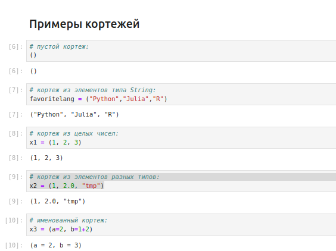{#fig:001 width=70%}

Рассмотрим операции над кортежами (рис. [-@fig:002]):

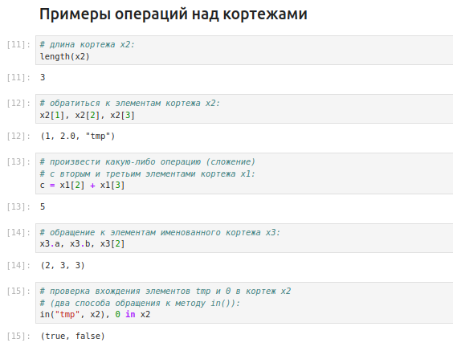{#fig:002 width=70%}

## Словари

Словарь — неупорядоченный набор связанных между собой по ключу данных.
Синтаксис определения словаря: `Dict(key1 => value1, key2 => value2, ...)`

Рассмотрим словари и проведем операции над ними (рис. [-@fig:004]):

{#fig:003 width=70%}

## Множества

Множество, как структура данных в Julia, соответствует множеству, как математическому объекту, то есть является неупорядоченной совокупностью элементов какого-либо типа. Возможные операции над множествами: объединение, пересечение, разность; принадлежность элемента множеству.

Синтаксис определения множества: `Set([itr])`
где itr — набор значений, сгенерированных данным итерируемым объектом или пустое множество.

Рассмотрим примеры множеств и операций над ними (рис. [-@fig:004]):

{#fig:004 width=70%}

{#fig:005 width=70%}

## Массивы

Массив — коллекция упорядоченных элементов, размещённая в многомерной сетке.
Векторы и матрицы являются частными случаями массивов.
Общий синтаксис одномерных массивов:
```
array_name_1 = [element1, element2, ...]
array_name_2 = [element1 element2 ...]
```

Рассмотрим примеры массивов (рис. [-@fig:006]):

{#fig:006 width=70%}

Рассмотрим примеры массивов, заданных некоторыми функциями через включение (рис. [-@fig:007]):

{#fig:007 width=70%}

Некоторые операции для работы с массивами:

- length(A) — число элементов массива A;

- ndims(A) — число размерностей массива A;

- size(A) — кортеж размерностей массива A;

- size(A, n) — размерность массива A в заданном направлении;

- copy(A) — создание копии массива A;

- ones(), zeros() — создать массив с единицами или нулями соответственно;

- fill(value,array_name) — заполнение массива заранее определенным значением;

- sort() — сортировка элементов;

- collect() — вернуть массив всех элементов в коллекции или итераторе;

- reshape() — изменение размера массива;

- transpose() — транспонирование массива;

Рассмотрим несколько примеров (рис. [-@fig:008]):

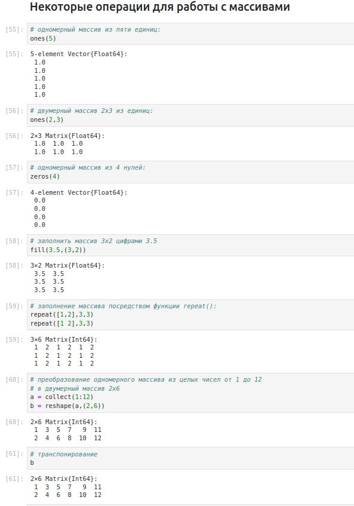{#fig:008 width=70%}

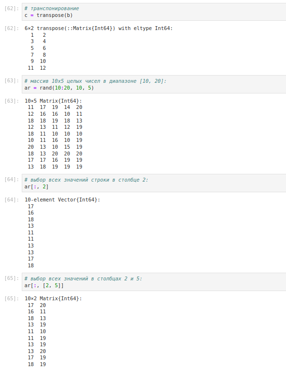{#fig:009 width=70%}

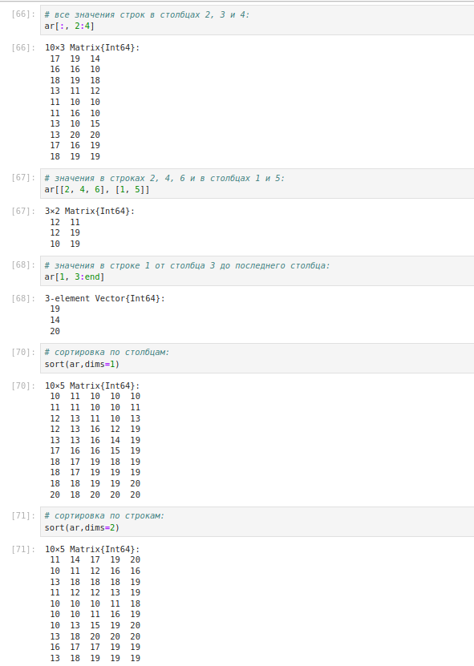{#fig:0010 width=70%}

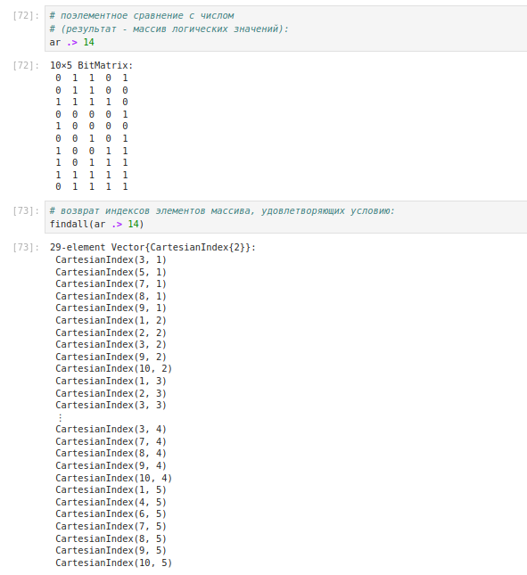{#fig:011 width=70%}

## Задания для самостоятельной работы

1. Даны множества: $A = {0, 3, 4, 9}, B = {1, 3, 4, 7}, C = {0, 1, 2, 4, 7, 8, 9}$. Найдем $P = A \cap B \cup A \cap B \cup A \cap C \cup B \cap C$

2. Приведем свои примеры с выполнением операций над множествами элементов
разных типов (рис. [-@fig:012]):

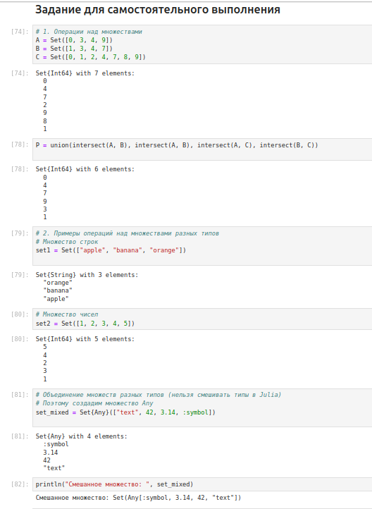{#fig:012 width=70%}

3. Создадим разными способами массивы и векторы (рис. [-@fig:013]):

{#fig:013 width=70%}

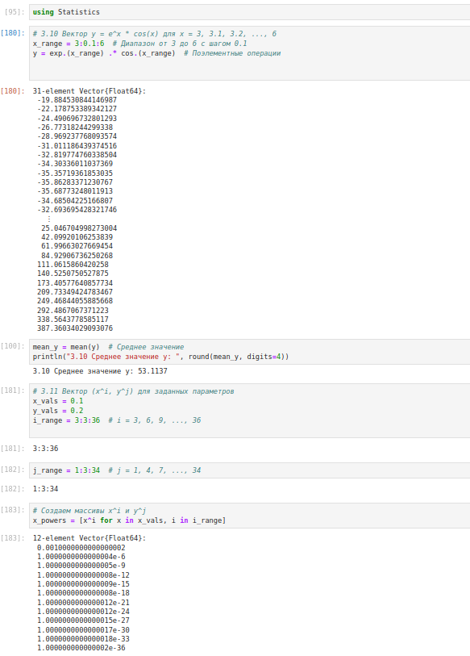{#fig:014 width=70%}

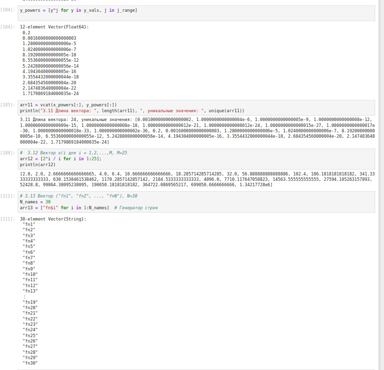{#fig:015 width=70%}

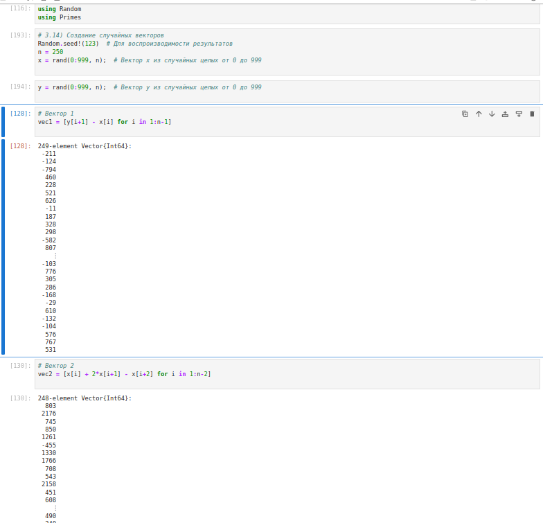{#fig:016 width=70%}

{#fig:017 width=70%}

{#fig:018 width=70%}

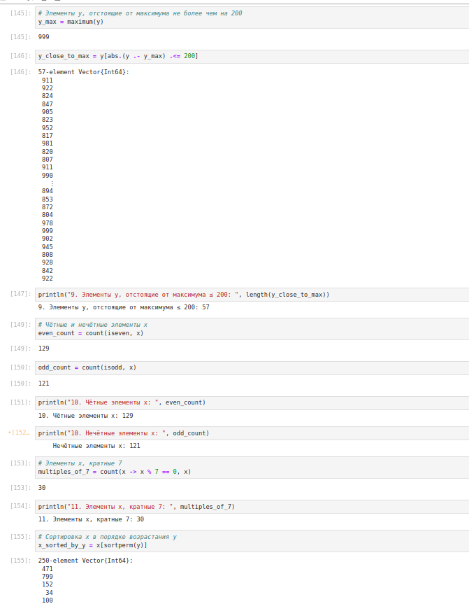{#fig:019 width=70%}

4. Создадим массив squares, в котором будут храниться квадраты всех целых чисел от 1 до 100  (рис. [-@fig:020]):

{#fig:020 width=70%}

5. Подключим пакет Primes (функции для вычисления простых чисел). Сгенерируем массив myprimes, в котором будут храниться первые 168 простых чисел. Определим 89-е наименьшее простое число. Получим срез массива с 89-го до 99-го элемента включительно, содержащий наименьшие простые числа (рис. [-@fig:021])

6. Вычислим выражения (рис. [-@fig:021]):

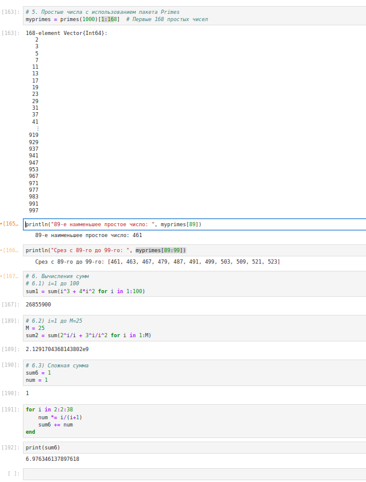{#fig:021 width=70%}

# Выводы

В процессе выполнения данной лабораторной работы я изучила несколько структур данных,  реализованных в Julia, научиться применять их и операции над ними для решения задач.
