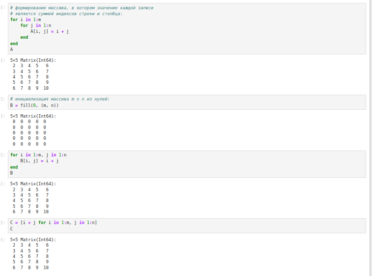
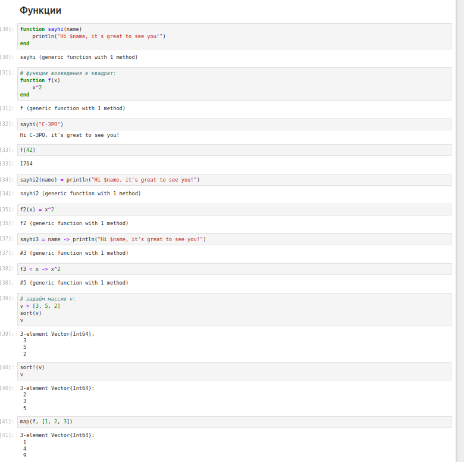
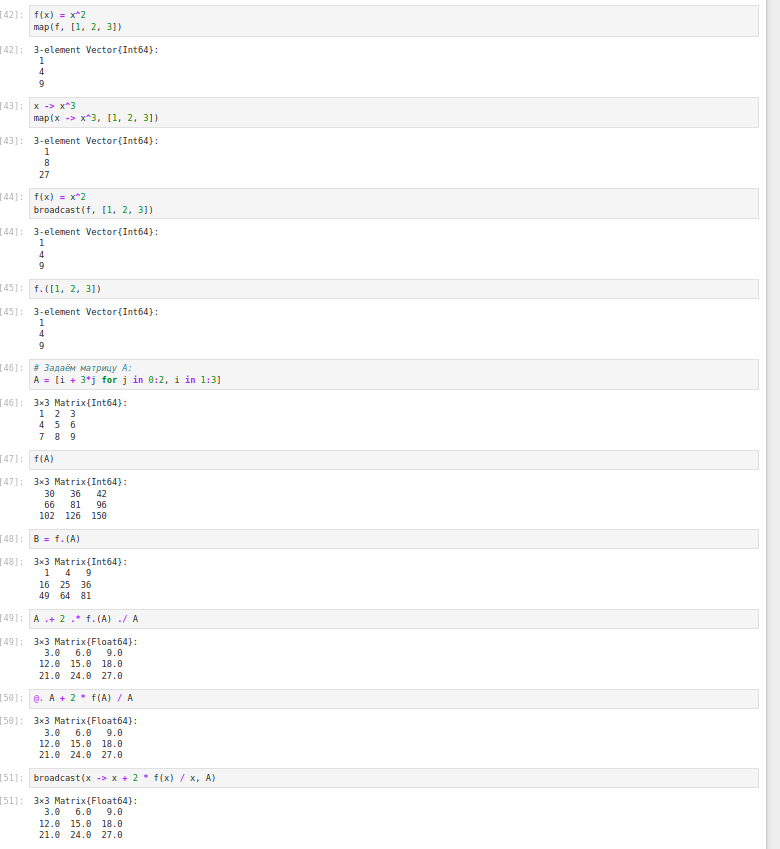
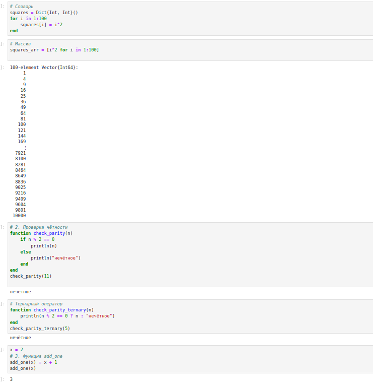
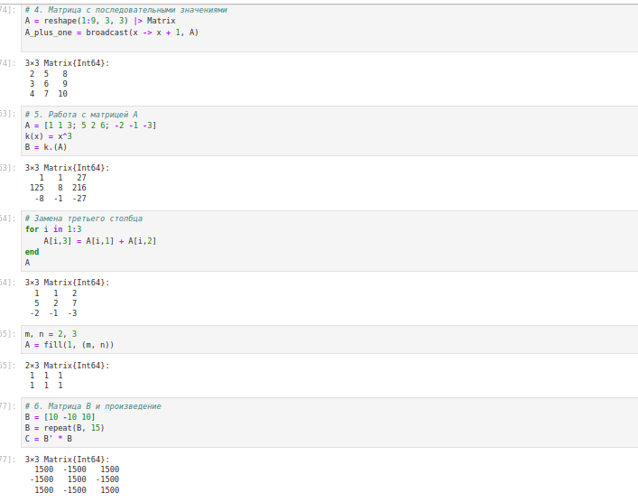
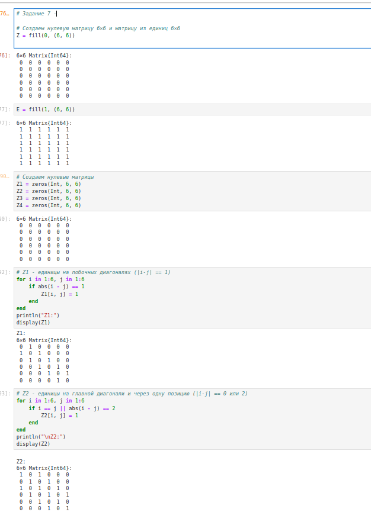
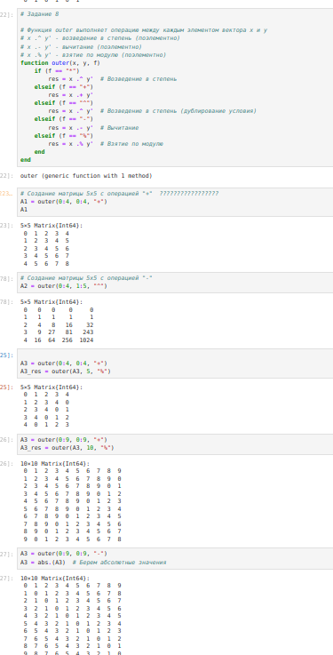

---
## Front matter
lang: ru-RU
title: Лабораторная работа № 3. Управляющие структуры.
author:
  - Абакумова О. М.
institute:
  - Российский университет дружбы народов, Москва, Россия

## i18n babel
babel-lang: russian
babel-otherlangs: english

## Formatting pdf
toc: false
toc-title: Содержание
slide_level: 2
aspectratio: 169
section-titles: true
theme: metropolis
header-includes:
 - \metroset{progressbar=frametitle,sectionpage=progressbar,numbering=fraction}
mainfont: Open Sans Light
---

# Информация

## Докладчик

:::::::::::::: {.columns align=center}
::: {.column width="70%"}

  * Абакумова Олеся Максимовна
  * Студентка
  * Российский университет дружбы народов
  * 1132220832@pfur.ru
  * <https://github.com/omabakumova>

:::
::: {.column width="30%"}

:::
::::::::::::::

# Цель работы

Основная цель работы — освоить применение циклов функций и сторонних для Julia
пакетов для решения задач линейной алгебры и работы с матрицами.

# Задание

1. Выполнить примеры, приведенные в лабораторной работе.

2. Выполнить задания для самостоятельного выполнения

# Выполнение лабораторной работы
## Циклы while и for

{#fig:001 width=35%}

## Циклы while и for

{#fig:002 width=35%}

## Условные выражения

Довольно часто при решении задач требуется проверить выполнение тех или иных
условий. Для этого используют условные выражения.

## Условные выражения

{#fig:003 width=35%}

## Функции

{#fig:004 width=35%}

По соглашению в Julia функции, сопровождаемые восклицательным знаком, изменяют свое содержимое, а функции без восклицательного знака не делают этого.

## Функции

Функция `sort(v)` возвращает отсортированный массив, который содержит те же
элементы, что и массив v, но исходный массив v остаётся без изменений. Если же использовать `sort!(v)`, то отсортировано будет содержимое исходного массива v.

## Функции

В программировании под функцией высшего порядка понимается функция, принимающая в качестве аргументов другие функции или возвращающая другую функцию в качестве результата. Основная идея состоит в том, что функции имеют тот же статус,что и другие объекты данных.

## Функции

{#fig:005 width=35%}

## Функции

- В Julia функция mapявляется функцией высшего порядка, которая принимает функцию
в качестве одного из своих входных аргументов и применяет эту функцию к каждому элементу структуры данных, которая ей передаётся также в качестве аргумента.

## Функции

- Функция `broadcast` — ещё одна функция высшего порядка в Julia, представляющая собой обобщение функции `map`. Функция `broadcast()` будет пытаться привести все объекты
к общему измерению, `map()` будет напрямую применять данную функцию поэлементно.

## Функции

- Точечный синтаксис для `broadcast()` позволяет записать относительно сложные составные поэлементные выражения в форме, близкой к математической записи.

## Сторонние библиотеки (пакеты) в Julia

Julia имеет более 2000 зарегистрированных пакетов, что делает их огромной частью
экосистемы Julia. Есть вызовы функций первого класса для других языков, обеспечи-
вающие интерфейсы сторонних функций. Можно вызвать функции из Python или R,
например, с помощью `PyCall` или `Rcall`.

## Сторонние библиотеки (пакеты) в Julia

{#fig:006 width=35%}

## Задания для самостоятельной работы

1. Используя циклы `while` и `for`:

- выведите на экран целые числа от 1 до 100 и напечатайте их квадраты;

- создайте словарь `squares`, который будет содержать целые числа в качестве ключей и квадраты в качестве их пар-значений;

- создайте массив `squares_arr`, содержащий квадраты всех чисел от 1 до 100.

## Задания для самостоятельной работы

{#fig:007 width=35%}

## Задания для самостоятельной работы

{#fig:008 width=35%}

## Задания для самостоятельной работы

{#fig:009 width=35%}

## Задания для самостоятельной работы

2. Напишите условный оператор, который печатает число, если число чётное, и строку «нечётное», если число нечётное. Перепишите код, используя тернарный оператор.

## Задания для самостоятельной работы

{#fig:009 width=35%}

## Задания для самостоятельной работы

3. Напишите функцию `add_one`, которая добавляет 1 к своему входу.

## Задания для самостоятельной работы

{#fig:009 width=35%}

## Задания для самостоятельной работы

4. Используйте `map()` или `broadcast()` для задания матрицы A, каждый элемент которой увеличивается на единицу по сравнению с предыдущим.

## Задания для самостоятельной работы

{#fig:010 width=35%}

## Задания для самостоятельной работы

5. Задайте матрицу А и выполните:

- Возведите матрицу в третью степень.

- Замените третий столбец матрицы А на сумму второго и третьего столбцов.

## Задания для самостоятельной работы

{#fig:010 width=35%}

## Задания для самостоятельной работы

6. Создайте матрицу B с элементами. Вычислите матрицу $C = B^T B$.

## Задания для самостоятельной работы

{#fig:010 width=35%}

## Задания для самостоятельной работы

7. Создайте матрицу Z размерности 6 x 6, все элементы которой равны нулю, и матрицу E, все элементы которой равны 1. Используя циклы `while` или `for` и закономерности расположения элементов, создайте следующие матрицы размерности 6 x 6.

## Задания для самостоятельной работы

{#fig:011 width=35%}

## Задания для самостоятельной работы

{#fig:012 width=35%}

## Задания для самостоятельной работы

8. В языке R есть функция `outer()`. Фактически, это матричное умножение с возможностью изменить применяемую операцию (например, заменить произведение на сложение или возведение в степень)/ Напишите эту функцию. 

## Задания для самостоятельной работы

{#fig:013 width=35%}

## Задания для самостоятельной работы

9. Решите следующую систему линейных уравнений с 5 неизвестными:

$$\begin{cases}
x_1 + 2x_2 + 3x_3 + 4x_4 + 5x_5 = 7, \\
2x_1 + x_2 + 2x_3 + 3x_4 + 4x_5 = -1, \\
3x_1 + 2x_2 + x_3 + 2x_4 + 3x_5 = -3, \\
4x_1 + 3x_2 + 2x_3 + x_4 + 2x_5 = 5, \\
5x_1 + 4x_2 + 3x_3 + 2x_4 + x_5 = 17,
\end{cases}$$

## Задания для самостоятельной работы

{#fig:014 width=35%}

## Задания для самостоятельной работы

10. Создайте матрицу M размерности $6 \times 10$, элементами которой являются целые числа.

## Задания для самостоятельной работы

11. Вычислите следующие выражения.

## Задания для самостоятельной работы

{#fig:015 width=35%}

# Выводы

В результате выполнения данной лабораторной работы я освоила применение циклов функций и сторонних для Julia
пакетов для решения задач линейной алгебры и работы с матрицами.
