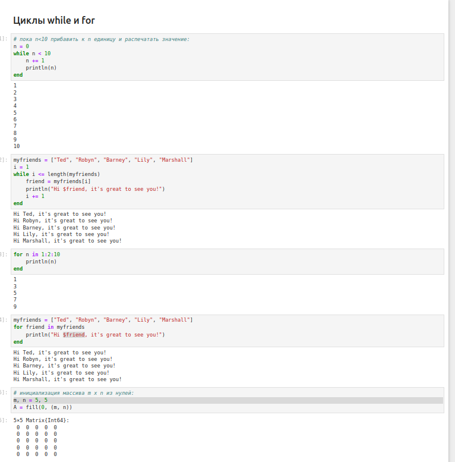
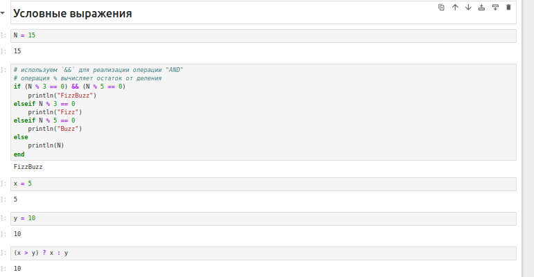
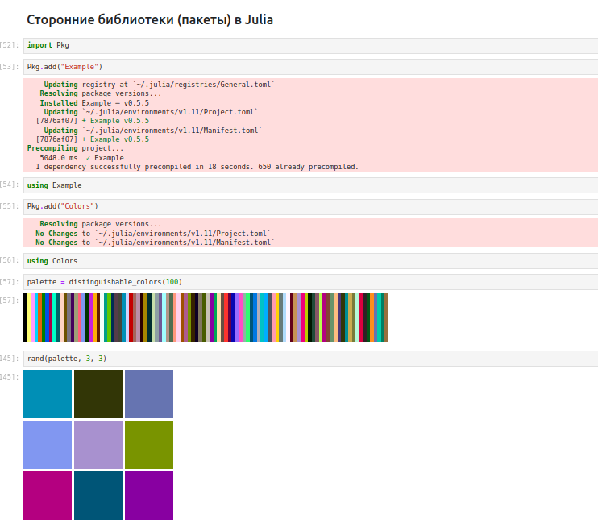
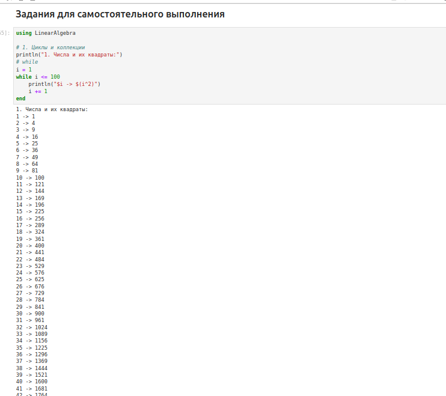
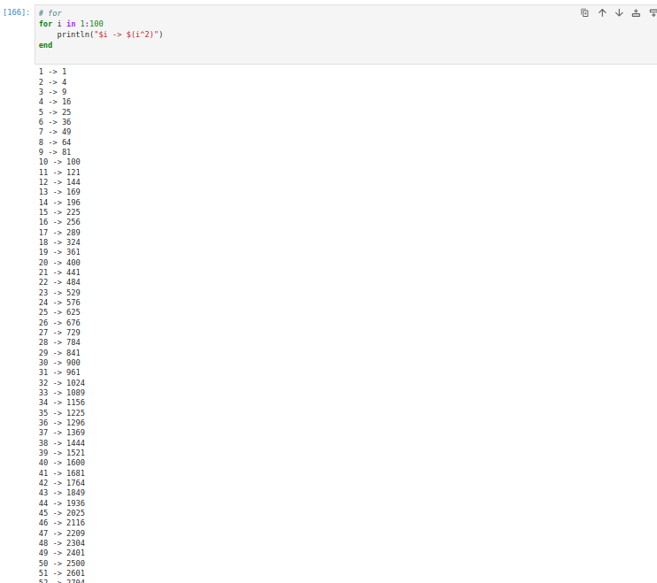
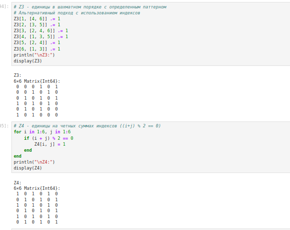
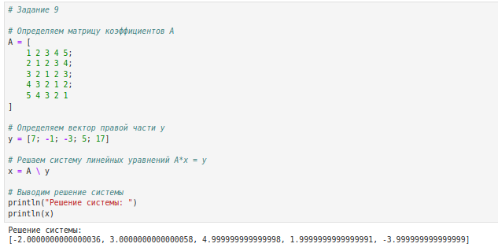
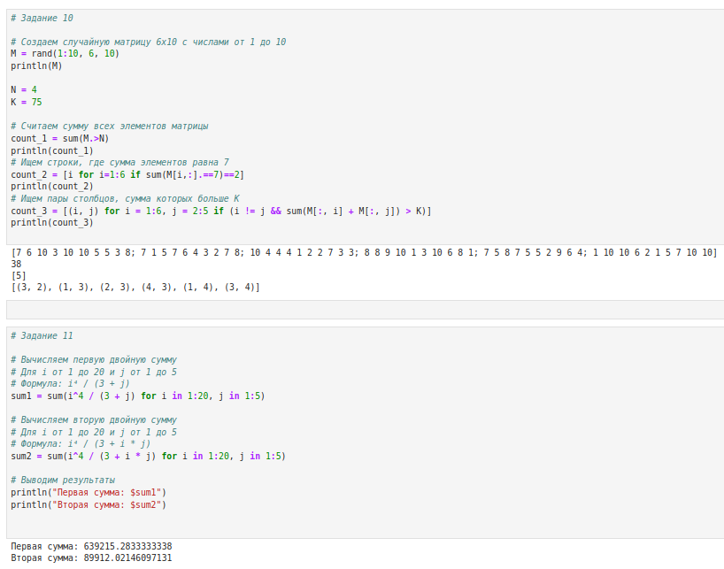

---
## Front matter
title: "Лабораторная работа № 3. Управляющие структуры"
author: "Абакумова Олеся Максимовна, НФИбд-02-22"

## Generic otions
lang: ru-RU
toc-title: "Содержание"

## Bibliography
bibliography: bib/cite.bib
csl: pandoc/csl/gost-r-7-0-5-2008-numeric.csl

## Pdf output format
toc: true # Table of contents
toc-depth: 2
lof: true # List of figures
lot: true # List of tables
fontsize: 12pt
linestretch: 1.5
papersize: a4
documentclass: scrreprt
## I18n polyglossia
polyglossia-lang:
  name: russian
  options:
	- spelling=modern
	- babelshorthands=true
polyglossia-otherlangs:
  name: english
## I18n babel
babel-lang: russian
babel-otherlangs: english
## Fonts
mainfont: IBM Plex Serif
romanfont: IBM Plex Serif
sansfont: IBM Plex Sans
monofont: IBM Plex Mono
mathfont: STIX Two Math
mainfontoptions: Ligatures=Common,Ligatures=TeX,Scale=0.94
romanfontoptions: Ligatures=Common,Ligatures=TeX,Scale=0.94
sansfontoptions: Ligatures=Common,Ligatures=TeX,Scale=MatchLowercase,Scale=0.94
monofontoptions: Scale=MatchLowercase,Scale=0.94,FakeStretch=0.9
mathfontoptions:
## Biblatex
biblatex: true
biblio-style: "gost-numeric"
biblatexoptions:
  - parentracker=true
  - backend=biber
  - hyperref=auto
  - language=auto
  - autolang=other*
  - citestyle=gost-numeric
## Pandoc-crossref LaTeX customization
figureTitle: "Рис."
tableTitle: "Таблица"
listingTitle: "Листинг"
lofTitle: "Список иллюстраций"
lotTitle: "Список таблиц"
lolTitle: "Листинги"
## Misc options
indent: true
header-includes:
  - \usepackage{indentfirst}
  - \usepackage{float} # keep figures where there are in the text
  - \floatplacement{figure}{H} # keep figures where there are in the text
---


# Цель работы

Основная цель работы — освоить применение циклов функций и сторонних для Julia
пакетов для решения задач линейной алгебры и работы с матрицами.

# Задание

1. Выполнить примеры, приведенные в лабораторной работе.

2. Выполнить задания для самостоятельного выполнения

# Выполнение лабораторной работы
## Циклы while и for

Для различных операций, связанных с перебором индексируемых элементов структур
данных, традиционно используются циклы while и for.
Синтаксис while:

```Julia
while <условие>
	<тело цикла>
end
```
Синтаксис for:
```Julia
for <переменная> in <диапазон>
	<тело цикла>
end
```
Рассмотрим примеры (рис. [-@fig:001]):

{#fig:001 width=70%}

Пример использования цикла for для создания двумерного массива, в котором значение каждой записи является суммой индексов строки и столбца (рис. [-@fig:002]):

{#fig:002 width=70%}

Также выше приведены другие различные реализации.

## Условные выражения

Довольно часто при решении задач требуется проверить выполнение тех или иных
условий. Для этого используют условные выражения.
Синтаксис условных выражений с ключевым словом:

```Julia
if <условие 1>
	<действие 1>
elseif <условие 2>
	<действие 2>
else
	<действие 3>
end
```

Рассмотрим пример (рис. [-@fig:003]):

{#fig:003 width=70%}

Синтаксис условных выражений с тернарными операторами:
```Julia
a ? b : c
```
(если выполнено a, то выполнить b, если нет, то c).
Такая запись эквивалентна записи условного выражения с ключевым словом:
```Julia
if a
	b
else
	c
end
```
Пример условного выражения с тернарным оператором также рассмотрен выше  (рис. [-@fig:003]).


## Функции

Julia дает нам несколько разных способов написать функцию. Первый требует ключевых слов function и end (рис. [-@fig:004]):

{#fig:004 width=70%}

По соглашению в Julia функции, сопровождаемые восклицательным знаком, изменяют свое содержимое, а функции без восклицательного знака не делают этого.
Можно рассмотреть это на примере функции `sort`(рис. [-@fig:004]).

Функция `sort(v)` возвращает отсортированный массив, который содержит те же
элементы, что и массив v, но исходный массив v остаётся без изменений. Если же использовать `sort!(v)`, то отсортировано будет содержимое исходного массива v.

В программировании под функцией высшего порядка понимается функция, принимающая в качестве аргументов другие функции или возвращающая другую функцию в качестве результата. Основная идея состоит в том, что функции имеют тот же статус,что и другие объекты данных.

- В Julia функция map (рис. [-@fig:005])является функцией высшего порядка, которая принимает функцию
в качестве одного из своих входных аргументов и применяет эту функцию к каждому элементу структуры данных, которая ей передаётся также в качестве аргумента.

- Функция `broadcast` (рис. [-@fig:005]) — ещё одна функция высшего порядка в Julia, представляющая собой обобщение функции `map`. Функция `broadcast()` будет пытаться привести все объекты
к общему измерению, `map()` будет напрямую применять данную функцию поэлементно.

- Точечный синтаксис (рис. [-@fig:005]) для `broadcast()` позволяет записать относительно сложные составные поэлементные выражения в форме, близкой к математической записи.

{#fig:005 width=70%}

## Сторонние библиотеки (пакеты) в Julia

Julia имеет более 2000 зарегистрированных пакетов, что делает их огромной частью
экосистемы Julia. Есть вызовы функций первого класса для других языков, обеспечи-
вающие интерфейсы сторонних функций. Можно вызвать функции из Python или R,
например, с помощью `PyCall` или `Rcall`.

- При первом использовании пакета в текущей установке Julia вам необходимо
использовать менеджер пакетов, чтобы явно его добавить (рис. [-@fig:006]).

- При каждом новом использовании Julia (например, в начале нового сеанса в REPL или открытии блокнота в первый раз) нужно загрузить пакет, используя ключевое слово `using`(рис. [-@fig:006]).

- Можно рассмотреть пример с использованием пакета `Colors`(рис. [-@fig:006]).

{#fig:006 width=70%}

## Задания для самостоятельной работы

1. Используя циклы `while` и `for` (рис. [-@fig:007]):

- выведите на экран целые числа от 1 до 100 и напечатайте их квадраты;

- создайте словарь `squares`, который будет содержать целые числа в качестве ключей и квадраты в качестве их пар-значений;

- создайте массив `squares_arr`, содержащий квадраты всех чисел от 1 до 100.

{#fig:007 width=70%}

{#fig:008 width=70%}

{#fig:009 width=70%}

2. Напишите условный оператор, который печатает число, если число чётное, и строку «нечётное», если число нечётное. Перепишите код, используя тернарный оператор (рис. [-@fig:009]).

3. Напишите функцию `add_one`, которая добавляет 1 к своему входу (рис. [-@fig:009]).

4. Используйте `map()` или `broadcast()` для задания матрицы A, каждый элемент которой увеличивается на единицу по сравнению с предыдущим (рис. [-@fig:010]).

{#fig:010 width=70%}

5. Задайте матрицу А и выполните (рис. [-@fig:010]):

- Возведите матрицу в третью степень.

- Замените третий столбец матрицы А на сумму второго и третьего столбцов.


6. Создайте матрицу B с элементами. Вычислите матрицу $C = B^T B$ (рис. [-@fig:010]).

7. Создайте матрицу Z размерности 6 x 6, все элементы которой равны нулю, и матрицу E, все элементы которой равны 1. Используя циклы `while` или `for` и закономерности расположения элементов, создайте следующие матрицы размерности 6 x 6 (рис. [-@fig:011]).

{#fig:011 width=70%}

{#fig:012 width=70%}


8. В языке R есть функция `outer()`. Фактически, это матричное умножение с возможностью изменить применяемую операцию (например, заменить произведение на сложение или возведение в степень)/ Напишите эту функцию. (рис. [-@fig:013]).


{#fig:013 width=70%}

9. Решите следующую систему линейных уравнений с 5 неизвестными (рис. [-@fig:014]):

$$\begin{cases}
x_1 + 2x_2 + 3x_3 + 4x_4 + 5x_5 = 7, \\
2x_1 + x_2 + 2x_3 + 3x_4 + 4x_5 = -1, \\
3x_1 + 2x_2 + x_3 + 2x_4 + 3x_5 = -3, \\
4x_1 + 3x_2 + 2x_3 + x_4 + 2x_5 = 5, \\
5x_1 + 4x_2 + 3x_3 + 2x_4 + x_5 = 17,
\end{cases}$$

рассмотрев соответствующее матричное уравнение Ax = y. Обратите внимание на особый вид матрицы A. Метод, используемый для решения данной системы уравнений, должен быть легко обобщаем на случай большего числа уравнений, где матрица A будет иметь такую же структуру.

{#fig:014 width=70%}

10. Создайте матрицу M размерности $6 \times 10$, элементами которой являются целые числа (рис. [-@fig:015]).


11. Вычислите (рис. [-@fig:015]):

{#fig:015 width=70%}

# Выводы

В результате выполнения данной лабораторной работы я освоила применение циклов функций и сторонних для Julia
пакетов для решения задач линейной алгебры и работы с матрицами.
