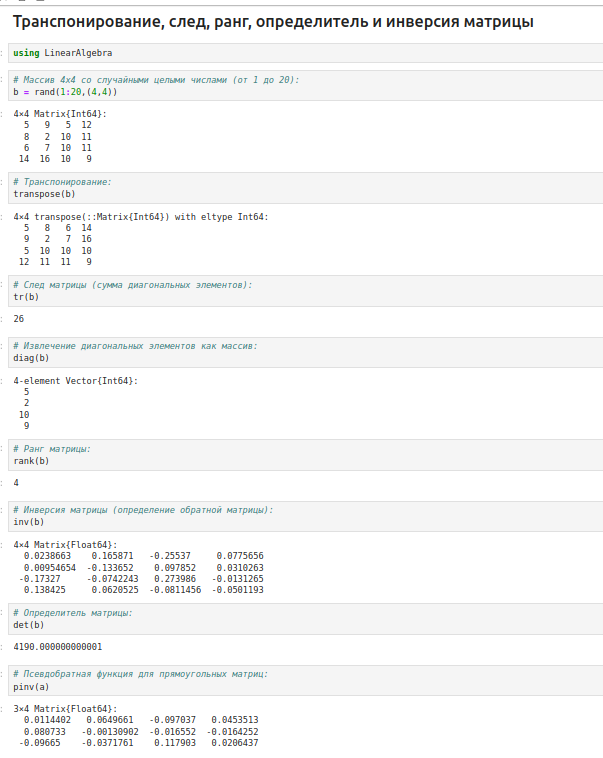
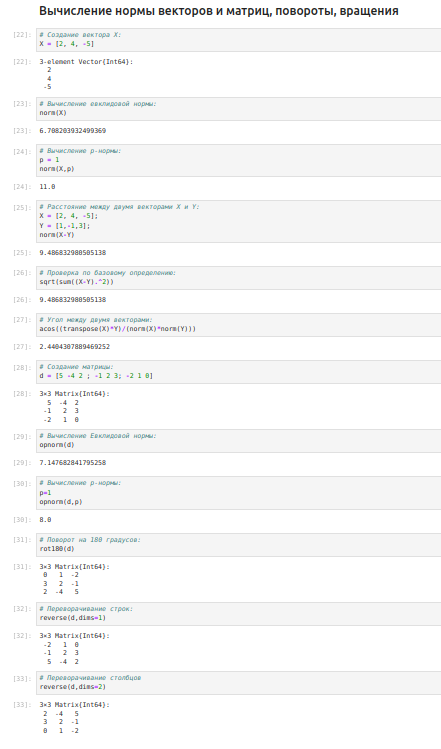
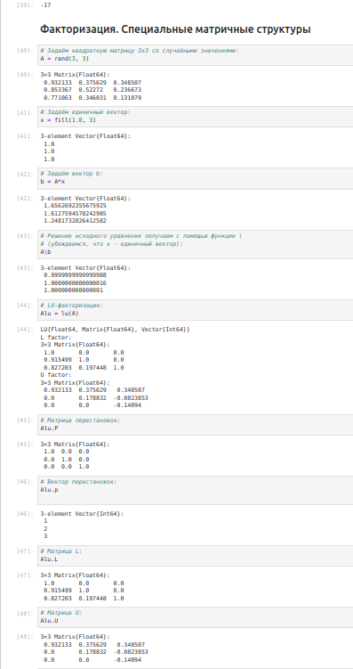
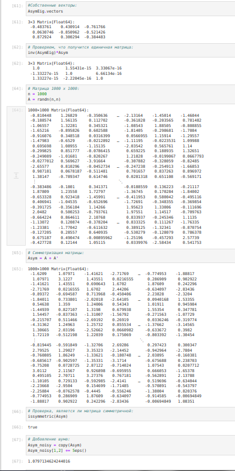
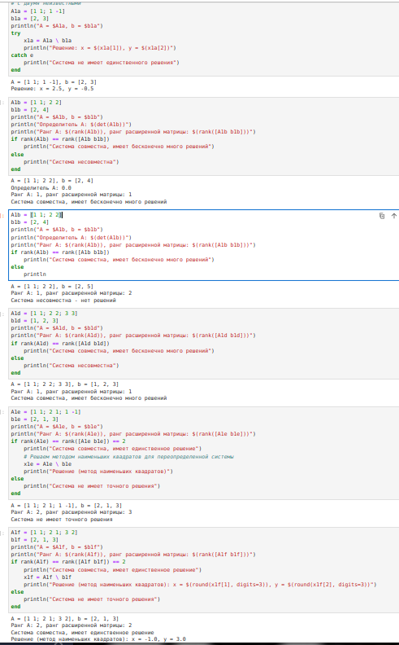
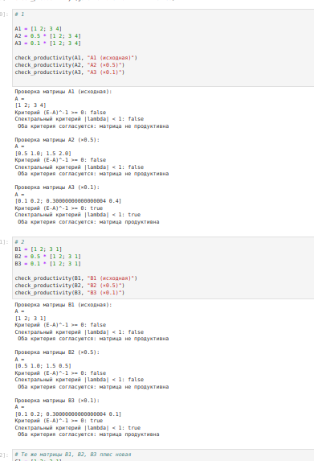

---
## Front matter
lang: ru-RU
title: Лабораторная работа № 4. Линейная алгебра.
author:
  - Абакумова О. М.
institute:
  - Российский университет дружбы народов, Москва, Россия

## i18n babel
babel-lang: russian
babel-otherlangs: english

## Formatting pdf
toc: false
toc-title: Содержание
slide_level: 2
aspectratio: 169
section-titles: true
theme: metropolis
header-includes:
 - \metroset{progressbar=frametitle,sectionpage=progressbar,numbering=fraction}
mainfont: Open Sans Light
---

# Информация

## Докладчик

:::::::::::::: {.columns align=center}
::: {.column width="40%"}

  * Абакумова Олеся Максимовна
  * Студентка
  * Российский университет дружбы народов
  * 1132220832@pfur.ru
  * <https://github.com/omabakumova>

:::
::: {.column width="30%"}

:::
::::::::::::::

# Цель работы

Основной целью работы является изучение возможностей специализированных пакетов Julia для выполнения и оценки эффективности операций над объектами линейной
алгебры.

# Задание

1. Выполнить примеры, приведенные в лабораторной работе.

2. Выполнить задания для самостоятельного выполнения

# Выполнение лабораторной работы
## Поэлементные операции над многомерными массивами

{#fig:001 width=40%}

## Транспонирование, след, ранг, определитель и инверсия матрицы

Для выполнения таких операций над матрицами, как транспонирование, диагонализация, определение следа, ранга, определителя матрицы и т.п. можно воспользоваться библиотекой (пакетом) `LinearAlgebra`.

## Транспонирование, след, ранг, определитель и инверсия матрицы

{#fig:002 width=30%}

## Вычисление нормы векторов и матриц, повороты, вращения

Евклидова норма:

$\| \vec{X} \|_2 = \sqrt{x_1^2 + x_2^2 + \ldots + x_n^2}$

p-норма:

$\| \vec{A} \|_p = \left( \sum_{i=1}^n |a_i|^p \right)^{1/p}$

## Вычисление нормы векторов и матриц, повороты, вращения

{#fig:003 width=25%}

## Матричное умножение, единичная матрица, скалярное произведение

{#fig:004 width=40%}

## Факторизация. Специальные матричные структуры

В математике факторизация (или разложение) объекта — его декомпозиция (например,числа, полинома или матрицы) в произведение других объектов или факторов, которые, будучи перемноженными, дают исходный объект.

Рассмотрим несколько примеров. Для работы со специальными матричными структурами потребуется пакет `LinearAlgebra`.

## Факторизация. Специальные матричные структуры

{#fig:005 width=25%}

## Факторизация. Специальные матричные структуры

Исходная система уравнений $Ax = b$ может быть решена или с использованием
исходной матрицы, или с использованием объекта факторизации.

## Факторизация. Специальные матричные структуры

{#fig:006 width=25%}

## Факторизация. Специальные матричные структуры

{#fig:007 width=25%}

## Факторизация. Специальные матричные структуры

Далее для оценки эффективности выполнения операций над матрицами большой
размерности и специальной структуры воспользуемся пакетом `BenchmarkTools`.

## Факторизация. Специальные матричные структуры

{#fig:008 width=25%}

## Факторизация. Специальные матричные структуры

Далее рассмотрим примеры работы с разряженными матрицами большой размерности.
Использование типов `Tridiagonal` и `SymTridiagonal` для хранения трёхдиагональных матриц позволяет работать с потенциально очень большими трёхдиагональными матрицами.

## Факторизация. Специальные матричные структуры

{#fig:009 width=40%}

## Общая линейная алгебра

Обычный способ добавить поддержку числовой линейной алгебры - это обернуть
подпрограммы `BLAS` и `LAPACK`. Собственно, для матриц с элементами `Float32`,`Float64`,
`Complex {Float32}` или `Complex {Float64}` разработчики Julia использовали такое же
решение. Однако Julia также поддерживает общую линейную алгебру, что позволяет,
например, работать с матрицами и векторами рациональных чисел.

## Общая линейная алгебра

Для задания рационального числа используется двойная косая черта: $1//2$
В следующем примере показано, как можно решить систему линейных уравнений с рациональными элементами без преобразования в типы элементов с плавающей запятой (для избежания проблемы с переполнением используем `BigInt`).

## Общая линейная алгебра

{#fig:010 width=40%}

## Задания для самостоятельного выполнения

1. 1. Задайте вектор `v`. Умножьте вектор `v` скалярно сам на себя и сохраните результат в `dot_v`.

2. Умножьте `v` матрично на себя (внешнее произведение), присвоив результат переменной `outer_v`.

## Задания для самостоятельного выполнения

{#fig:011 width=40%}

## Задания для самостоятельного выполнения

3. Решить СЛАУ с двумя неизвестными.

## Задания для самостоятельного выполнения

{#fig:012 width=25%}

## Задания для самостоятельного выполнения

4. Решить СЛАУ с тремя неизвестными.

## Задания для самостоятельного выполнения

{#fig:013 width=30%}

## Задания для самостоятельного выполнения

5. Приведите матрицы к диагональному виду.

6. Вычислите.

## Задания для самостоятельного выполнения

{#fig:014 width=40%}

## Задания для самостоятельного выполнения

7. Найдите собственные значения матрицы $A$. Создайте диагональную матрицу из собственных значений матрицы $A$. Создайте
нижнедиагональную матрицу из матрица $A$. Оцените эффективность выполняемых
операций.

## Задания для самостоятельного выполнения

{#fig:015 width=40%}

## Задания для самостоятельного выполнения

Линейная модель экономики может быть записана как СЛАУ: $x - Ax = y$ ,
где элементы матрицы $A$ и столбца $y$ — неотрицательные числа. По своему смыслу в экономике элементы матрицы $A$ и столбцов $x$, $y$ не могут быть отрицательными числами.

## Задания для самостоятельного выполнения

{#fig:016 width=40%}

## Задания для самостоятельного выполнения

8. Матрица $A$ называется продуктивной, если решение $x$ системы при любой неотрицательной правой части $y$ имеет только неотрицательные элементы $x_i$. Используя это определение, проверьте, являются ли матрицы продуктивными.

9. Критерий продуктивности: матрица $A$ является продуктивной тогда и только тогда, когда все элементы матрица: $(E-A)^-1$
являются неотрицательными числами. Используя этот критерий, проверьте, являются ли матрицы продуктивными.

## Задания для самостоятельного выполнения

{#fig:017 width=25%}

## Задания для самостоятельного выполнения

10. Спектральный критерий продуктивности: матрица $A$ является продуктивной тогда и только тогда, когда все её собственные значения по модулю меньше 1. Используя этот критерий, проверьте, являются ли матрицы продуктивными.

## Задания для самостоятельного выполнения

{#fig:018 width=40%}

# Выводы

В результате выполнения данной лабораторной работы я изучила возможности специализированных пакетов Julia для выполнения и оценки эффективности операций над объектами линейной алгебры.
