---
## Front matter
title: "Лабораторная работа № 4. Линейная алгебра"
author: "Абакумова Олеся Максимовна, НФИбд-02-22"

## Generic otions
lang: ru-RU
toc-title: "Содержание"

## Bibliography
bibliography: bib/cite.bib
csl: pandoc/csl/gost-r-7-0-5-2008-numeric.csl

## Pdf output format
toc: true # Table of contents
toc-depth: 2
lof: true # List of figures
lot: true # List of tables
fontsize: 12pt
linestretch: 1.5
papersize: a4
documentclass: scrreprt
## I18n polyglossia
polyglossia-lang:
  name: russian
  options:
	- spelling=modern
	- babelshorthands=true
polyglossia-otherlangs:
  name: english
## I18n babel
babel-lang: russian
babel-otherlangs: english
## Fonts
mainfont: IBM Plex Serif
romanfont: IBM Plex Serif
sansfont: IBM Plex Sans
monofont: IBM Plex Mono
mathfont: STIX Two Math
mainfontoptions: Ligatures=Common,Ligatures=TeX,Scale=0.94
romanfontoptions: Ligatures=Common,Ligatures=TeX,Scale=0.94
sansfontoptions: Ligatures=Common,Ligatures=TeX,Scale=MatchLowercase,Scale=0.94
monofontoptions: Scale=MatchLowercase,Scale=0.94,FakeStretch=0.9
mathfontoptions:
## Biblatex
biblatex: true
biblio-style: "gost-numeric"
biblatexoptions:
  - parentracker=true
  - backend=biber
  - hyperref=auto
  - language=auto
  - autolang=other*
  - citestyle=gost-numeric
## Pandoc-crossref LaTeX customization
figureTitle: "Рис."
tableTitle: "Таблица"
listingTitle: "Листинг"
lofTitle: "Список иллюстраций"
lotTitle: "Список таблиц"
lolTitle: "Листинги"
## Misc options
indent: true
header-includes:
  - \usepackage{indentfirst}
  - \usepackage{float} # keep figures where there are in the text
  - \floatplacement{figure}{H} # keep figures where there are in the text
---

# Цель работы

Основной целью работы является изучение возможностей специализированных пакетов Julia для выполнения и оценки эффективности операций над объектами линейной
алгебры.

# Задание

1. Выполнить примеры, приведенные в лабораторной работе.

2. Выполнить задания для самостоятельного выполнения

# Выполнение лабораторной работы
## Поэлементные операции над многомерными массивами

Для матрицы 4 × 3 рассмотрим поэлементные операции сложения и произведения её
элементов. Для работы со средними значениями можно воспользоваться возможностями пакета `Statistics` (рис. [-@fig:001]):

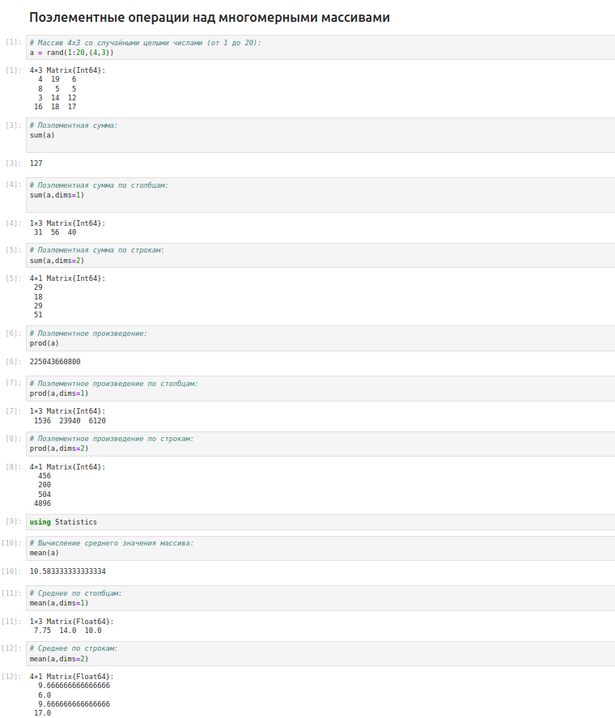{#fig:001 width=70%}

## Транспонирование, след, ранг, определитель и инверсия матрицы

Для выполнения таких операций над матрицами, как транспонирование, диагонализация, определение следа, ранга, определителя матрицы и т.п. можно воспользоваться библиотекой (пакетом) `LinearAlgebra` (рис. [-@fig:002]):

{#fig:002 width=70%}

## Вычисление нормы векторов и матриц, повороты, вращения

Евклидова норма:

$\| \vec{X} \|_2 = \sqrt{x_1^2 + x_2^2 + \ldots + x_n^2}$

p-норма:

$\| \vec{A} \|_p = \left( \sum_{i=1}^n |a_i|^p \right)^{1/p}$ 

{#fig:003 width=70%}

## Матричное умножение, единичная матрица, скалярное произведение

Рассмотрим следущие примеры в данном разделе (рис. [-@fig:004]):

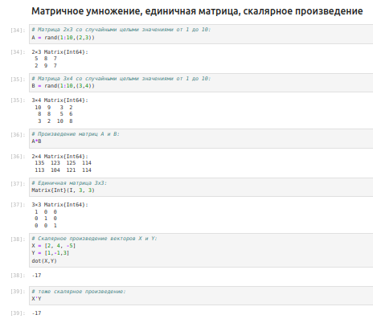{#fig:004 width=70%}

## Факторизация. Специальные матричные структуры

В математике факторизация (или разложение) объекта — его декомпозиция (например,числа, полинома или матрицы) в произведение других объектов или факторов, которые, будучи перемноженными, дают исходный объект.

Рассмотрим несколько примеров. Для работы со специальными матричными структурами потребуется пакет `LinearAlgebra` (рис. [-@fig:005]):

{#fig:005 width=70%}

Исходная система уравнений $Ax = b$ может быть решена или с использованием
исходной матрицы, или с использованием объекта факторизации (рис. [-@fig:006]):

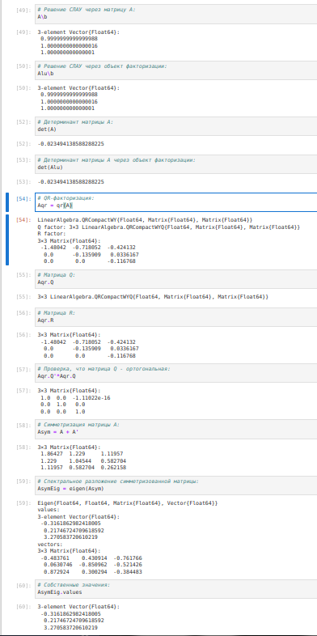{#fig:006 width=70%}

Далее рассмотрим примеры работы с матрицами большой размерности и специальной
структуры (рис. [-@fig:007]):

{#fig:007 width=70%}

Далее для оценки эффективности выполнения операций над матрицами большой
размерности и специальной структуры воспользуемся пакетом `BenchmarkTools` (рис. [-@fig:008]):

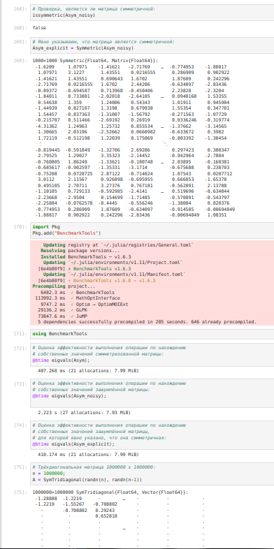{#fig:008 width=70%}

Далее рассмотрим примеры работы с разряженными матрицами большой размерности(рис. [-@fig:008]).
Использование типов `Tridiagonal` и `SymTridiagonal` для хранения трёхдиагональных матриц позволяет работать с потенциально очень большими трёхдиагональными матрицами (рис. [-@fig:009]):

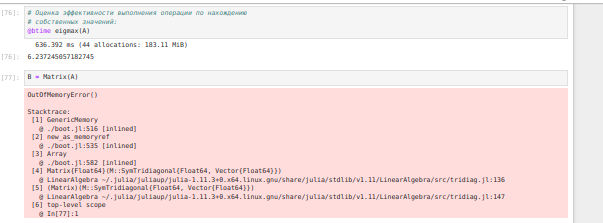{#fig:009 width=70%}

При попытке задать подобную матрицу обычным способом и посчитать её собственные
значения, вы скорее всего получите ошибку переполнения памяти.

## Общая линейная алгебра

Обычный способ добавить поддержку числовой линейной алгебры - это обернуть
подпрограммы `BLAS` и `LAPACK`. Собственно, для матриц с элементами `Float32`,`Float64`,
`Complex {Float32}` или `Complex {Float64}` разработчики Julia использовали такое же
решение. Однако Julia также поддерживает общую линейную алгебру, что позволяет,
например, работать с матрицами и векторами рациональных чисел.
Для задания рационального числа используется двойная косая черта: $1//2$
В следующем примере показано, как можно решить систему линейных уравнений с рациональными элементами без преобразования в типы элементов с плавающей запятой (для избежания проблемы с переполнением используем `BigInt`) (рис. [-@fig:010]).

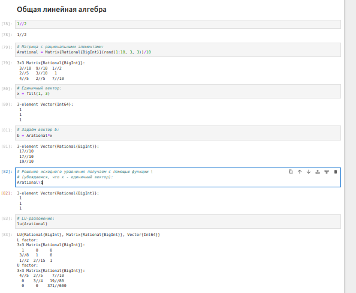{#fig:010 width=70%}

## Задания для самостоятельного выполнения

### Произведения векторов

1. 1. Задайте вектор `v`. Умножьте вектор `v` скалярно сам на себя и сохраните результат в `dot_v`(рис. [-@fig:011]).

2. Умножьте `v` матрично на себя (внешнее произведение), присвоив результат переменной `outer_v` (рис. [-@fig:011]).

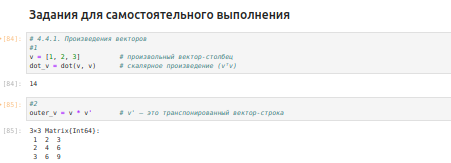{#fig:011 width=70%}

### Системы линейных уравнений

1. Решить СЛАУ с двумя неизвестными (рис. [-@fig:012]):

{#fig:012 width=70%}

2. Решить СЛАУ с тремя неизвестными (рис. [-@fig:013]).

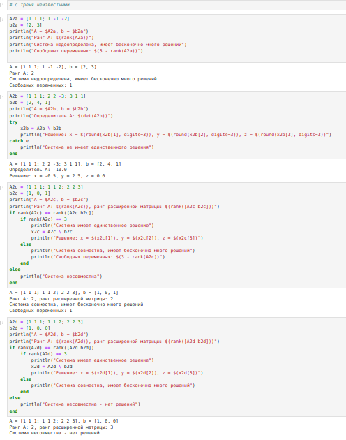{#fig:013 width=70%}

### Операции с матрицами

1. Приведите матрицы к диагональному виду (рис. [-@fig:014]).

2. Вычислите (рис. [-@fig:014]).

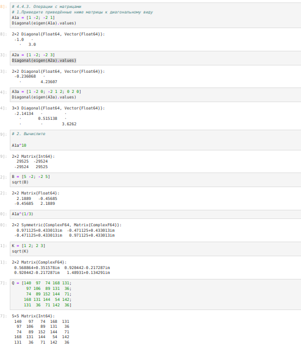{#fig:014 width=70%}

3. Найдите собственные значения матрицы $A$ (рис. [-@fig:014]). Создайте диагональную матрицу из собственных значений матрицы $A$. Создайте
нижнедиагональную матрицу из матрица $A$. Оцените эффективность выполняемых
операций (рис. [-@fig:015]):

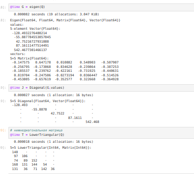{#fig:015 width=70%}

### Линейные модели экономики

Линейная модель экономики может быть записана как СЛАУ: $x - Ax = y$ ,
где элементы матрицы $A$ и столбца $y$ — неотрицательные числа. По своему смыслу в экономике элементы матрицы $A$ и столбцов $x$, $y$ не могут быть отрицательными числами (рис. [-@fig:016])

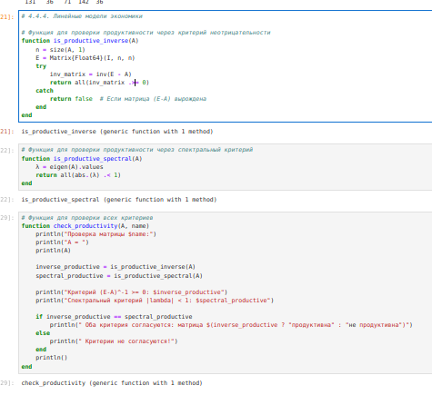{#fig:016 width=70%}

1. Матрица $A$ называется продуктивной, если решение $x$ системы при любой неотрицательной правой части $y$ имеет только неотрицательные элементы $x_i$. Используя это определение, проверьте, являются ли матрицы продуктивными(рис. [-@fig:017]).

2. Критерий продуктивности: матрица $A$ является продуктивной тогда и только тогда, когда все элементы матрица: $(E-A)^-1$
являются неотрицательными числами. Используя этот критерий, проверьте, являются ли матрицы продуктивными (рис. [-@fig:017]).

{#fig:017 width=70%}

3. Спектральный критерий продуктивности: матрица $A$ является продуктивной тогда и только тогда, когда все её собственные значения по модулю меньше 1. Используя этот критерий, проверьте, являются ли матрицы продуктивными (рис. [-@fig:018]).

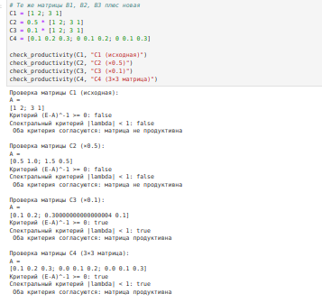{#fig:018 width=70%}

# Выводы

В результате выполнения данной лабораторной работы я изучила возможности специализированных пакетов Julia для выполнения и оценки эффективности операций над объектами линейной алгебры.
