---
## Front matter
lang: ru-RU
title: Лабораторная работа № 5. Построение графиков
author:
  - Абакумова О. М.
institute:
  - Российский университет дружбы народов, Москва, Россия

## i18n babel
babel-lang: russian
babel-otherlangs: english

## Formatting pdf
toc: false
toc-title: Содержание
slide_level: 2
aspectratio: 169
section-titles: true
theme: metropolis
header-includes:
 - \metroset{progressbar=frametitle,sectionpage=progressbar,numbering=fraction}
mainfont: Open Sans Light
---

# Информация

## Докладчик

:::::::::::::: {.columns align=center}
::: {.column width="70%"}

  * Абакумова Олеся Максимовна
  * Студентка
  * Российский университет дружбы народов
  * 1132220832@pfur.ru
  * <https://github.com/omabakumova>

:::
::: {.column width="30%"}

:::
::::::::::::::

# Цель работы

Основная цель работы — освоить синтаксис языка Julia для построения графиков.

# Задание

1. Выполнить примеры, приведенные в лабораторной работе.

2. Выполнить задания для самостоятельного выполнения

# Выполнение лабораторной работы

## Предварительные сведения

Julia поддерживает несколько пакетов для работы с графиками. Использование того или иного пакета зависит от целей, преследуемых пользователем при построении.
Стандартным для Julia является пакет `Plots.jl`.

## Предварительные сведения

Одним из преимуществ `Plots.jl` является то, что он позволяет легко менять вызов библиотек работы с графикой: `(gr (), pyplot (), plotlyjs ())`.
Далее рассмотрим построение графика функции $f(x) = (3x^2 + 6x - 9)e^{-0.3x}$ разными способами. Фактически для построения графика функции требуется иметь массив соответствующих значений $x$ и $y$.

## Предварительные сведения

{#fig:001 width=40%}

## Предварительные сведения

{#fig:002 width=40%}

## Предварительные сведения

{#fig:003 width=40%}

## Предварительные сведения

{#fig:004 width=40%}

## Предварительные сведения

{#fig:005 width=40%}

## Опции при построении графика

Далее на примере графика функции $sin(x)$ и графика разложения этой функции в ряд
Тейлора:

$$
\sin x = x - \frac{x^{3}}{3!} + \frac{x^{5}}{5!} - \dots
       = \sum_{n=0}^{\infty} (-1)^{n} \frac{x^{2n+1}}{(2n+1)!},
       \qquad x\in\mathbb{C}
$$

рассмотрим дополнительные возможности пакетов для работы с графикой.

## Опции при построении графика

{#fig:006 width=40%}

## Опции при построении графика

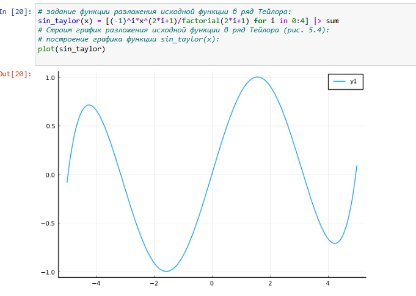{#fig:007 width=40%}

## Опции при построении графика

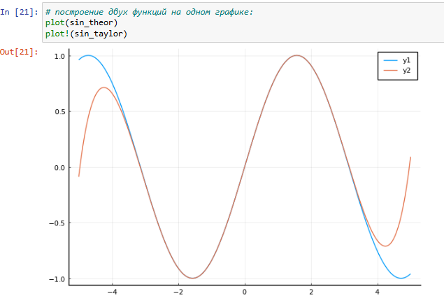{#fig:008 width=40%}

## Опции при построении графика

{#fig:009 width=40%}

## Опции при построении графика

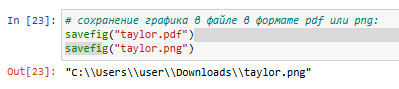{#fig:010 width=40%}

## Точечный график

Графики в виде точек на плоскости или в пространстве часто используются в статистических исследованиях.

## Точечный график

{#fig:011 width=40%}

## Точечный график

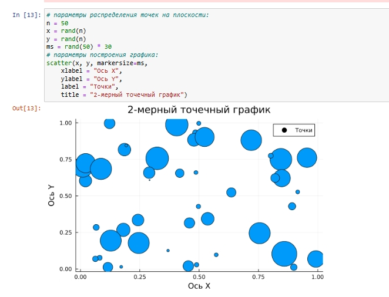{#fig:012 width=40%}

## Точечный график

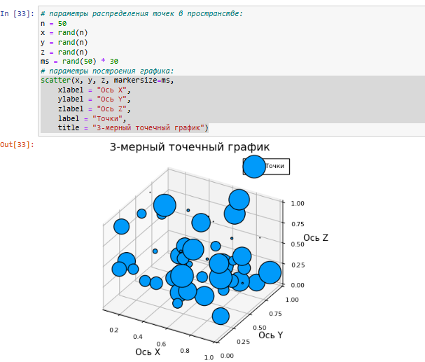{#fig:013 width=40%}

## Аппроксимация данных

Аппроксимация — научный метод, состоящий в замене объектов их более простыми
аналогами, сходными по своим свойствам.
Пусть на некотором отрезке в точках $(x_0, x_1, x_2, \dots, x_N)$ известны значения некоторой функции $f(x)$, а именно $(y_0, y_1, y_2, \dots, y_N)$.

## Аппроксимация данных

Требуется определить параметры $a_i$ многочлена
вида вида $F(x) = a_0 + a_1 x + \dots + a_k x^k$, де $k < N$ такое, что сумма квадратов отклонений значений $y$ от значений функции $F(y)$ в заданных точках $x$ минимальна, т.е.

$$
S = \sum_{i=0}^{N} \bigl[y_i - F(x_i, a_0, a_1, \dots, a_k)\bigr]^2 \to \min
$$

## Аппроксимация данных

Геометрически это означает, что нужно найти кривую $y = F(x)$, полином которой
проходит как можно ближе к каждой из заданных точек.
Такая задача может быть решена, если решить систему уравнений вида:
$$
A\vec{x} = \vec{y},
$$ 
где $A$ — матрица коэффициентов многочлена $F(x)$, а $\vec{x}$ и $\vec{y}$ — векторы соответствующих значений. Для демонстрации зададим искусственно некоторую функцию, в данном случае похожую по поведению на экспоненту

## Аппроксимация данных

{#fig:014 width=40%}

## Аппроксимация данных

{#fig:015 width=40%}

## Две оси ординат

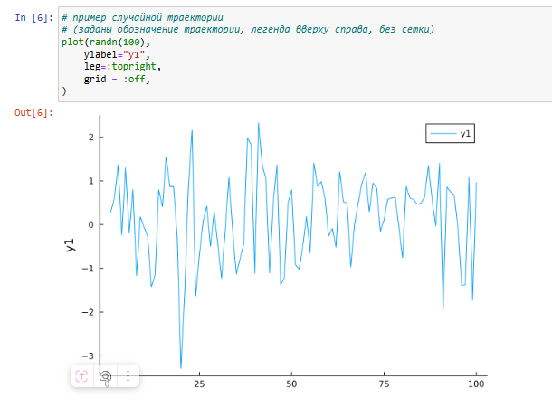{#fig:016 width=40%}

## Две оси ординат

{#fig:017 width=40%}

## Полярные координаты

Приведём пример построения графика функции 

$$
r(\vartheta) = 1 + \cos \vartheta \cdot \sin^2 \vartheta
$$

в полярных координатах.

## Полярные координаты

{#fig:018 width=40%}

## Параметрический график

При параметрическом представлении графика некоторой функции координаты на
графике задаются как функции от некоторого набора свободных параметров. В случае
одного параметра получим параметрическое уравнение кривой. Выражая координаты
точек поверхности через два свободных параметра, получим параметрическое задание поверхности.

## Параметрический график

Приведём пример построения графика параметрически заданной кривой на плоскости. Кривая задана выражениями 
 
$$
\begin{aligned}
x(t) &= \sin(t), \\
y(t) &= \sin(2t),
\end{aligned}
\qquad 0 \leq t \leq 2\pi
$$

## Параметрический график

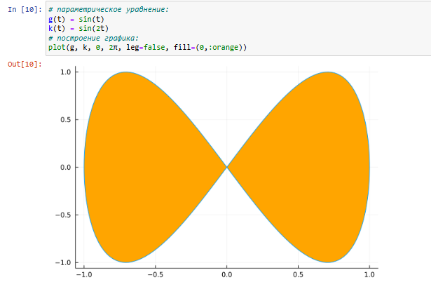{#fig:019 width=40%}

## Параметрический график

Приведём пример построения графика параметрически заданной кривой в пространстве. Кривая задана выражениями:
$$
x(t) = \cos(t),\quad
y(t) = \sin(t),\quad
z(t) = \sin(5t).
$$

## Параметрический график

{#fig:020 width=40%}

## График поверхности

Для построения поверхности, заданной уравнением $f(x,y) = x^2 + y^2$, можно воспользоваться функцией `surface()`

## График поверхности

{#fig:021 width=40%}

## График поверхности

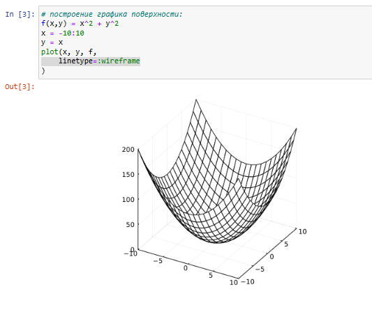{#fig:022 width=40%}

## График поверхности

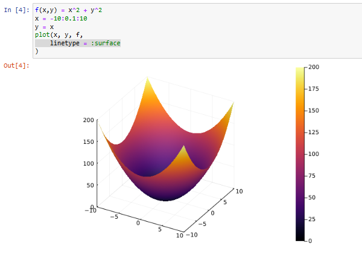{#fig:023 width=40%}

## График поверхности

{#fig:024 width=40%}

## Линии уровня

Линией уровня некоторой функции от двух переменных называется множество точек
на координатной плоскости, в которых функция принимает одинаковые значения. Линий уровня бесконечно много, и через каждую точку области определения можно провестилинию уровня.

## Линии уровня

С помощью линий уровня можно определить наибольшее и наименьшее значение
исходной функции от двух переменных. Каждая из этих линий соответствует определённому значению высоты.

Поверхности уровня представляют собой непересекающиеся пространственные поверхности.

## Линии уровня

$$
g(x, y) = (3x + y^2)\left|\sin(x) + \cos(y)\right|
$$

## Линии уровня

{#fig:026 width=40%}

## Линии уровня

{#fig:027 width=40%}

## Векторные поля

Если каждой точке некоторой области пространства поставлен в соответствие вектор с началом в данной точке, то говорят, что в этой области задано векторное поле.

Векторные поля задают векторными функциями. Для функции $h(x, y) = x^3 - 3x + y^2$ сначала построим её график и линии уровня.

## Векторные поля

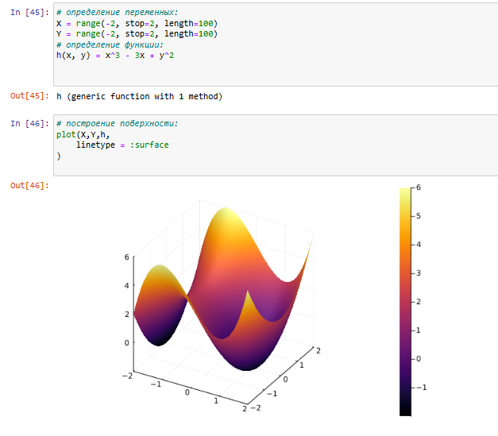{#fig:028 width=40%}

## Векторные поля

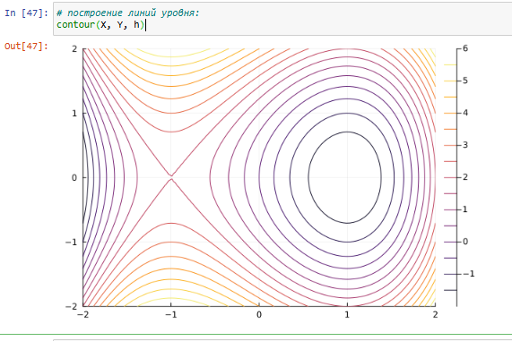{#fig:029 width=40%}

## Векторные поля

Векторное поле можно охарактеризовать векторными линиями. Каждая точка векторной линии является началом вектора поля, который лежит на касательной в данной точке.

Для заданной функции построим векторное поле.

## Векторные поля

{#fig:030 width=40%}

## Векторные поля

{#fig:031 width=40%}

## Анимация

Технически анимированное изображение представляет собой несколько наложенных
изображений (или построенных в разных точках графиках) в одном файле.

## Анимация

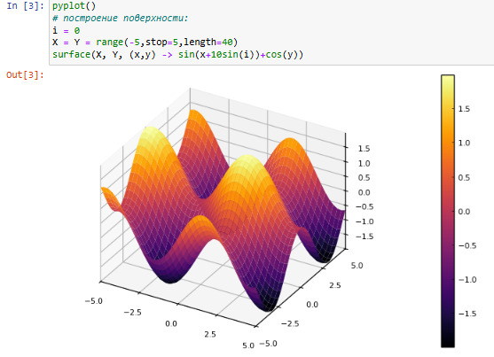{#fig:032 width=40%}

## Анимация

{#fig:033 width=40%}

## Гипоциклоида

Гипоциклоида — плоская кривая, образуемая точкой окружности, катящейся по внутренней стороне другой окружности без скольжения:

$$
\begin{aligned}
x &= r(k-1) \left( \cos t + \frac{\cos((k-1)t)}{k-1} \right), \\
y &= r(k-1) \left( \sin t - \frac{\sin((k-1)t)}{k-1} \right),
\end{aligned}
$$

где $k = \frac{R}{r}$, $R$ — радиус неподвижной окружности, $r$ — радиус катящейся окружности.
Модуль величины $k$ определяет форму гипоциклоиды.

## Гипоциклоида

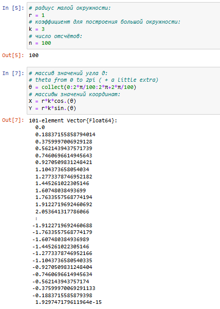{#fig:034 width=40%}

## Гипоциклоида

{#fig:035 width=40%}

## Гипоциклоида

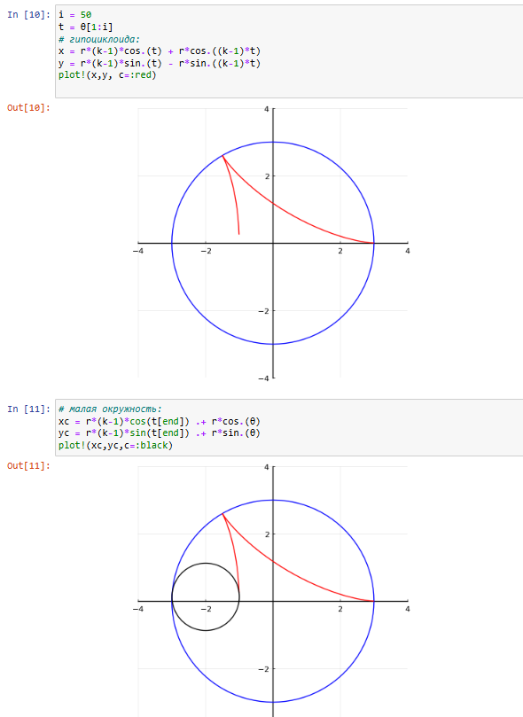{#fig:036 width=40%}

## Гипоциклоида

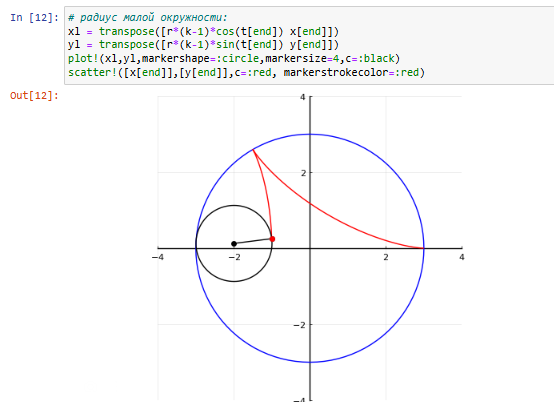{#fig:037 width=40%}

## Гипоциклоида

{#fig:038 width=40%} 

## Гипоциклоида

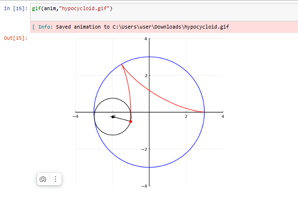{#fig:039 width=40%} 

## Errorbars

В исследованиях часто требуется изобразить графики погрешностей измерения.

## Errorbars

{#fig:040 width=40%} 

## Errorbars

{#fig:041 width=40%} 

## Errorbars

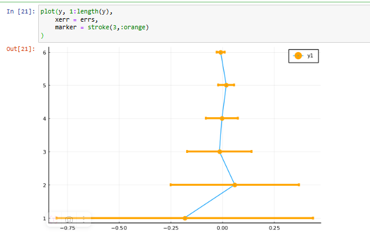{#fig:042 width=40%} 

## Errorbars

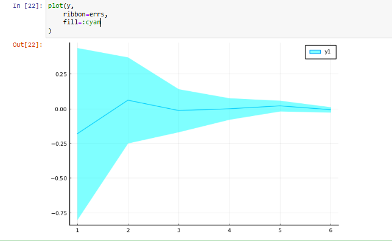{#fig:043 width=40%}

## Errorbars

{#fig:044 width=40%}

## Errorbars

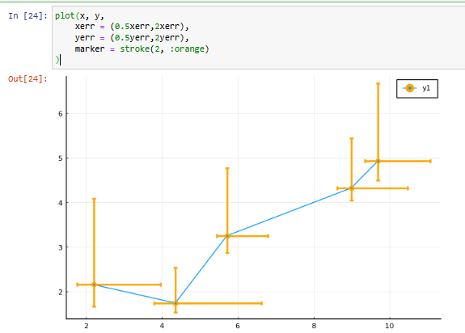{#fig:045 width=40%}

## Использование пакета Distributions

{#fig:046 width=40%}

## Использование пакета Distributions

{#fig:047 width=40%}

## Использование пакета Distributions

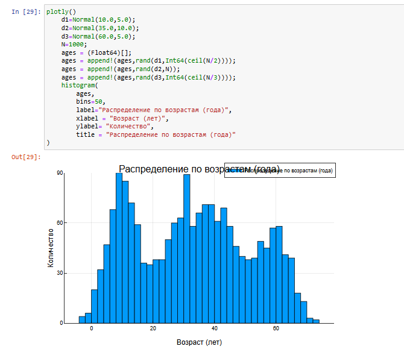{#fig:048 width=40%}

## Подграфики 

Определим макет расположения графиков. Команда layout принимает кортеж `layout = (N, M)`, который строит сетку графиков `NxM`. Например, если задать `layout = (4,1)` на графике четыре серии, то получим четыре ряда графиков, для автоматического вычисления сетки необходимо передать layout целое число

## Подграфики 

{#fig:049 width=40%} 

## Подграфики 

{#fig:050 width=40%} 

## Подграфики 

Аргумент `heights` принимает в качестве входных данных массив с долями желае-
мых высот. Если в сумме дроби не составляют 1,0, то некоторые подзаголовки могут отображаться неправильно.

## Подграфики 

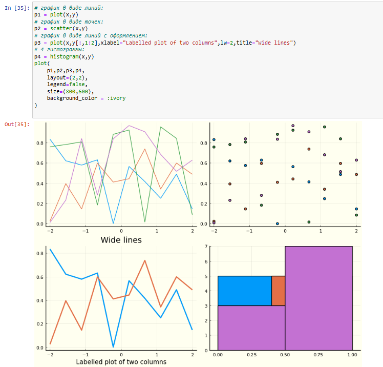{#fig:051 width=40%} 

## Подграфики 

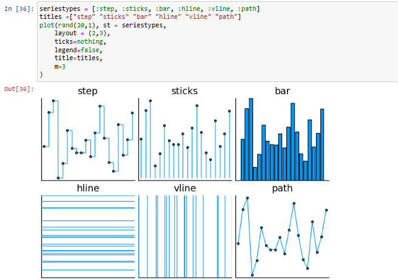{#fig:052 width=40%} 

## Подграфики 

Применение макроса `@layout` наиболее простой способ определения сложных макетов.
Точные размеры могут быть заданы с помощью фигурных скобок, в противном случае пространство будет поровну разделено между графиками 

## Подграфики 

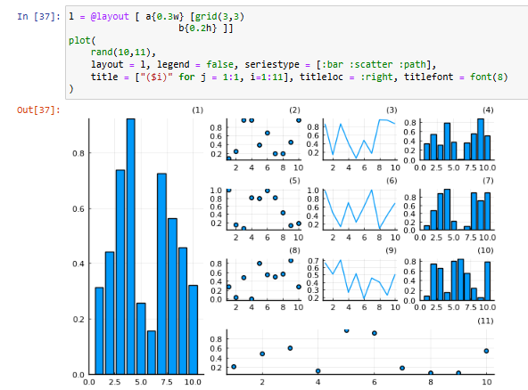{#fig:053 width=40%} 

## Задания для самостоятельного выполнения

1. Постройте все возможные типы графиков (простые, точечные, гистограммы и т.д.) функции функции $y = \sin(x)$, где $x \in [0, 2\pi]$. Отобразите все графики в одном графическом окне

## Задания для самостоятельного выполнения

![Все возможные типы графиков функции $y = \sin(x)$, где $x \in [0, 2\pi]$](image/54.png){#fig:054 width=40%}

## Задания для самостоятельного выполнения

2. Постройте графики функции $y = \sin(x)$, где $x \in [0, 2\pi]$ со всеми возможными (сколько сможете вспомнить) типами оформления линий графика. Отобразите все графики в одном графическом окне 

## Задания для самостоятельного выполнения

![Демонстрация всех типов линий графика для функции $y = \sin(x)$, где $x \in [0, 2\pi]$](image/55.png){#fig:055 width=40%}

## Задания для самостоятельного выполнения
 
3. Постройте график функции $y(x) = \pi x^2 \ln(x)$, назовите оси соответственно. Пусть
цвет рамки будет зелёным, а цвет самого графика — красным. Задайте расстояние
между надписями и осями так, чтобы надписи полностью умещались в графическом
окне. Задайте шрифт надписей. Задайте частоту отметок на осях координат 

## Задания для самостоятельного выполнения

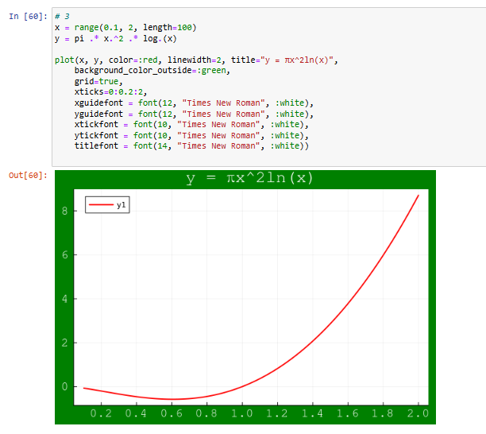{#fig:056 width=40%}

## Задания для самостоятельного выполнения

4. Задайте вектор $x = (-2, -2, 0, 1, 2)$. В одном графическом окне (в 4-х подокнах)
изобразите графически по точкам $x$ значения функции $y(x) = x^3 - 3x$ в виде:

- точек,

- линий,

- линий и точек,

- кривой.

Сохраните полученные изображения в файле `figure_familiya.png`, где вместо
`familiya` укажите вашу фамилию 

## Задания для самостоятельного выполнения

{#fig:057 width=40%}

## Задания для самостоятельного выполнения

5. Задайте вектор $x = (3, 3.1, 3.2, … , 6)$. Постройте графики функций $y_1(x) = \pi x$
и $y_2(x) = \exp(x) \cos(x)$ в указанном диапазоне значений аргумента $x$ следующимобразом:

- постройте оба графика разного цвета на одном рисунке, добавьте легенду и сетку для каждого графика; укажите недостатки у данного построения 

## Задания для самостоятельного выполнения

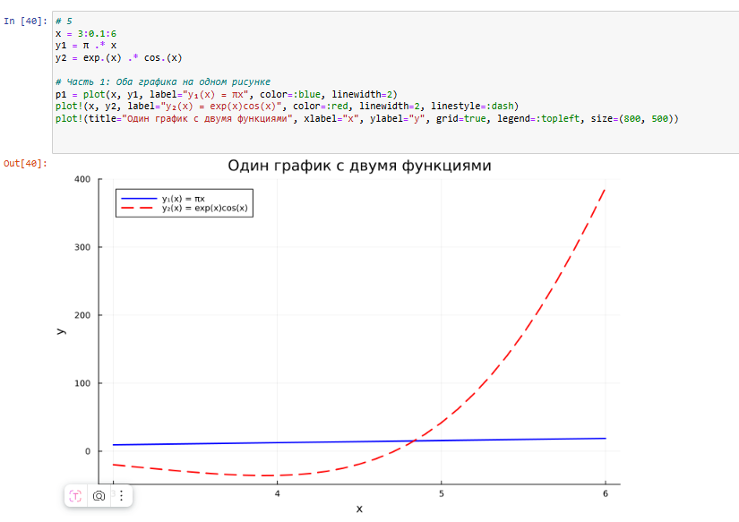{#fig:058 width=40%}

## Задания для самостоятельного выполнения

Недостатки первого построения:

- Функции имеют разные масштабы (y1 ~ 10, y2 ~ ±200), что делает один график почти незаметным.

- Трудно сравнивать поведение функций из-за разных порядков величин.

## Задания для самостоятельного выполнения

- постройте аналогичный график с двумя осями ординат 

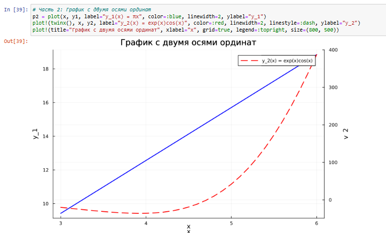{#fig:059 width=40%}

## Задания для самостоятельного выполнения

6. Постройте график некоторых экспериментальных данных (придумайте сами), учитывая ошибку измерения 

## Задания для самостоятельного выполнения

{#fig:060 width=40%}

## Задания для самостоятельного выполнения

7. Постройте точечный график случайных данных. Подпишите оси, легенду, название графика 

## Задания для самостоятельного выполнения

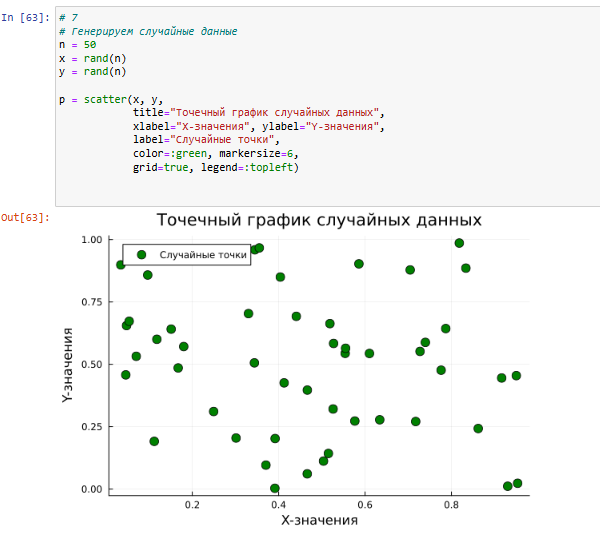{#fig:061 width=40%}

## Задания для самостоятельного выполнения

8. Постройте 3-мерный точечный график случайных данных. Подпишите оси, легенду, название графика

## Задания для самостоятельного выполнения

{#fig:062 width=40%}

## Задания для самостоятельного выполнения

9. Создайте анимацию с построением синусоиды. То есть вы строите последовательность
графиков синусоиды, постепенно увеличивая значение аргумента. После соедините
их в анимацию 

## Задания для самостоятельного выполнения

{#fig:063 width=40%}

## Задания для самостоятельного выполнения

10. Постройте анимированную гипоциклоиду для 2 целых значений модуля $k$ и 2 рациональных значений модуля $k$ 

## Задания для самостоятельного выполнения

{#fig:064 width=40%}

## Задания для самостоятельного выполнения

11. Постройте анимированную эпициклоиду для 2 целых значений модуля $k$ и 2 рациональных значений модуля $k$ 

## Задания для самостоятельного выполнения

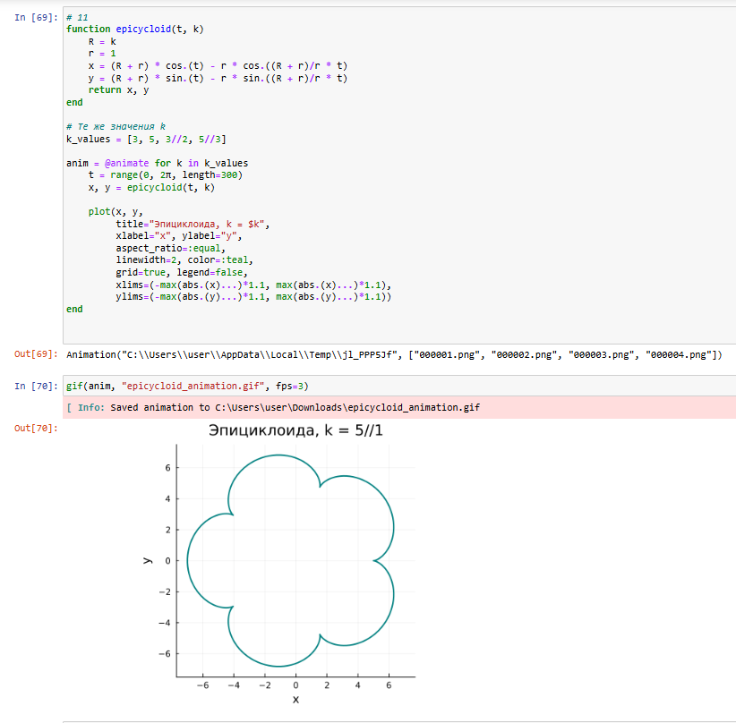{#fig:065 width=40%}

# Выводы

В результате выполнения данной лабораторной работы я освоила синтаксис языка Julia для построения графиков.
