---
## Front matter
title: "Лабораторная работа № 5. Построение графиков"
author: "Абакумова Олеся Максимовна, НФИбд-02-22"

## Generic otions
lang: ru-RU
toc-title: "Содержание"

## Bibliography
bibliography: bib/cite.bib
csl: pandoc/csl/gost-r-7-0-5-2008-numeric.csl

## Pdf output format
toc: true # Table of contents
toc-depth: 2
lof: true # List of figures
lot: true # List of tables
fontsize: 12pt
linestretch: 1.5
papersize: a4
documentclass: scrreprt
## I18n polyglossia
polyglossia-lang:
  name: russian
  options:
	- spelling=modern
	- babelshorthands=true
polyglossia-otherlangs:
  name: english
## I18n babel
babel-lang: russian
babel-otherlangs: english
## Fonts
mainfont: IBM Plex Serif
romanfont: IBM Plex Serif
sansfont: IBM Plex Sans
monofont: IBM Plex Mono
mathfont: STIX Two Math
mainfontoptions: Ligatures=Common,Ligatures=TeX,Scale=0.94
romanfontoptions: Ligatures=Common,Ligatures=TeX,Scale=0.94
sansfontoptions: Ligatures=Common,Ligatures=TeX,Scale=MatchLowercase,Scale=0.94
monofontoptions: Scale=MatchLowercase,Scale=0.94,FakeStretch=0.9
mathfontoptions:
## Biblatex
biblatex: true
biblio-style: "gost-numeric"
biblatexoptions:
  - parentracker=true
  - backend=biber
  - hyperref=auto
  - language=auto
  - autolang=other*
  - citestyle=gost-numeric
## Pandoc-crossref LaTeX customization
figureTitle: "Рис."
tableTitle: "Таблица"
listingTitle: "Листинг"
lofTitle: "Список иллюстраций"
lotTitle: "Список таблиц"
lolTitle: "Листинги"
## Misc options
indent: true
header-includes:
  - \usepackage{indentfirst}
  - \usepackage{float} # keep figures where there are in the text
  - \floatplacement{figure}{H} # keep figures where there are in the text
---


# Цель работы

Основная цель работы — освоить синтаксис языка Julia для построения графиков.

# Задание

1. Выполнить примеры, приведенные в лабораторной работе.

2. Выполнить задания для самостоятельного выполнения

# Выполнение лабораторной работы

## Предварительные сведения

### Основные пакеты для работы с графиками в Julia

Julia поддерживает несколько пакетов для работы с графиками. Использование того или иного пакета зависит от целей, преследуемых пользователем при построении.
Стандартным для Julia является пакет `Plots.jl`.
Перед использованием графических пакетов следует их установить и подключить
в Julia:

```julia
using Pkg
Pkg.add("Plots")
Pkg.add("PyPlot")
Pkg.add("Plotly")
Pkg.add("UnicodePlots")
# подключаем для использования Plots:
using Plots
```

Одним из преимуществ `Plots.jl` является то, что он позволяет легко менять вызов библиотек работы с графикой: `(gr (), pyplot (), plotlyjs ())`.
Далее рассмотрим построение графика функции $f(x) = (3x^2 + 6x - 9)e^{-0.3x}$ разными способами. Фактически для построения графика функции требуется иметь массив соответствующих значений $x$ и $y$.
Зададим исходную функцию (используются поэлементные операции над векторами)(рис. [-@fig:001]):

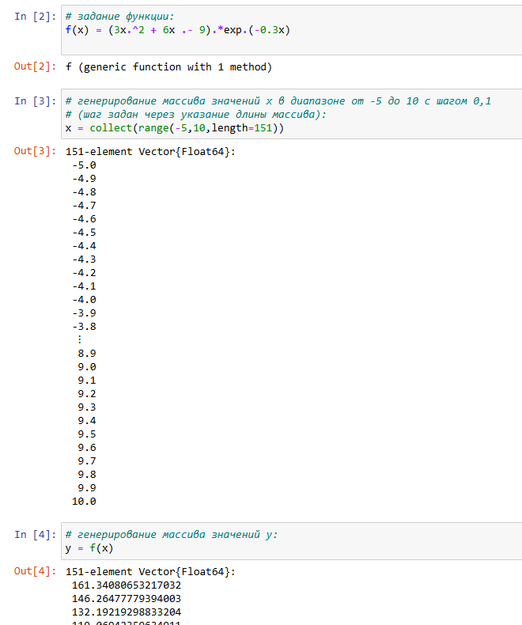{#fig:001 width=70%}

Далее показано сравнение построения графиков при использовании разных
программно-аппаратных частей `Plots.jl`.
По умолчанию используется `gr()`(рис. [-@fig:002]):

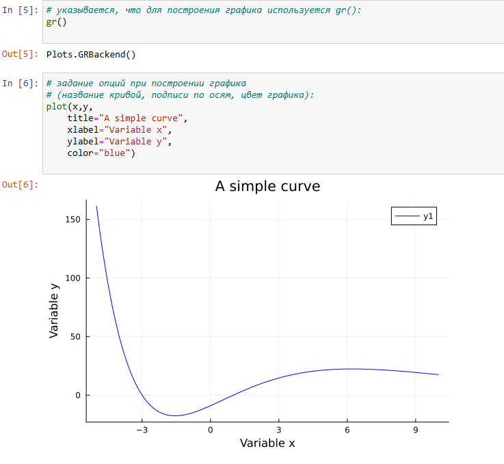{#fig:002 width=70%}

Если требуется, чтобы на графике были надписи на русском языке, то лучше воспользоваться `pyplot()` (рис. [-@fig:003]):

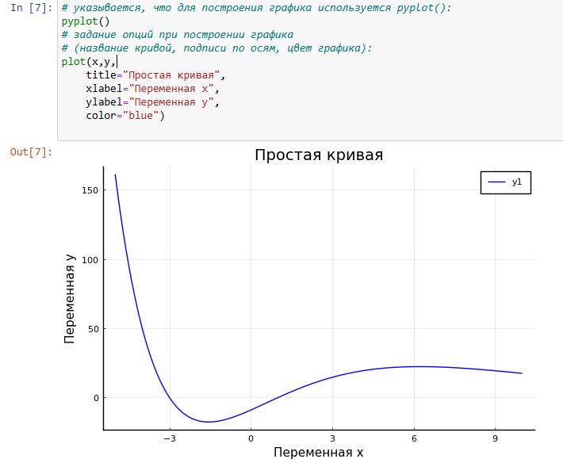{#fig:003 width=70%}

В качестве упражнения построим график функции $f(x) = (3x^2 + 6x - 9)e^{-0.3x}$ при помощи plotly() и unicodeplots() (рис. [-@fig:004]):

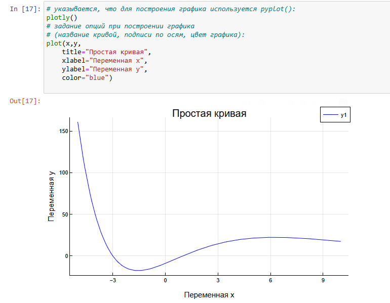{#fig:004 width=70%}

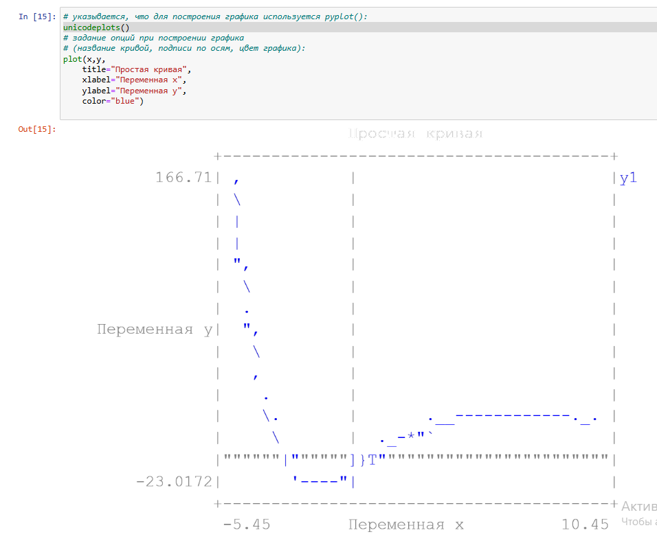{#fig:005 width=70%}

### Опции при построении графика

Далее на примере графика функции $sin(x)$ и графика разложения этой функции в ряд
Тейлора:

$$
\sin x = x - \frac{x^{3}}{3!} + \frac{x^{5}}{5!} - \dots
       = \sum_{n=0}^{\infty} (-1)^{n} \frac{x^{2n+1}}{(2n+1)!},
       \qquad x\in\mathbb{C}
$$

рассмотрим дополнительные возможности пакетов для работы с графикой.
Используем `pyplot()` (рис. [-@fig:006]):

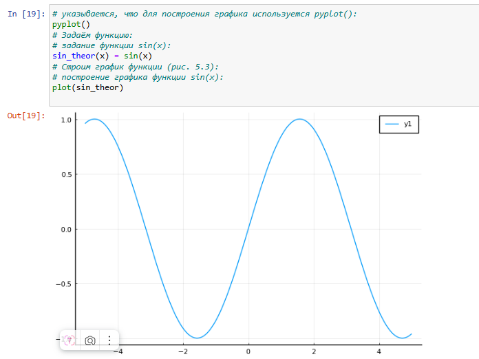{#fig:006 width=70%}

Задаём разложение исходной функции в ряд Тейлора. Строим график разложения исходной функции в ряд Тейлора (рис. [-@fig:007]):

{#fig:007 width=70%}

 Выводим две функции на один график (рис. [-@fig:008]):

{#fig:008 width=70%}

Далее добавим различные опции для отображения на графике (рис. [-@fig:009]):

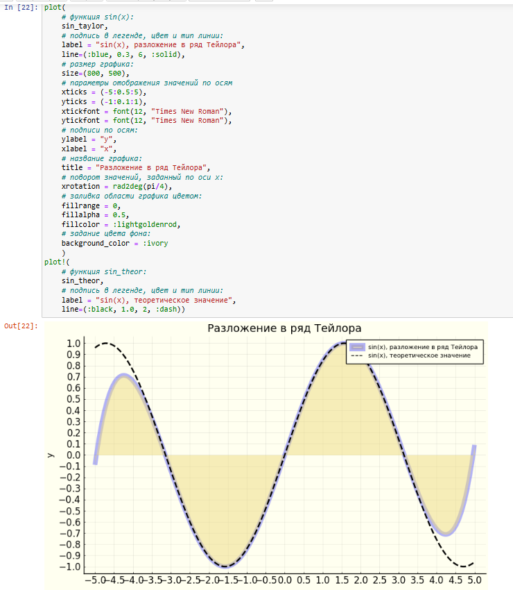{#fig:009 width=70%}

Для сохранения построенного графика в определённом формате можно использовать
функцию `savefig()` (рис. [-@fig:010]):

{#fig:010 width=70%}

### Точечный график

Графики в виде точек на плоскости или в пространстве часто используются в статистических исследованиях.

#### Простой точечный график

Как и построении обычного графика для точечного графика необходимо задать массив значений $x$, посчитать или задать значения $y$, задать опции построения графика (рис. [-@fig:011]):

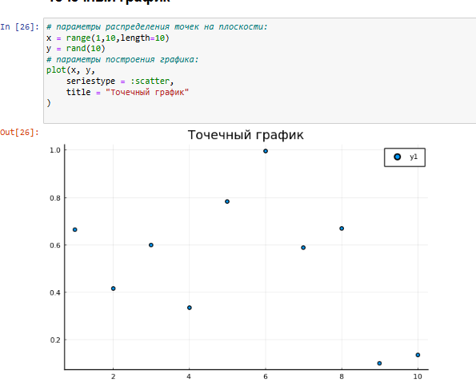{#fig:011 width=70%}

#### Точечный график с кодированием значения размером точки

Для точечного графика можно задать различные опции, например размер маркера,
его тип, цвет и и т.п (рис. [-@fig:012]):

{#fig:012 width=70%}

#### 3-мерный точечный график с кодированием значения размером точки

Можно строить и 3-мерные точечные графики (рис. [-@fig:013]):

{#fig:013 width=70%}

Также выше в качестве упражнения был дополнен код построения точечных графиков, подписаны оси, добавлены легенду и название (рис. [-@fig:012]) и (рис. [-@fig:013]).


### Аппроксимация данных

Аппроксимация — научный метод, состоящий в замене объектов их более простыми
аналогами, сходными по своим свойствам.
Пусть на некотором отрезке в точках $(x_0, x_1, x_2, \dots, x_N)$ известны значения некоторой функции $f(x)$, а именно $(y_0, y_1, y_2, \dots, y_N)$.
Требуется определить параметры $a_i$ многочлена
вида вида $F(x) = a_0 + a_1 x + \dots + a_k x^k$, де $k < N$ такое, что сумма квадратов отклонений значений $y$ от значений функции $F(y)$ в заданных точках $x$ минимальна, т.е.

$$
S = \sum_{i=0}^{N} \bigl[y_i - F(x_i, a_0, a_1, \dots, a_k)\bigr]^2 \to \min
$$

Геометрически это означает, что нужно найти кривую $y = F(x)$, полином которой
проходит как можно ближе к каждой из заданных точек.
Такая задача может быть решена, если решить систему уравнений вида:
$$
A\vec{x} = \vec{y},
$$ 
где $A$ — матрица коэффициентов многочлена $F(x)$, а $\vec{x}$ и $\vec{y}$ — векторы соответствующих значений. Для демонстрации зададим искусственно некоторую функцию, в данном случае похожую по поведению на экспоненту (рис. [-@fig:014]):

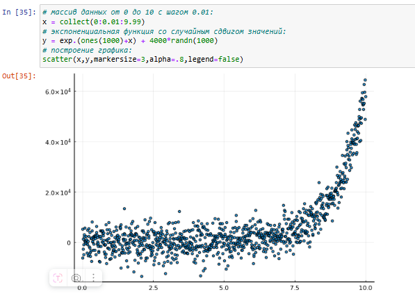{#fig:014 width=70%}

Аппроксимируем полученную функцию полиномом 5-й степени (рис. [-@fig:015]):

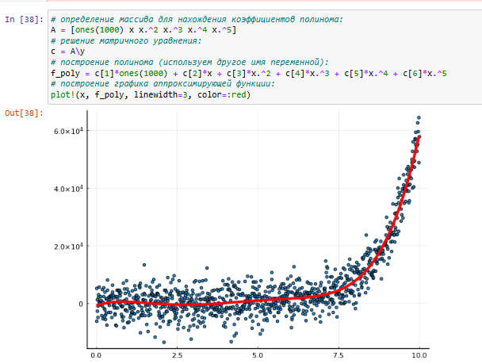{#fig:015 width=70%}

### Две оси ординат

Иногда требуется на один график вывести несколько траекторий с существенными
отличиями в значениях по оси ординат.
Пример первой траектории(рис. [-@fig:016]):

{#fig:016 width=70%}

Далее на существующий график добавляется вторая траектория с дополнительными элементами для улучшения восприятия информации(рис. [-@fig:017]):

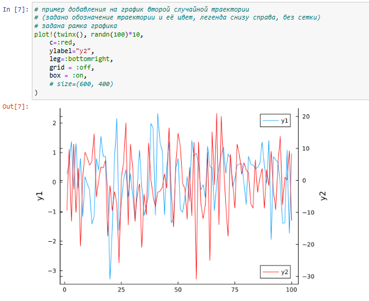{#fig:017 width=70%}

### Полярные координаты

Приведём пример построения графика функции 

$$
r(\vartheta) = 1 + \cos \vartheta \cdot \sin^2 \vartheta
$$

в полярных координатах (рис. [-@fig:018]):

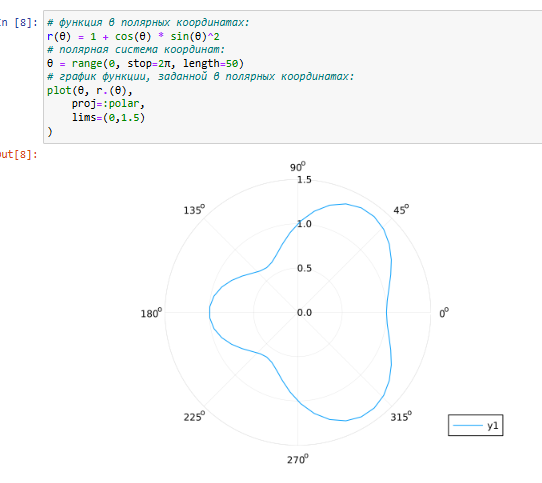{#fig:018 width=70%}

### Параметрический график

При параметрическом представлении графика некоторой функции координаты на
графике задаются как функции от некоторого набора свободных параметров. В случае
одного параметра получим параметрическое уравнение кривой. Выражая координаты
точек поверхности через два свободных параметра, получим параметрическое задание поверхности.

#### Параметрический график кривой на плоскости

Приведём пример построения графика (рис. [-@fig:019]) параметрически заданной кривой на плоскости. Кривая задана выражениями 
 
$$
\begin{aligned}
x(t) &= \sin(t), \\
y(t) &= \sin(2t),
\end{aligned}
\qquad 0 \leq t \leq 2\pi
$$

{#fig:019 width=70%}

#### Параметрический график кривой в пространстве

Приведём пример построения графика (рис. [-@fig:020]) параметрически заданной кривой в пространстве. Кривая задана выражениями:
$$
x(t) = \cos(t),\quad
y(t) = \sin(t),\quad
z(t) = \sin(5t).
$$

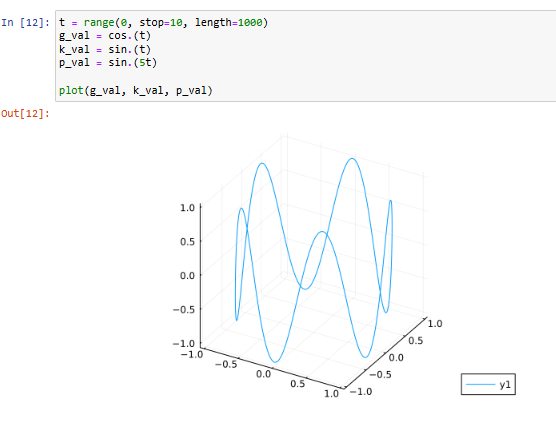{#fig:020 width=70%}

### График поверхности

Для построения поверхности, заданной уравнением $f(x,y) = x^2 + y^2$, можно воспользоваться функцией `surface()` (рис. [-@fig:021]):

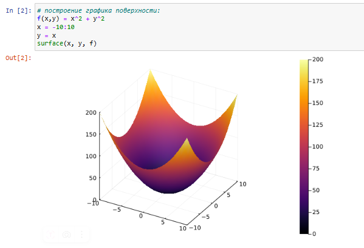{#fig:021 width=70%}

Также можно воспользоваться функцией `plot()` с заданными параметрами (рис. [-@fig:022]):

{#fig:022 width=70%}

Можно задать параметры сглаживания (рис.[-@fig:023]):

{#fig:023 width=70%}

Можно задать определённый угол зрения (рис.[-@fig:024]):

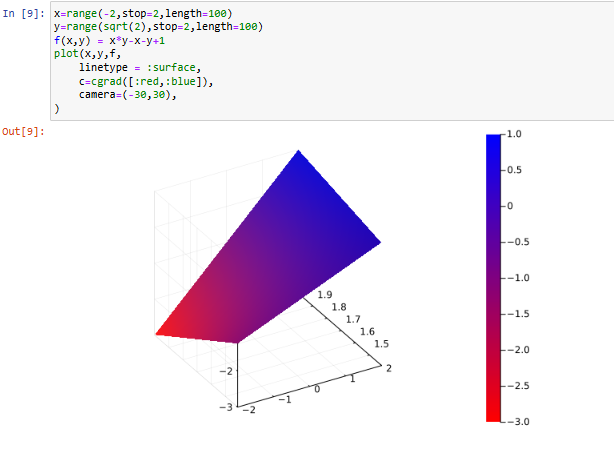{#fig:024 width=70%}


### Линии уровня

Линией уровня некоторой функции от двух переменных называется множество точек
на координатной плоскости, в которых функция принимает одинаковые значения. Линий уровня бесконечно много, и через каждую точку области определения можно провестилинию уровня.

С помощью линий уровня можно определить наибольшее и наименьшее значение
исходной функции от двух переменных. Каждая из этих линий соответствует определённому значению высоты.

Поверхности уровня представляют собой непересекающиеся пространственные поверхности.

Рассмотрим поверхность (рис.[-@fig:025]), заданную функцией 

$$
g(x, y) = (3x + y^2)\left|\sin(x) + \cos(y)\right|
$$

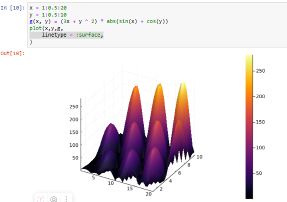{#fig:025 width=70%}

Линии уровня можно построить, используя проекцию значений исходной функции на
плоскость (рис.[-@fig:026]):

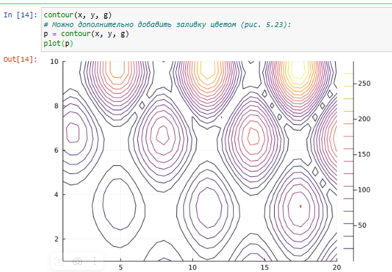{#fig:026 width=70%}

Можно дополнительно добавить заливку цветом (рис.[-@fig:027]):

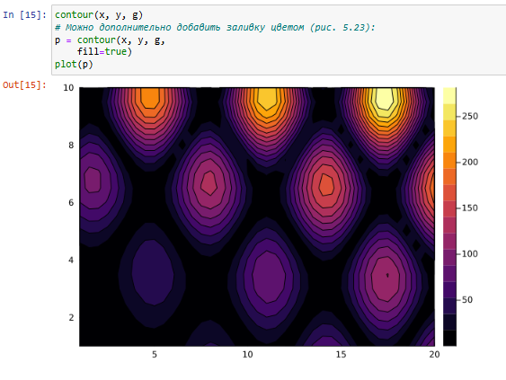{#fig:027 width=70%}

### Векторные поля

Если каждой точке некоторой области пространства поставлен в соответствие вектор с началом в данной точке, то говорят, что в этой области задано векторное поле.

Векторные поля задают векторными функциями. Для функции $h(x, y) = x^3 - 3x + y^2$ сначала построим её график (рис.[-@fig:028]) и линии уровня (рис.[-@fig:029]):

{#fig:028 width=70%}

{#fig:029 width=70%}

Векторное поле можно охарактеризовать векторными линиями. Каждая точка векторной линии является началом вектора поля, который лежит на касательной в данной точке.

Для заданной функции построим векторное поле (рис.[-@fig:030]):

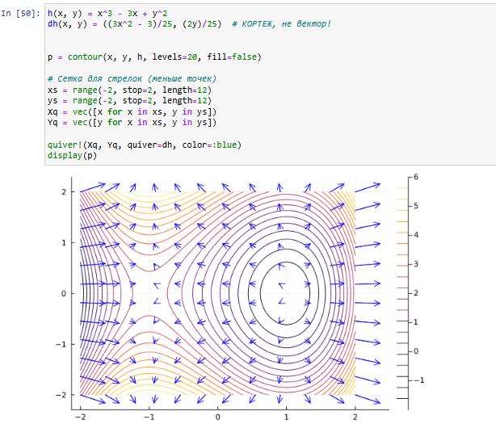{#fig:030 width=70%}

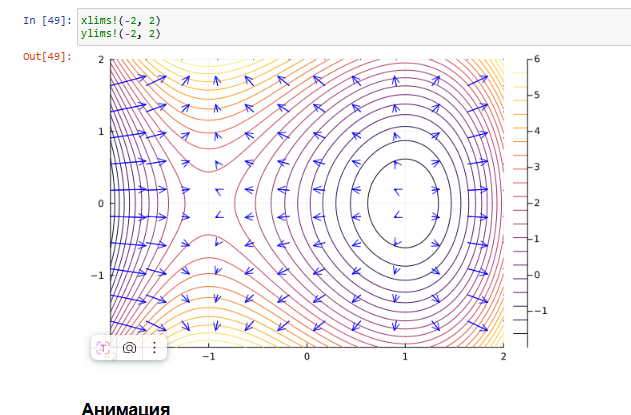{#fig:031 width=70%}

Для получения рис.[-@fig:030] и рис.[-@fig:031] был изменен листинг.

### Анимация

Технически анимированное изображение представляет собой несколько наложенных
изображений (или построенных в разных точках графиках) в одном файле.

#### Gif-анимация

В Julia рекомендуется использовать gif-анимацию в `pyplot()` (рис.[-@fig:032]):

{#fig:032 width=70%}

Добавляем анимацию (рис.[-@fig:033]):

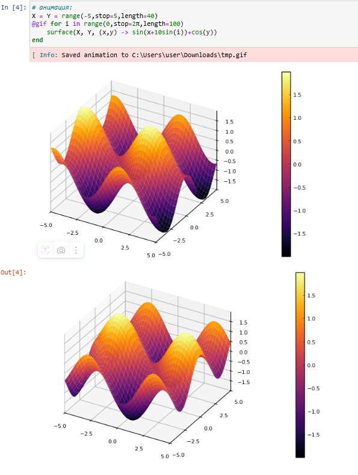{#fig:033 width=70%}

#### Гипоциклоида

Гипоциклоида — плоская кривая, образуемая точкой окружности, катящейся по внутренней стороне другой окружности без скольжения:

$$
\begin{aligned}
x &= r(k-1) \left( \cos t + \frac{\cos((k-1)t)}{k-1} \right), \\
y &= r(k-1) \left( \sin t - \frac{\sin((k-1)t)}{k-1} \right),
\end{aligned}
$$

где $k = \frac{R}{r}$, $R$ — радиус неподвижной окружности, $r$ — радиус катящейся окружности.
Модуль величины $k$ определяет форму гипоциклоиды.
Построим гипоциклоиду. Сначала зададим параметры (рис.[-@fig:034]):

{#fig:034 width=70%}

Построим оси координат и большую окружность (рис.[-@fig:035]):

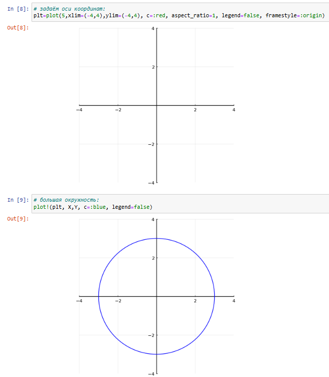{#fig:035 width=70%}

Для частичного построения гипоциклоиды будем менять параметр $t$, также добавляем малую окружность гипоциклоиды (рис.[-@fig:036]):

{#fig:036 width=70%}

Добавим радиус для малой окружности (рис.[-@fig:037]):

{#fig:037 width=70%}

В конце сделаем анимацию получившегося изображения (рис.[-@fig:038]):

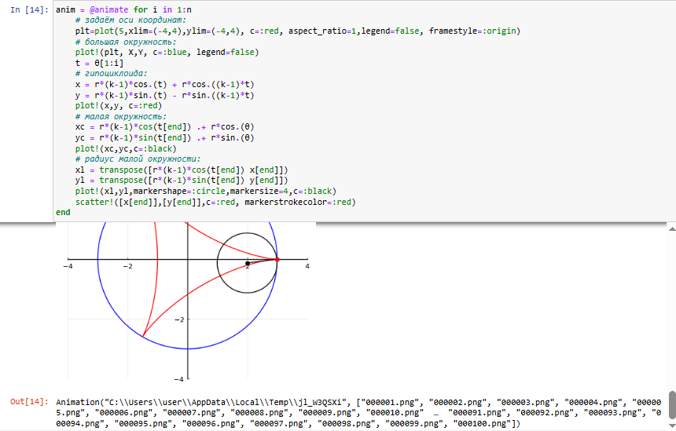{#fig:038 width=70%} 

{#fig:039 width=70%} 

### Errorbars

В исследованиях часто требуется изобразить графики погрешностей измерения.
Подключим пакет `Statistics`:

```julia
# подключение пакета Statistics:
import Pkg
Pkg.add("Statistics")
using Statistics
```

Зададим массив значений, сгенерируем массив ошибок (отклонений от исходных значений) (рис.[-@fig:040]):

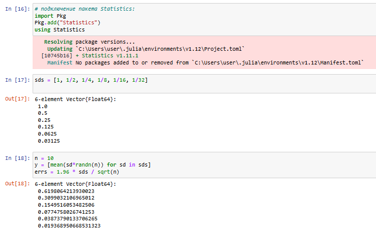{#fig:040 width=70%} 

Построим графики исходных значений и исходных значений с отклонениями (рис.[-@fig:041]):

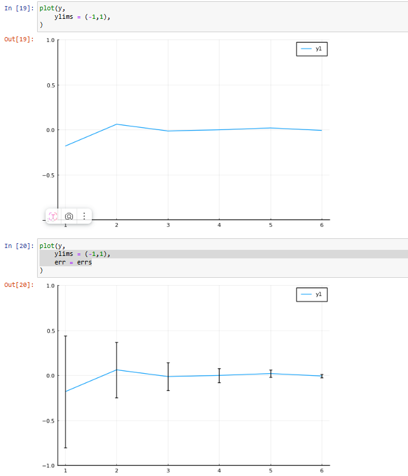{#fig:041 width=70%} 

Повернём график (рис.[-@fig:042]):

{#fig:042 width=70%} 

Заполним область цветом (рис.[-@fig:043]):

{#fig:043 width=70%}

Можно построить график ошибок по двум осям (рис.[-@fig:044]):

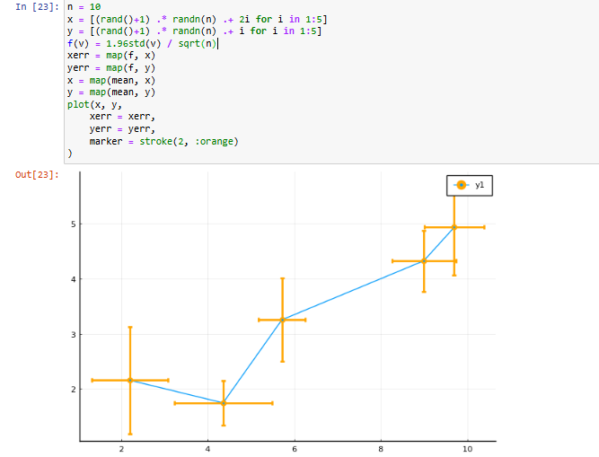{#fig:044 width=70%}

Можно построить график асимметричных ошибок по двум осям (рис.[-@fig:045]):

{#fig:045 width=70%}

### Использование пакета Distributions

Подгружаем пакет распределений:

```julia
import Pkg
Pkg.add("Distributions")
using Distributions
```

Построим гистограмму, построенную по массиву случайных чисел (рис.[-@fig:046]):

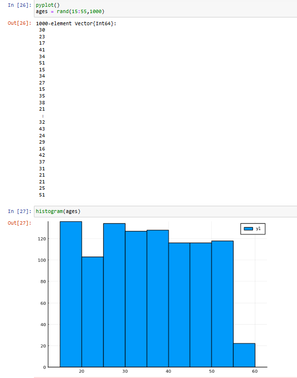{#fig:046 width=70%}

Задаём нормальное распределение и строим гистограмму (рис.[-@fig:047]):

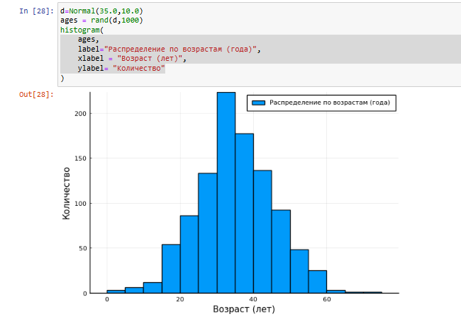{#fig:047 width=70%}

Далее применим для построения нескольких гистограмм распределения людей по
возрастам на одном графике `plotly()` (рис.[-@fig:048]):

{#fig:048 width=70%}

### Подграфики 

Определим макет расположения графиков. Команда layout принимает кортеж `layout = (N, M)`, который строит сетку графиков `NxM`. Например, если задать `layout = (4,1)` на графике четыре серии, то получим четыре ряда графиков(рис.[-@fig:049]), для автоматического вычисления сетки необходимо передать layout целое число (рис.[-@fig:050]):

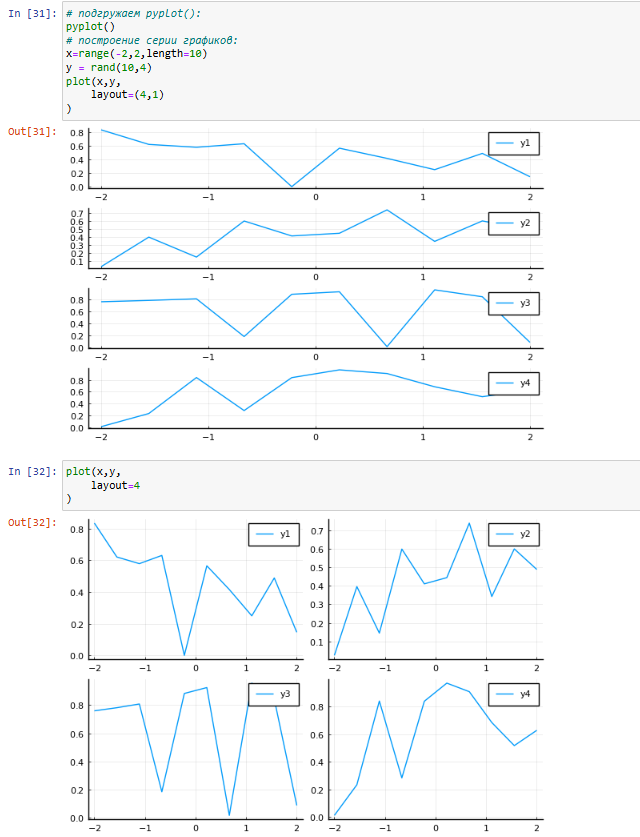{#fig:049 width=70%} 

Чуть более сложные макеты сетки могут быть созданы с помощью конструктора `grid(...)`. Например, в следующем макете создаются участки разной высоты
(рис.[-@fig:050]):

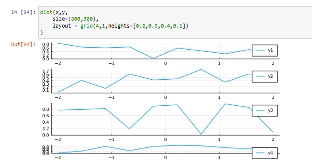{#fig:050 width=70%} 

Аргумент `heights` принимает в качестве входных данных массив с долями желае-
мых высот. Если в сумме дроби не составляют 1,0, то некоторые подзаголовки могут отображаться неправильно.

 Можно сгенерировать отдельные графики и объединить их в один, например, в сетке $2 × 2$ (рис.[-@fig:051]):

{#fig:051 width=70%} 

Обратим внимание, что атрибуты на отдельных графиках применяются к отдельным
графикам, в то время как атрибуты в последнем вызове `plot` применяются ко всем графикам.

Разнообразные варианты представления данных (рис.[-@fig:052]):

{#fig:052 width=70%} 

Применение макроса `@layout` наиболее простой способ определения сложных макетов.
Точные размеры могут быть заданы с помощью фигурных скобок, в противном случае пространство будет поровну разделено между графиками (рис.[-@fig:053]):

{#fig:053 width=70%} 


## Задания для самостоятельного выполнения

1. Постройте все возможные типы графиков (простые, точечные, гистограммы и т.д.) функции функции $y = \sin(x)$, где $x \in [0, 2\pi]$. Отобразите все графики в одном графическом окне (рис.[-@fig:054]):

![Все возможные типы графиков функции $y = \sin(x)$, где $x \in [0, 2\pi]$](image/54.png){#fig:054 width=70%}

2. Постройте графики функции $y = \sin(x)$, где $x \in [0, 2\pi]$ со всеми возможными (сколько сможете вспомнить) типами оформления линий графика. Отобразите все графики в одном графическом окне (рис.[-@fig:055]):

![Демонстрация всех типов линий графика для функции $y = \sin(x)$, где $x \in [0, 2\pi]$](image/55.png){#fig:055 width=70%}
 
3. Постройте график функции $y(x) = \pi x^2 \ln(x)$, назовите оси соответственно. Пусть
цвет рамки будет зелёным, а цвет самого графика — красным. Задайте расстояние
между надписями и осями так, чтобы надписи полностью умещались в графическом
окне. Задайте шрифт надписей. Задайте частоту отметок на осях координат (рис.[-@fig:056]):

{#fig:056 width=70%}

4. Задайте вектор $x = (-2, -2, 0, 1, 2)$. В одном графическом окне (в 4-х подокнах)
изобразите графически по точкам $x$ значения функции $y(x) = x^3 - 3x$ в виде:

- точек,

- линий,

- линий и точек,

- кривой.

Сохраните полученные изображения в файле `figure_familiya.png`, где вместо
`familiya` укажите вашу фамилию (рис.[-@fig:057]):

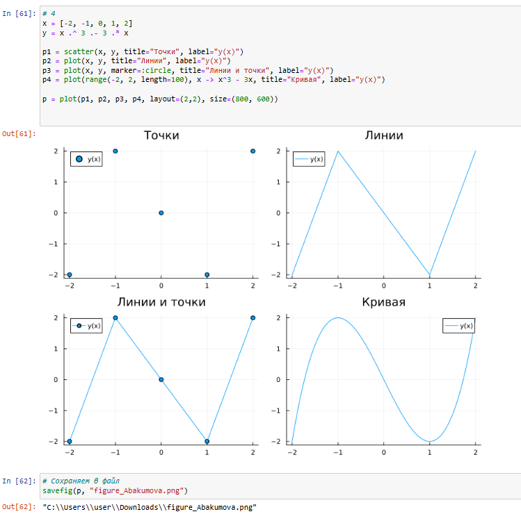{#fig:057 width=70%}

5. Задайте вектор $x = (3, 3.1, 3.2, … , 6)$. Постройте графики функций $y_1(x) = \pi x$
и $y_2(x) = \exp(x) \cos(x)$ в указанном диапазоне значений аргумента $x$ следующимобразом:

- постройте оба графика разного цвета на одном рисунке, добавьте легенду и сетку для каждого графика; укажите недостатки у данного построения (рис.[-@fig:058]):

{#fig:058 width=70%}

Недостатки первого построения:

- Функции имеют разные масштабы (y1 ~ 10, y2 ~ ±200), что делает один график почти незаметным.

- Трудно сравнивать поведение функций из-за разных порядков величин.

- постройте аналогичный график с двумя осями ординат (рис.[-@fig:059]):

{#fig:059 width=70%}

6. Постройте график некоторых экспериментальных данных (придумайте сами), учитывая ошибку измерения (рис.[-@fig:060]):

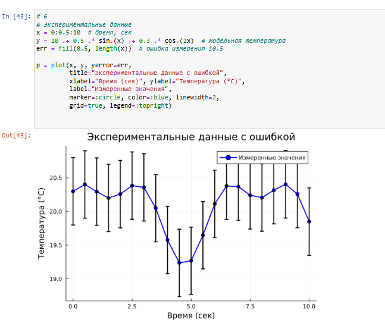{#fig:060 width=70%}

7. Постройте точечный график случайных данных. Подпишите оси, легенду, название графика (рис.[-@fig:061]):

{#fig:061 width=70%}

8. Постройте 3-мерный точечный график случайных данных. Подпишите оси, легенду, название графика(рис.[-@fig:062]):

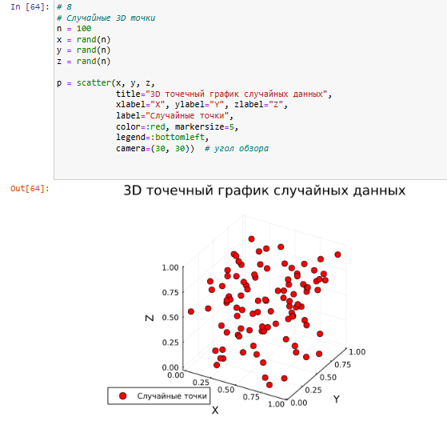{#fig:062 width=70%}

9. Создайте анимацию с построением синусоиды. То есть вы строите последовательность
графиков синусоиды, постепенно увеличивая значение аргумента. После соедините
их в анимацию  (рис.[-@fig:063]):

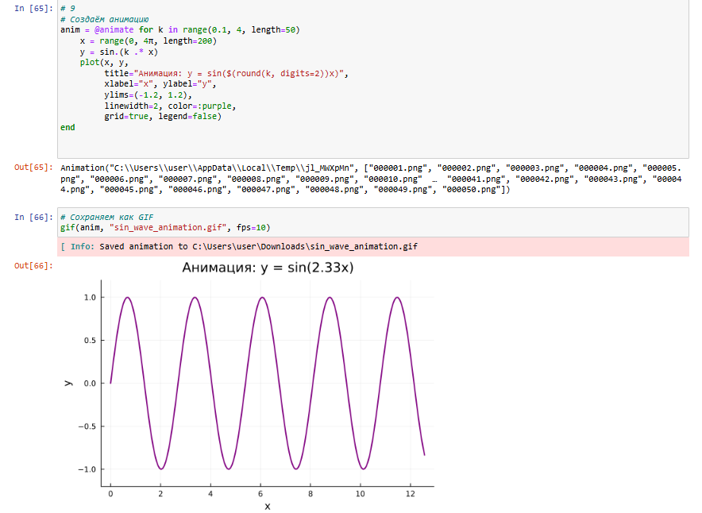{#fig:063 width=70%}

10. Постройте анимированную гипоциклоиду для 2 целых значений модуля $k$ и 2 рациональных значений модуля $k$ (рис.[-@fig:064]):

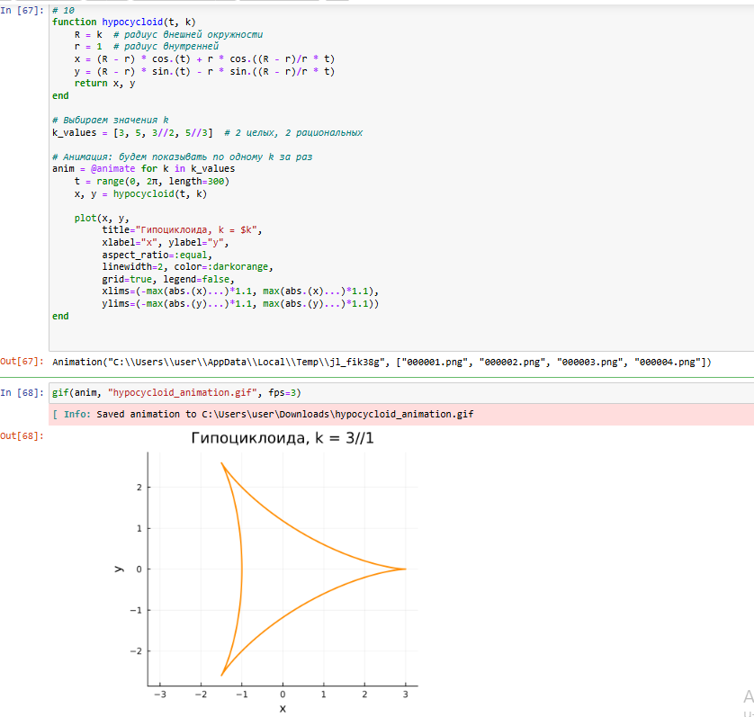{#fig:064 width=70%}

11. Постройте анимированную эпициклоиду для 2 целых значений модуля $k$ и 2 рациональных значений модуля $k$ (рис.[-@fig:065]):

{#fig:065 width=70%}


# Выводы

В результате выполнения данной лабораторной работы я освоила синтаксис языка Julia для построения графиков.
