---
## Front matter
title: "Лабораторная работа № 6. Решение моделей в непрерывном и дискретном времени"
author: "Абакумова Олеся Максимовна, НФИбд-02-22"

## Generic otions
lang: ru-RU
toc-title: "Содержание"

## Bibliography
bibliography: bib/cite.bib
csl: pandoc/csl/gost-r-7-0-5-2008-numeric.csl

## Pdf output format
toc: true # Table of contents
toc-depth: 2
lof: true # List of figures
lot: true # List of tables
fontsize: 12pt
linestretch: 1.5
papersize: a4
documentclass: scrreprt
## I18n polyglossia
polyglossia-lang:
  name: russian
  options:
	- spelling=modern
	- babelshorthands=true
polyglossia-otherlangs:
  name: english
## I18n babel
babel-lang: russian
babel-otherlangs: english
## Fonts
mainfont: IBM Plex Serif
romanfont: IBM Plex Serif
sansfont: IBM Plex Sans
monofont: IBM Plex Mono
mathfont: STIX Two Math
mainfontoptions: Ligatures=Common,Ligatures=TeX,Scale=0.94
romanfontoptions: Ligatures=Common,Ligatures=TeX,Scale=0.94
sansfontoptions: Ligatures=Common,Ligatures=TeX,Scale=MatchLowercase,Scale=0.94
monofontoptions: Scale=MatchLowercase,Scale=0.94,FakeStretch=0.9
mathfontoptions:
## Biblatex
biblatex: true
biblio-style: "gost-numeric"
biblatexoptions:
  - parentracker=true
  - backend=biber
  - hyperref=auto
  - language=auto
  - autolang=other*
  - citestyle=gost-numeric
## Pandoc-crossref LaTeX customization
figureTitle: "Рис."
tableTitle: "Таблица"
listingTitle: "Листинг"
lofTitle: "Список иллюстраций"
lotTitle: "Список таблиц"
lolTitle: "Листинги"
## Misc options
indent: true
header-includes:
  - \usepackage{indentfirst}
  - \usepackage{float} # keep figures where there are in the text
  - \floatplacement{figure}{H} # keep figures where there are in the text
---

# Цель работы

Основной целью работы является освоение специализированных пакетов для решения задач в непрерывном и дискретном времени.

# Задание

1. Выполнить примеры, приведенные в лабораторной работе.

2. Выполнить задания для самостоятельного выполнения

# Выполнение лабораторной работы

## Предварительные сведения

### Решение обыкновенных дифференциальных уравнений

Напомним, что обыкновенное дифференциальное уравнение (ОДУ) описывает изменение некоторой переменной $u$:

$$u'(t) = f(u(t), p, t)$$,

где $$f(u(t), p, t)$$ — нелинейная модель (функция) изменения $u(t)$ с заданным начальным
значением $$u(t_0) = u_0$$, $p$ — параметры модели, $t$ — время.
Для решения обыкновенных дифференциальных уравнений (ОДУ) в Julia можно использовать пакет `diffrentialEquations.jl`.

#### Модель экспоненциального роста

Рассмотрим пример использования этого пакета для решение уравнения модели экспоненциального роста, описываемую уравнением

$$u'(t) = a u(t), \quad u(0) = u_0$$,

где $a$ — коэффициент роста.
Предположим, что заданы следующие начальные данные $a = 0, 98$, $u(0) = 1, 0$, $t ∈ [0; 1, 0]$.

Аналитическое решение модели имеет вид:

$$u(t) = u_0 \exp(a t)$$

Численное решение в Julia будет иметь следующий вид (рис. [-@fig:001]):

{#fig:001 width=70%}

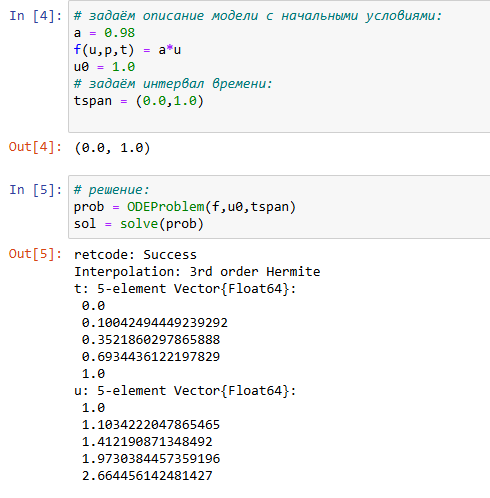{#fig:002 width=70%}

Построение графика, соответствующего полученному решению (рис. [-@fig:003]):

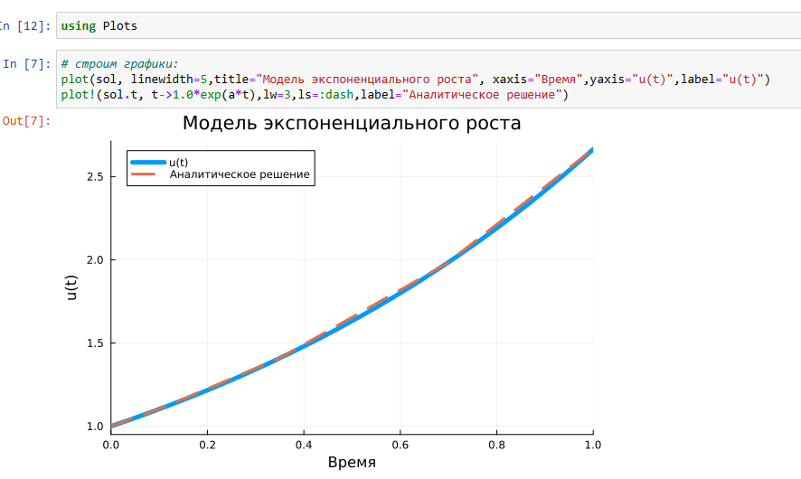{#fig:003 width=70%}

При построении одного из графиков использовался вызов `sol.t`, чтобы захватить массив моментов времени. Массив решений можно получить, воспользовавшись `sol.u`.

Если требуется задать точность решения, то можно воспользоваться параметрами
`abstol` (задаёт близость к нулю) и `reltol` (задаёт относительную точность). По умолчанию эти параметры имеют значение `abstol = 1e-6 и reltol = 1e-3`.

Для модели экспоненциального роста (рис. [-@fig:004]):

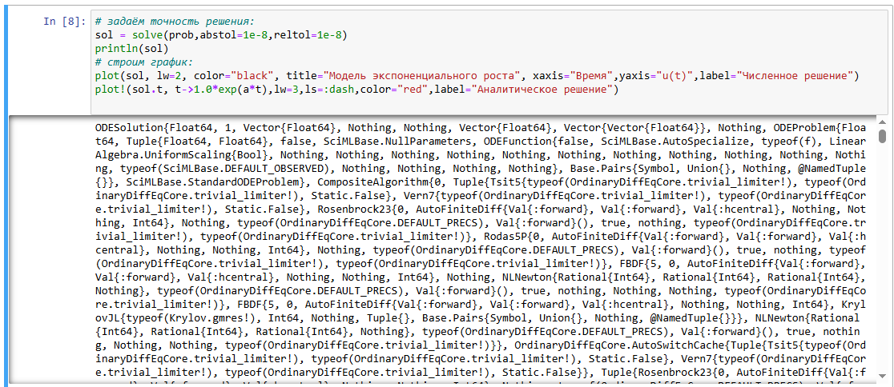{#fig:004 width=70%}

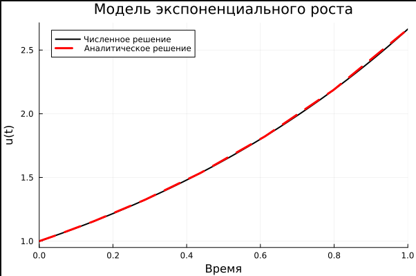{#fig:005 width=70%}

#### Система Лоренца

Динамической системой Лоренца является нелинейная автономная система обыкновенных дифференциальных уравнений третьего порядка:

  $$\begin{cases}
  \dot{x} = \sigma(y - x), \\
  \dot{y} = \rho x - y - xz, \\
  \dot{z} = xy - \beta z,
  \end{cases}$$

где $\sigma$, $\rho$ и $\beta$ — параметры системы (некоторые положительные числа, обычно указывают $\sigma = 10$ , $\rho = 28$ и $\beta = 8/3$).

Система получена из системы уравнений Навье–Стокса и описывает движение
воздушных потоков в плоском слое жидкости постоянной толщины при разложении
скорости течения и температуры в двойные ряды Фурье с последующем усечением до первых-вторых гармоник.

Решение системы неустойчиво на аттракторе, что не позволяет применять классические численные методы на больших отрезках времени, требуется использовать высокоточные вычисления.

Численное решение в Julia будет иметь следующий вид (рис. [-@fig:006]):

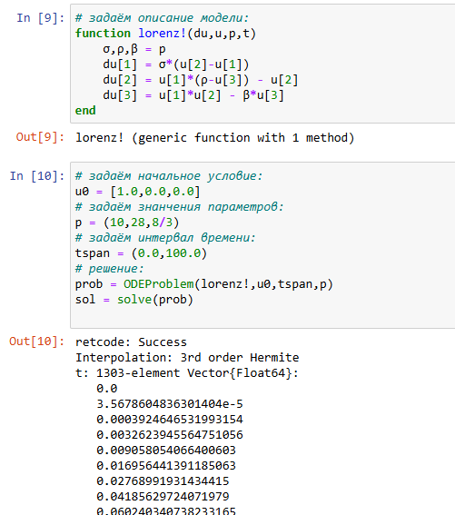{#fig:006 width=70%}

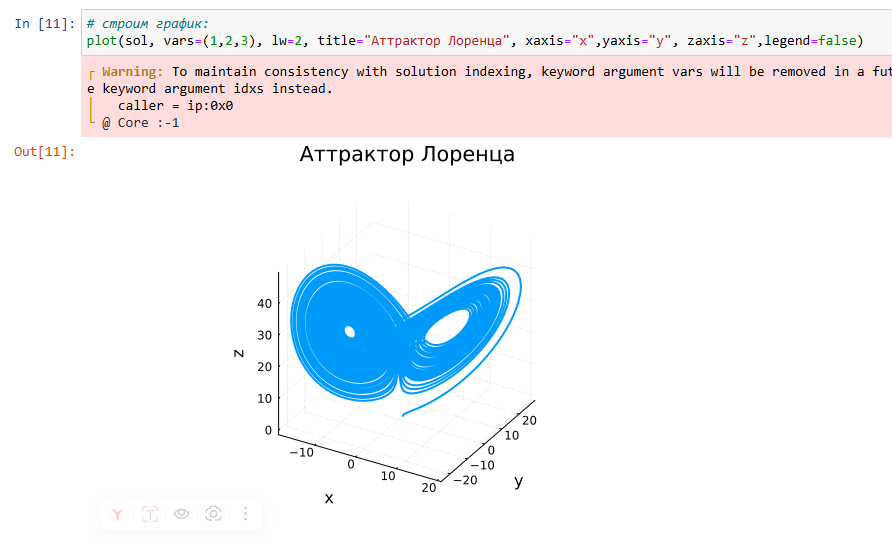{#fig:007 width=70%}

Можно отключить интерполяцию (рис. [-@fig:008]):

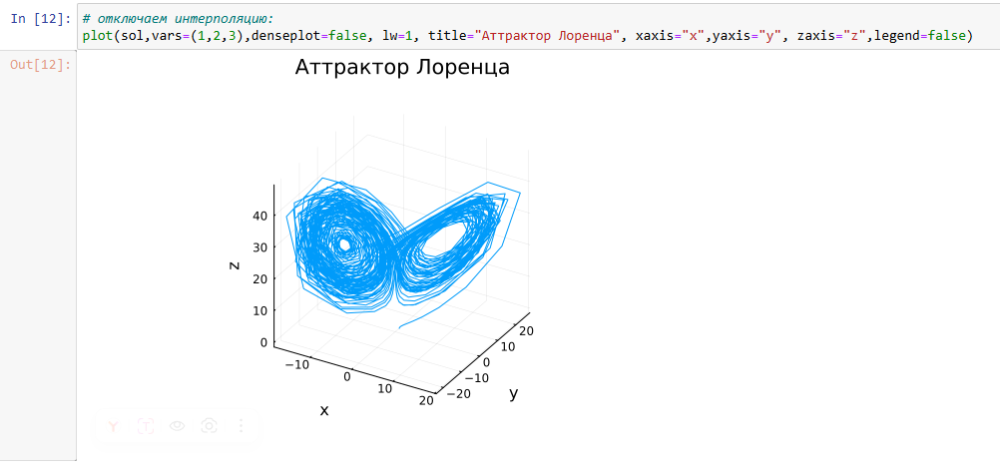{#fig:008 width=70%}

### Модель Лотки–Вольтерры

Модель Лотки–Вольтерры описывает взаимодействие двух видов типа «хищник – жертва»:

  $$\begin{cases} 
  \dot{x} = (\alpha - \beta y)x, \\
  \dot{y} = (-\gamma + \delta x)y,
  \end{cases}$$

где $x$ — количество жертв, $y$ — количество хищников, $t$ — время, $\alpha$, $\beta$, $\gamma$, $\delta$ — коэффициенты, отражающие взаимодействия между видами (в данном случае $\alpha$ — коэффициент
рождаемости жертв, $\gamma$ — коэффициент убыли хищников, $\beta$ — коэффициент убыли жертв в результате взаимодействия с хищниками, $\delta$ — коэффициент роста численности хищников).

Численное решение в Julia будет иметь следующий вид (рис. [-@fig:009]):

{#fig:009 width=70%}

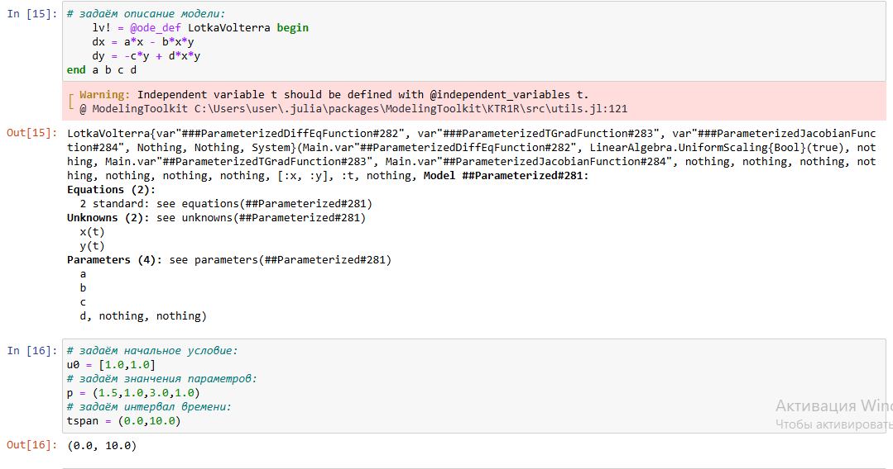{#fig:010 width=70%}

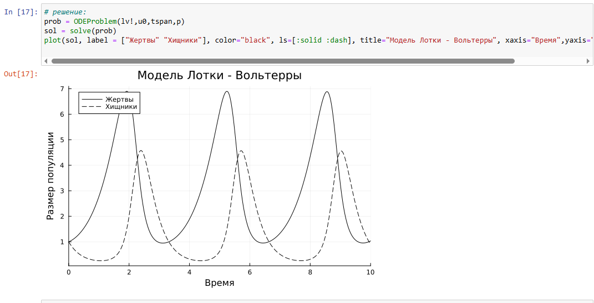{#fig:011 width=70%}

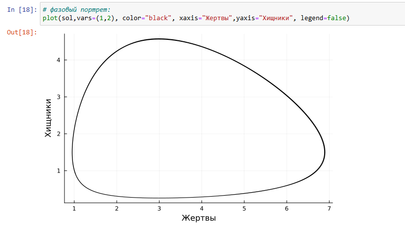{#fig:012 width=70%}

## Задания для самостоятельного выполнения

1. Реализовать и проанализировать модель роста численности изолированной популяции (модель Мальтуса):̇ 
   $$\dot{x} = ax, \quad a = b - c,$$

где $x(t) — численность изолированной популяции в момент времени $t$, $a$ — коэффициент роста популяции, $b$ — коэффициент рождаемости, $c$ — коэффициент смертности.
Начальные данные и параметры задать самостоятельно и пояснить их выбор. Построить соответствующие графики (в том числе с анимацией).

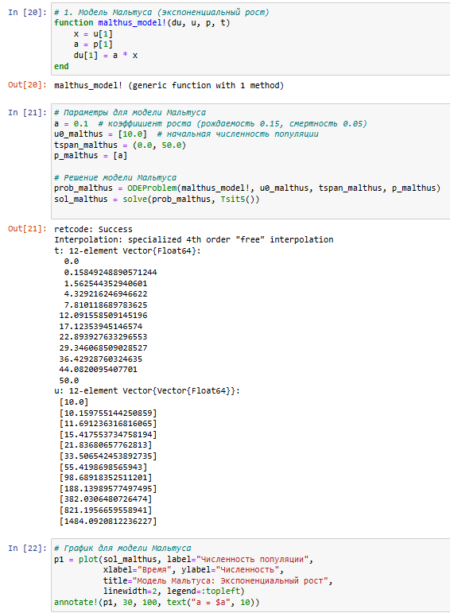{#fig:013 width=70%}

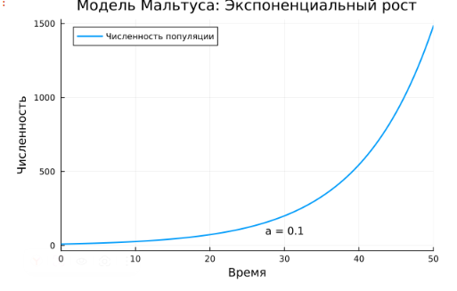{#fig:014 width=70%}

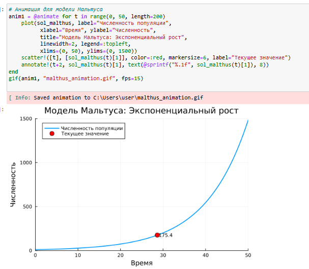{#fig:015 width=70%}

2. Реализовать и проанализировать логистическую модель роста популяции, заданную уравнением:

   $$\dot{x} = r x \left(1 - \frac{x}{k}\right), \quad r > 0, \quad k > 0,$$
   
$r$ — коэффициент роста популяции, $k$ — потенциальная ёмкость экологической системы (предельное значение численности популяции). Начальные данные и параметрызадать самостоятельно и пояснить их выбор. Построить соответствующие графики (втом числе с анимацией).

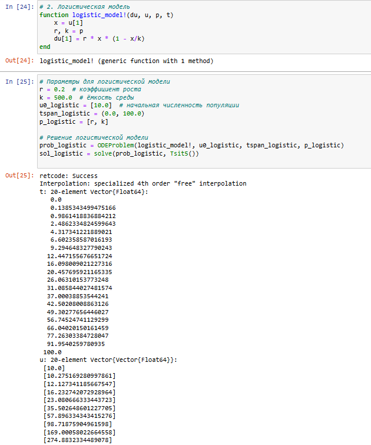{#fig:016 width=70%}

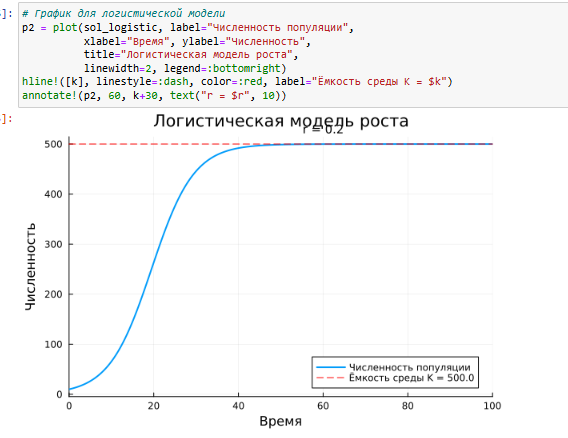{#fig:017 width=70%}

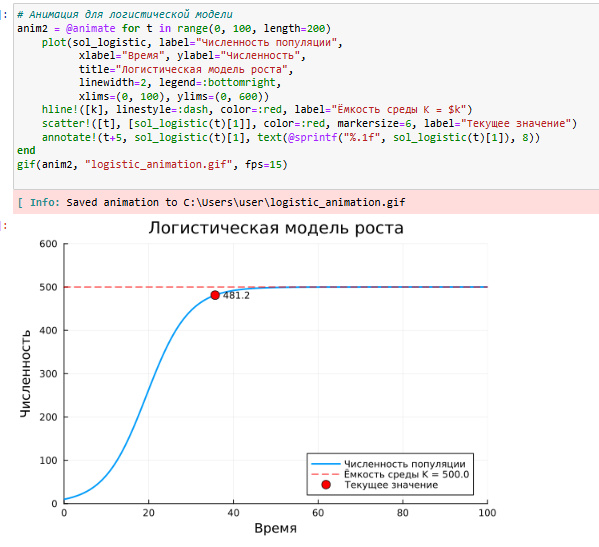{#fig:018 width=70%}

3. Реализовать и проанализировать модель эпидемии Кермака–Маккендрика (SIR-
модель):

   $$\begin{aligned}
   \dot{s} &= -\beta i s, \\
   \dot{i} &= \beta i s - \nu i, \\
   \dot{r} &= \nu i
   \end{aligned}$$

где $s(t)$ — численность восприимчивых к болезни индивидов в момент времени $t$, $i(t)$ — численность инфицированных индивидов в момент времени $t$, $r(t)$ — численность переболевших индивидов в момент времени $t$, $\beta$ — коэффициент интенсивности контактов индивидов с последующим инфицированием, $\nu$ — коэффициент интенсивности выздоровления инфицированных индивидов. Численность популяции считается постоянной, т.е. $\dot{s} + \dot{i} + \dot{r} = 0$.Начальные данные и параметры задать самостоятельно и пояснить их выбор. Построить соответствующие графики (в том числе с анимацией).

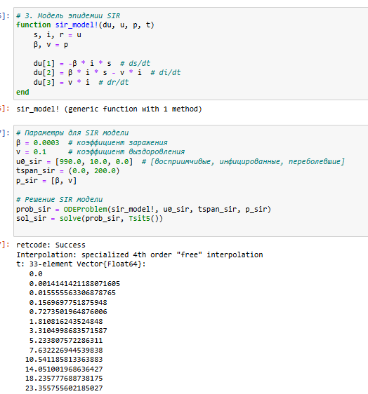{#fig:019 width=70%}

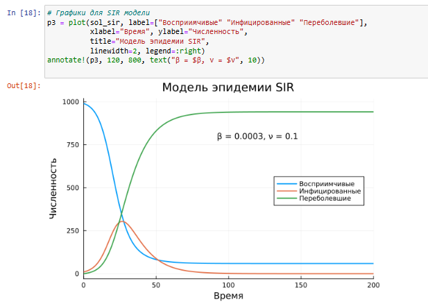{#fig:020 width=70%}

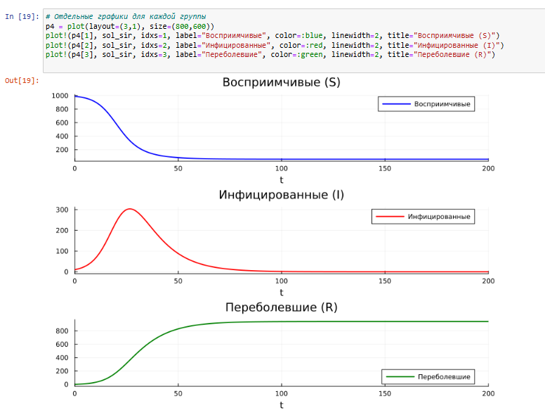{#fig:021 width=70%}

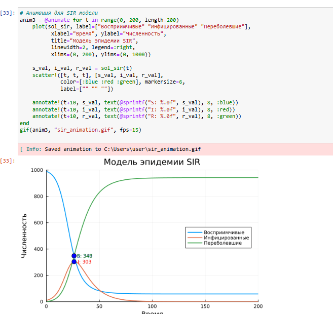{#fig:022 width=70%}
   
4. Как расширение модели SIR (Susceptible-Infected-Removed) по результатом эпидемии испанки была предложена модель SEIR (Susceptible-Exposed-Infected-Removed):
   
   $$\begin{aligned}
   \dot{s}(t) &= -\frac{\beta}{N} s(t) i(t), \\
   \dot{e}(t) &= \frac{\beta}{N} s(t) i(t) - \delta e(t), \\
   \dot{i}(t) &= \delta e(t) - \gamma i(t), \\
   \dot{r}(t) &= \gamma i(t).
   \end{aligned}$$
   
Размер популяции сохраняется:
   
   $$s(t) + e(t) + i(t) + r(t) = N$$
   
Исследуйте, сравните с SIR.

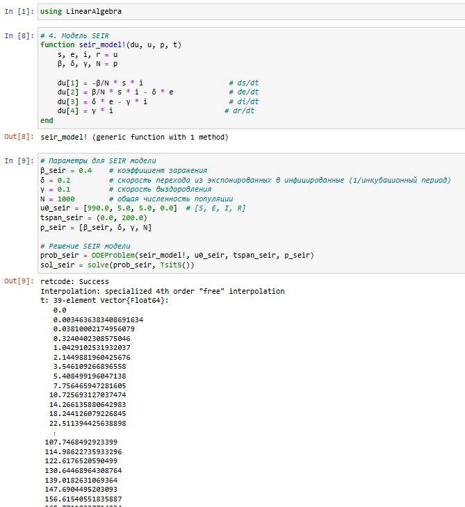{#fig:023 width=70%}

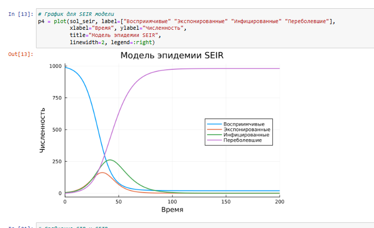{#fig:024 width=70%}

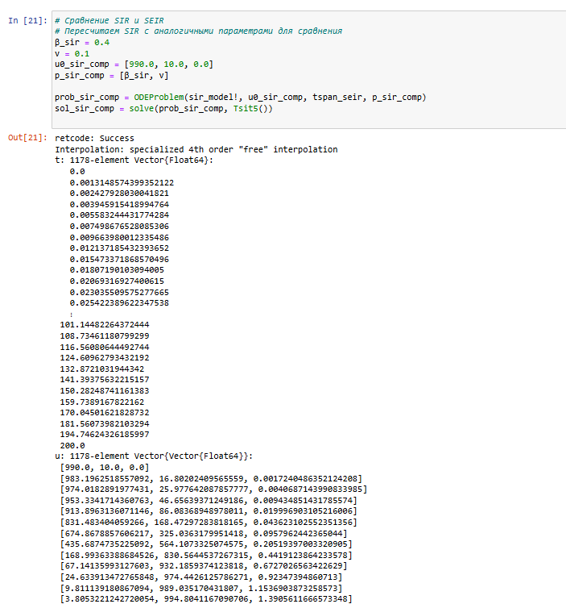{#fig:025 width=70%}

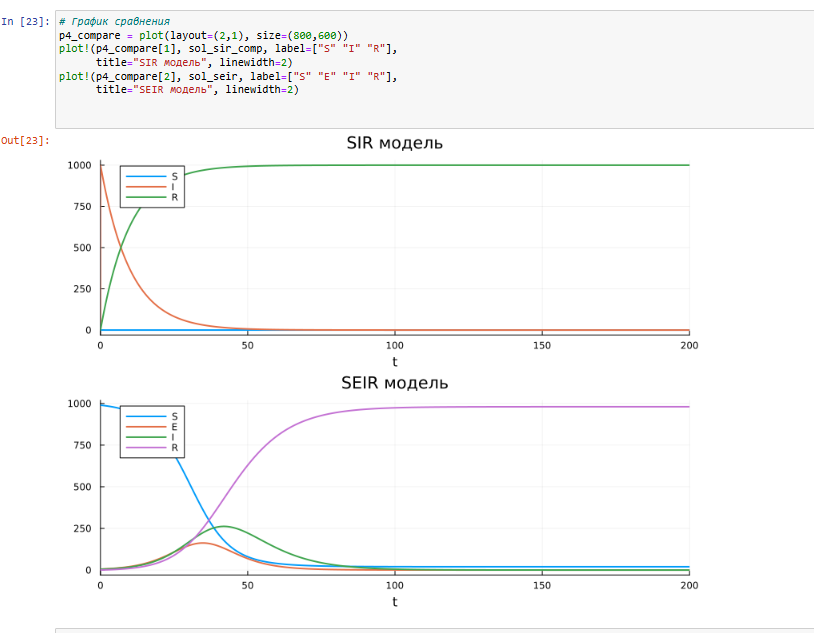{#fig:026 width=70%}

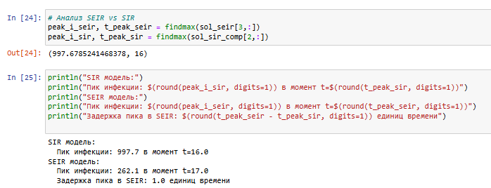{#fig:027 width=70%}

5. Для дискретной модели Лотки–Вольтерры:
   
   $$\begin{aligned}
   X_1(t+1) &= a X_1(t)(1 - X_1(t)) - X_1(t) X_2(t), \\
   X_2(t+1) &= -c X_2(t) + d X_1(t) X_2(t).
   \end{aligned}$$
   
с начальными данными $a = 2, c = 1, d = 5$ найдите точку равновесия. Получите и сравните аналитическое и численное решения. Численное решение изобразите на фазовом портрете.

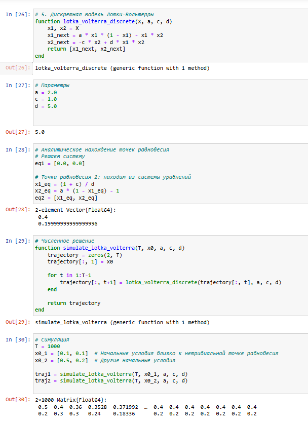{#fig:028 width=70%}

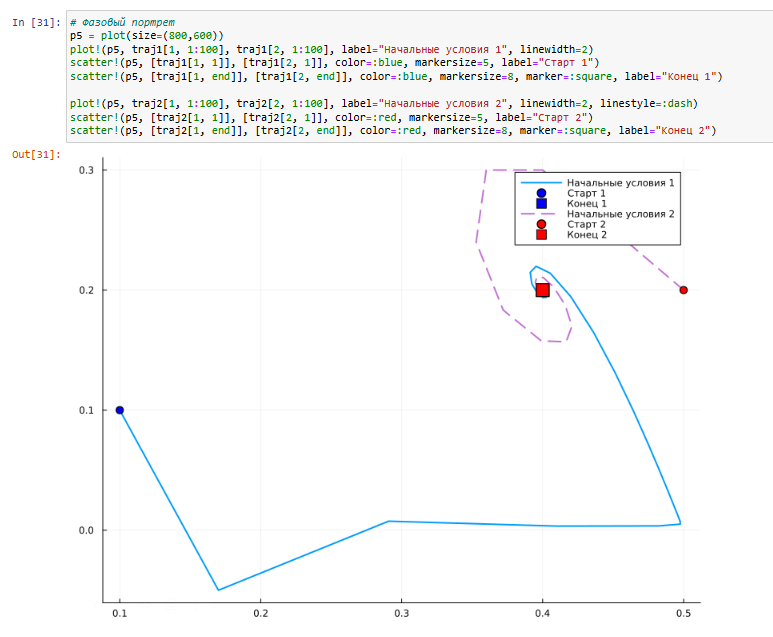{#fig:029 width=70%}

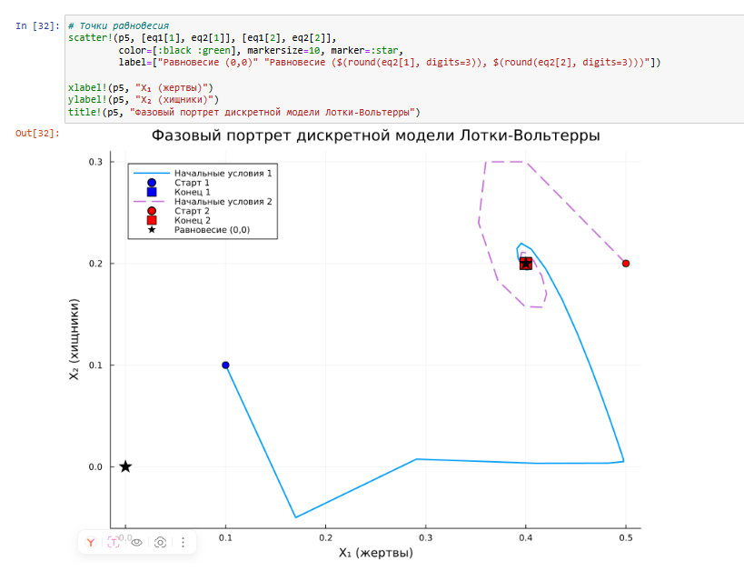{#fig:030 width=70%}

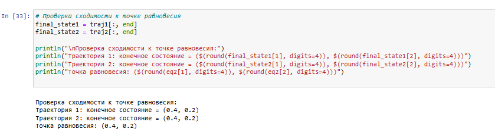{#fig:031 width=70%}

6. Реализовать на языке Julia модель отбора на основе конкурентных отношений:
   
   $$\begin{aligned}
   \dot{x} &= \alpha x - \beta x y, \\
   \dot{y} &= \alpha y - \beta x y.
   \end{aligned}$$
   
Начальные данные и параметры задать самостоятельно и пояснить их выбор. Построить соответствующие графики (в том числе с анимацией) и фазовый портрет.

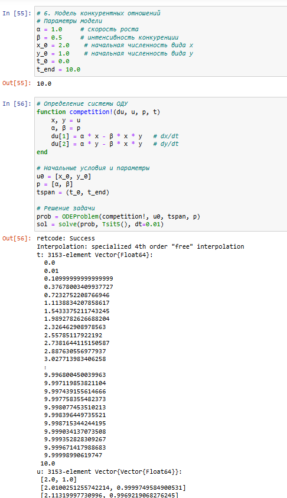{#fig:032 width=70%}

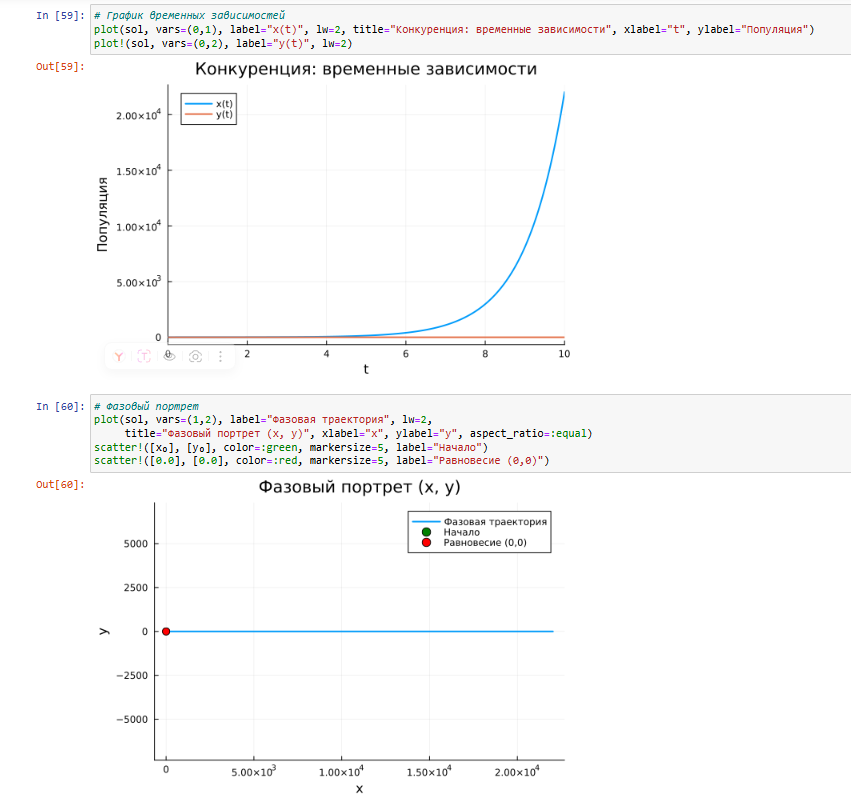{#fig:033 width=70%}

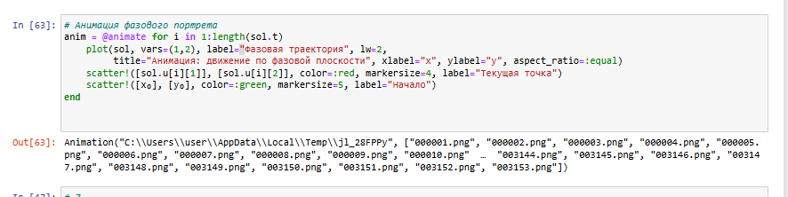{#fig:034 width=70%}

7. Реализовать на языке Julia модель консервативного гармонического осциллятора:
   
   $$\ddot{x} + \omega_0^2 x = 0, \quad x(t_0) = x_0, \quad \dot{x}(t_0) = y_0,$$
   
где $\omega_0$ — циклическая частота. Начальные параметры подобрать самостоятельно, выбор пояснить. Построить соответствующие графики (в том числе с анимацией) и фазовый портрет.

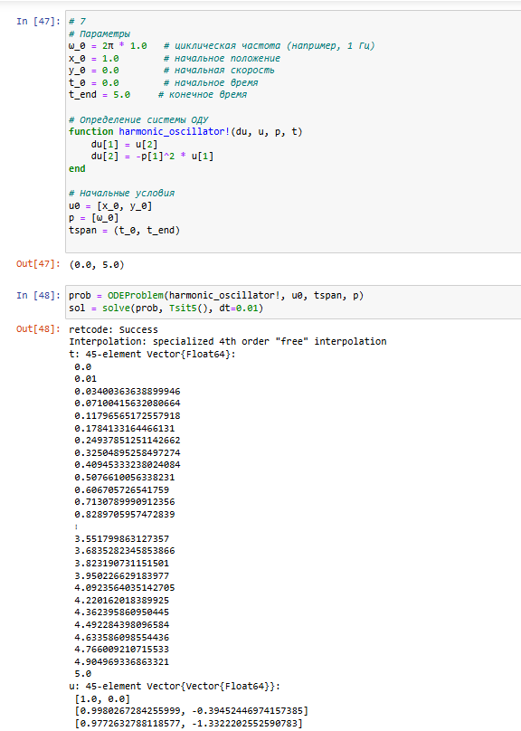{#fig:035 width=70%}

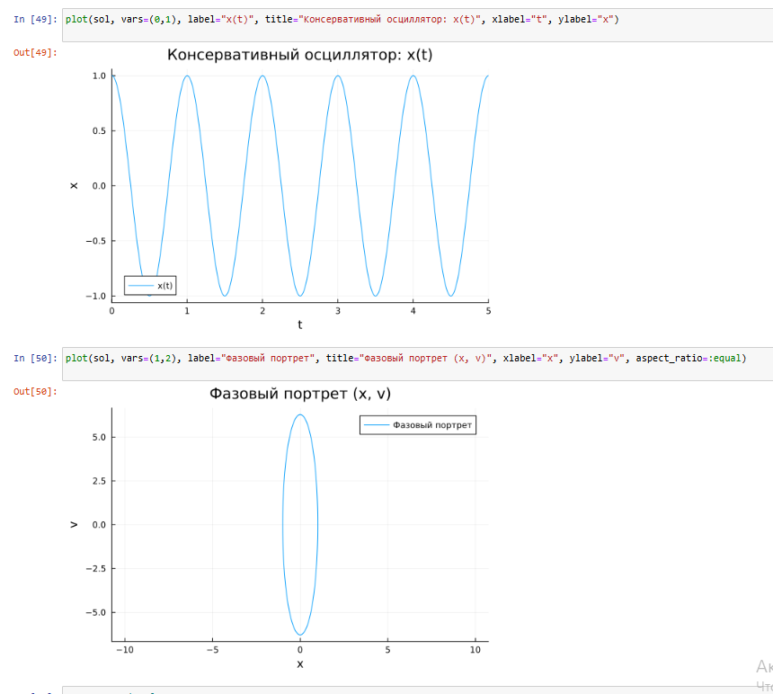{#fig:036 width=70%}

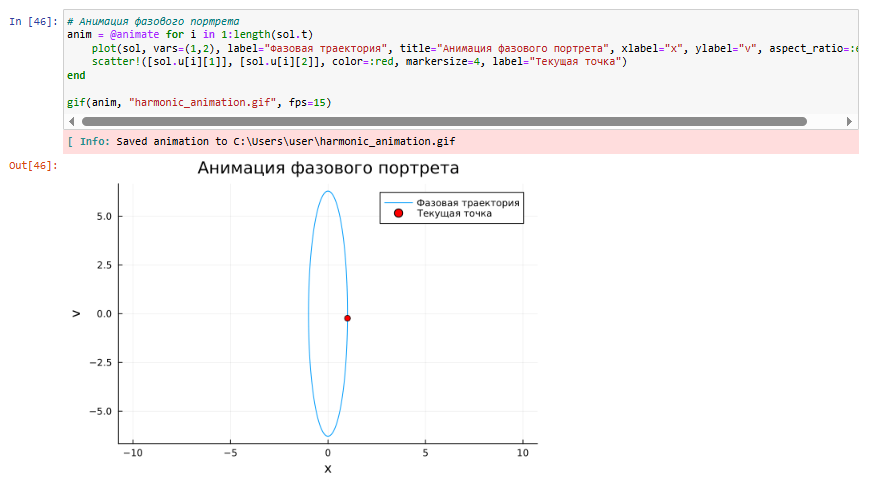{#fig:037 width=70%}

8. Реализовать на языке Julia модель свободных колебаний гармонического осциллятора:
   
   $$\ddot{x} + 2\gamma \dot{x} + \omega_0^2 x = 0, \quad x(t_0) = x_0, \quad \dot{x}(t_0) = y_0,$$
   
 где $\omega_0$ — циклическая частота, $\gamma$ — параметр, характеризующий потери энергии. Начальные параметры подобрать самостоятельно, выбор пояснить. Построить соответствующие графики (в том числе с анимацией) и фазовый портрет.

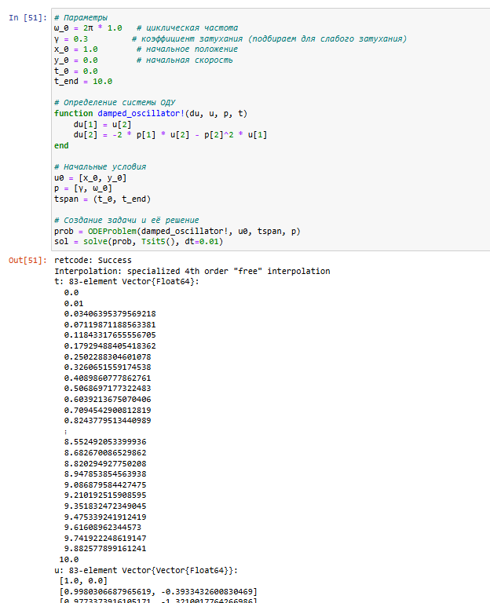{#fig:038 width=70%} 

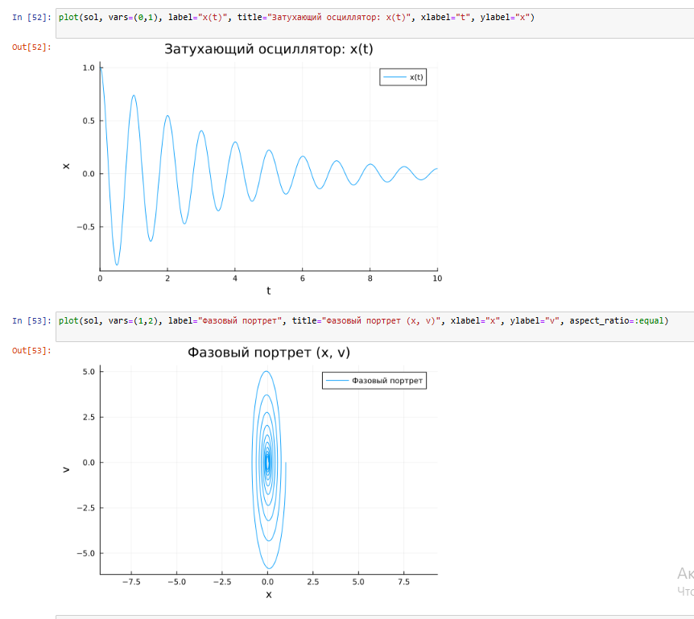{#fig:039 width=70%} 

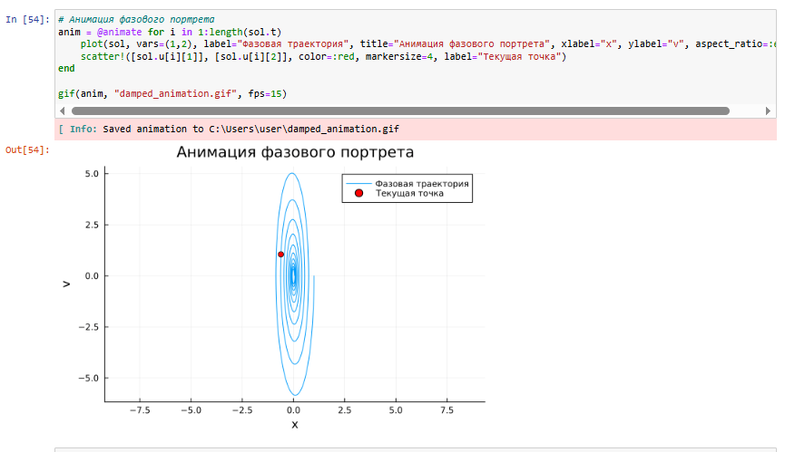{#fig:040 width=70%} 

# Выводы

В результате выполнения данной лабораторной работы я освоила специализированные пакеты для решения задач в непрерывном и дискретном времени.
