---
## Front matter
lang: ru-RU
title: Лабораторная работа № 7. Введение в работу с данными
author:
  - Абакумова О. М.
institute:
  - Российский университет дружбы народов, Москва, Россия


## i18n babel
babel-lang: russian
babel-otherlangs: english

## Formatting pdf
toc: false
toc-title: Содержание
slide_level: 2
aspectratio: 169
section-titles: true
theme: metropolis
header-includes:
 - \metroset{progressbar=frametitle,sectionpage=progressbar,numbering=fraction}
mainfont: Open Sans Light
---

# Информация

## Докладчик

:::::::::::::: {.columns align=center}
::: {.column width="70%"}

  * Абакумова Олеся Максимовна
  * Студентка
  * Российский университет дружбы народов
  * 1132220832@pfur.ru
  * <https://github.com/omabakumova>

:::
::: {.column width="30%"}


:::
::::::::::::::

# Цель работы

Основной целью работы является освоение специализированных пакетов Julia для обработки
данных.

# Задание

1. Выполнить примеры, приведенные в лабораторной работе.

2. Выполнить задания для самостоятельного выполнения

# Выполнение лабораторной работы

## Предварительные сведения

Обработка и анализ данных, полученных в результате проведения исследований, —
важная и неотъемлемая часть исследовательской деятельности. Большое значение имеет выявление определённых связей и закономерностей в имеющихся неструктурированных
данных, особенно в данных больших размерностей. Выявленные в данных связей и закономерностей позволяет строить прогнозные модели с предполагаемым результатом. Для решения таких задач применяют методы из таких областей знаний как математическая статистика, программирование, искусственный интеллект, машинное обучение.

## Julia для науки о данных

В Julia для обработки данных используются наработки из других языков программирования, в частности, из R и Python.

## Считывание данных

Перед тем, как начать проводить какие-либо операции над данными, необходимо их откуда-то считать и возможно сохранить в определённой структуре.
Довольно часто данные для обработки содержаться в csv-файле, имеющим текстовый формат, в котором данные в строке разделены, например, запятыми, и соответствуют
ячейкам таблицы, а строки данных соответствуют строкам таблицы. Также данные могут быть представлены в виде фреймов или множеств.
В Julia для работы с такого рода структурами данных используют пакеты CSV,
`DataFrames`, `RDatasets`, `FileIO`.

## Считывание данных

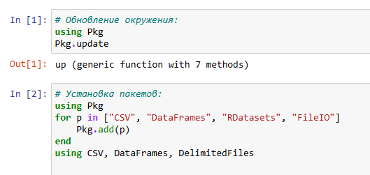{#fig:001 width=40%}

## Считывание данных

{#fig:002 width=40%}

## Считывание данных

{#fig:003 width=40%}

## Считывание данных


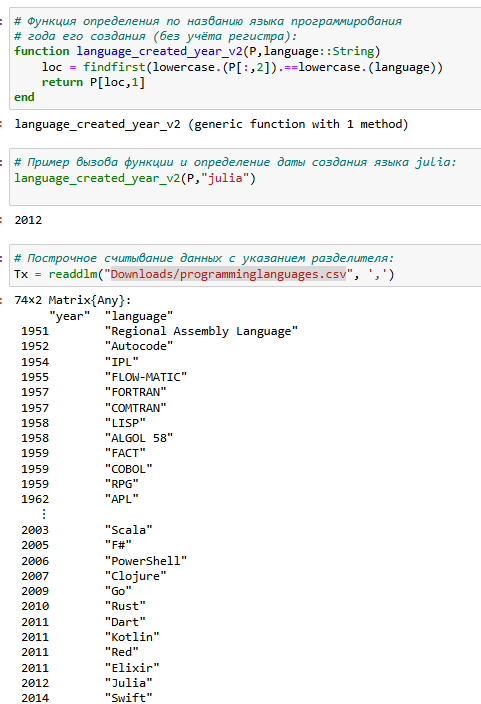{#fig:004 width=25%}


## Запись данных в файл

{#fig:005 width=25%}


## Словари

При работе с данными бывает удобно записать их в формате словаря.
Предположим, что словарь должен содержать перечень всех языков программирования и года их создания, при этом при указании года выводить все языки программирования, созданные в этом году.
При инициализации словаря можно задать конкретные типы данных для ключей
и значений.

## Словари

{#fig:006 width=40%}

## Словари

В последнем случае словарь принимает ключи и значения любого типа.
Далее требуется заполнить словарь ключами и годами, которые содержат все языки программирования, созданные в каждом году, в качестве значений.

В результате при вызове словаря можно, выбрав любой год, узнать, какие языки программирования были созданы в этом году.

## DataFrames

Работа с данными, записанными в структуре DataFrame, позволяет использовать индексацию и получить доступ к столбцам по заданному имени заголовка или по индексу столбца.
На примере с данными о языках программирования и годах их создания зададим
структуру DataFrame.

## DataFrames

{#fig:007 width=25%}

## DataFrames

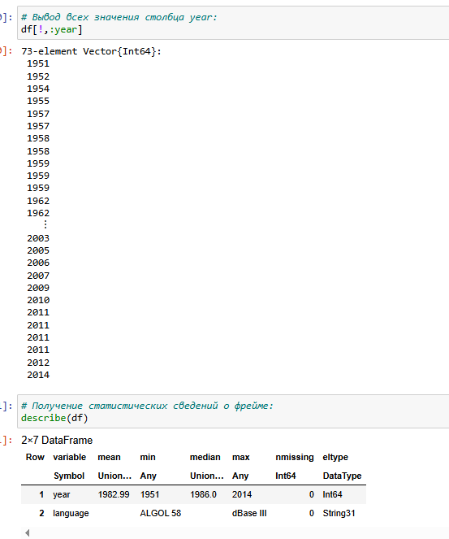{#fig:008 width=40%}

## DataFrames

В Julia это означает, что имена заголовков обрабатываются как символы. Также следует
иметь в виду, что вызов `df[1]` эквивалентен вызову df `[:year]`.
Пакет `DataFrames` предоставляет возможность с помощью description получить основные статистические сведения о каждом столбце во фрейме данных.

## RDatasets

{#fig:009 width=40%}

## RDatasets

В данном случает набор данных содержит сведения о цветах. При этом следует иметь
в виду, что данные, загруженные с помощью набора данных, хранятся в виде `DataFrame`. Пакет `RDatasets` также предоставляет возможность с помощью `description` получить
основные статистические сведения о каждом столбце в наборе данных.

## RDatasets 

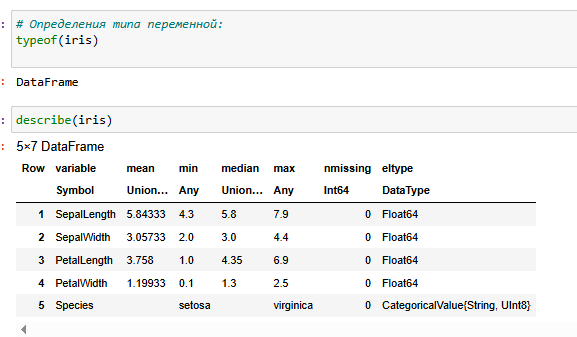{#fig:010 width=40%}

## Работа с переменными отсутствующего типа (Missing Values)

Пакет `DataFrames` позволяет использовать так называемый «отсутствующий» тип.
В операции сложения числа и переменной с отсутствующим типом значение также
будет иметь отсутствующий тип. Приведём пример работы с данными, среди которых есть данные с отсутствующим
типом.

## Работа с переменными отсутствующего типа (Missing Values)

{#fig:011 width=25%}

## Работа с переменными отсутствующего типа (Missing Values)

{#fig:012 width=40%}

## FileIO

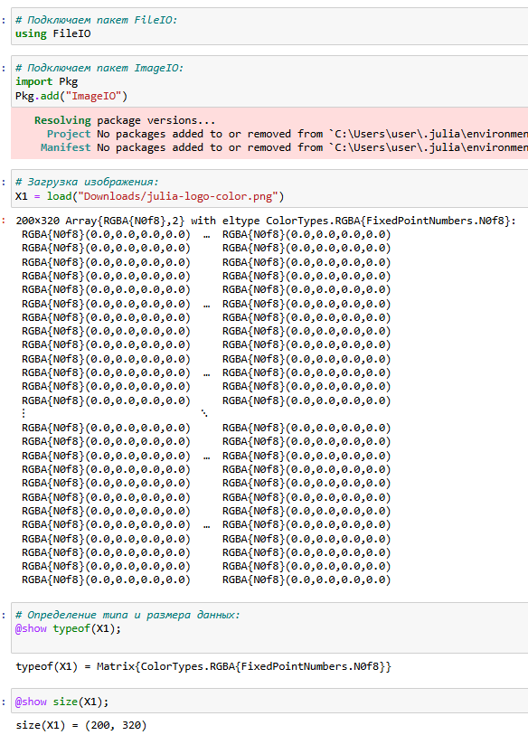{#fig:013 width=25%}

# Обработка данных: стандартные алгоритмы машинного обучения в Julia

## Кластеризация данных. Метод k-средних

Задача кластеризации данных заключается в формировании однородной группы упо-
рядоченных по какому-то признаку данных.
Метод k-средних позволяет минимизировать суммарное квадратичное отклонение
точек кластеров от центров этих кластеров:

$$
V = \sum_{i=1}^{k} \sum_{x \in S_i} (x - \mu_i)^2
$$

где $S_i, i = 1, 2, ..., k$ — полученные кластеры, $k$ — число кластеров, $\mu_i$ — центры масс (главные точки или объекты кластера) всех векторов $x$ из кластера $S_i$.

## Кластеризация данных. Метод k-средних

Рассмотрим задачу кластеризации данных на примере данных о недвижимости. Файл с данными houses $S_i$ с SV содержит список транзакций с недвижимостью в районе Сакраменто, о которых было сообщено в течение определённого числа дней.

## Кластеризация данных. Метод k-средних

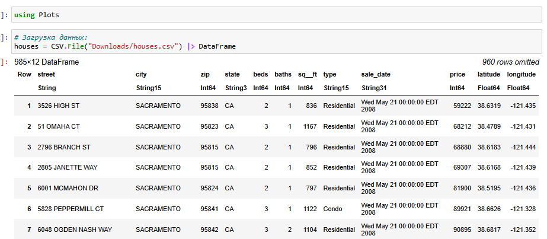{#fig:014 width=40%}

## Кластеризация данных. Метод k-средних

{#fig:015 width=40%}

## Кластеризация данных. Метод k-средних

Как видно из графика, имеются так называемые «артефакты», т.е. проявляются отсутствующие или невозможные сведения в исходных данных, например, цены на
недвижимость нулевой площади.

Для того чтобы избавиться от такого эффекта, можно отфильтровать и исключить такие
значения, получить более корректный график цен.

## Кластеризация данных. Метод k-средних

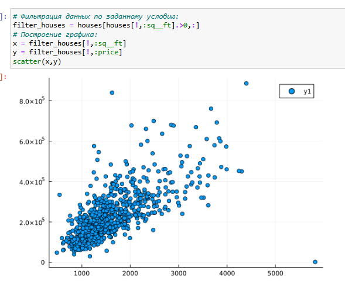{#fig:016 width=40%}

## Кластеризация данных. Метод k-средних

{#fig:017 width=40%}

## Кластеризация данных. Метод k-средних

Каждая функция хранится в виде строки X, но можно транспонировать получившуюся
матрицу, чтобы иметь возможность работать с столбцами данных X.В качестве критерия для формирования кластеров данных и определения количества
кластеров попробуем использовать количество почтовых индексов.Для определения k-среднего можно воспользоваться соответствующей функцией пакета Statistics.

## Кластеризация данных. Метод k-средних

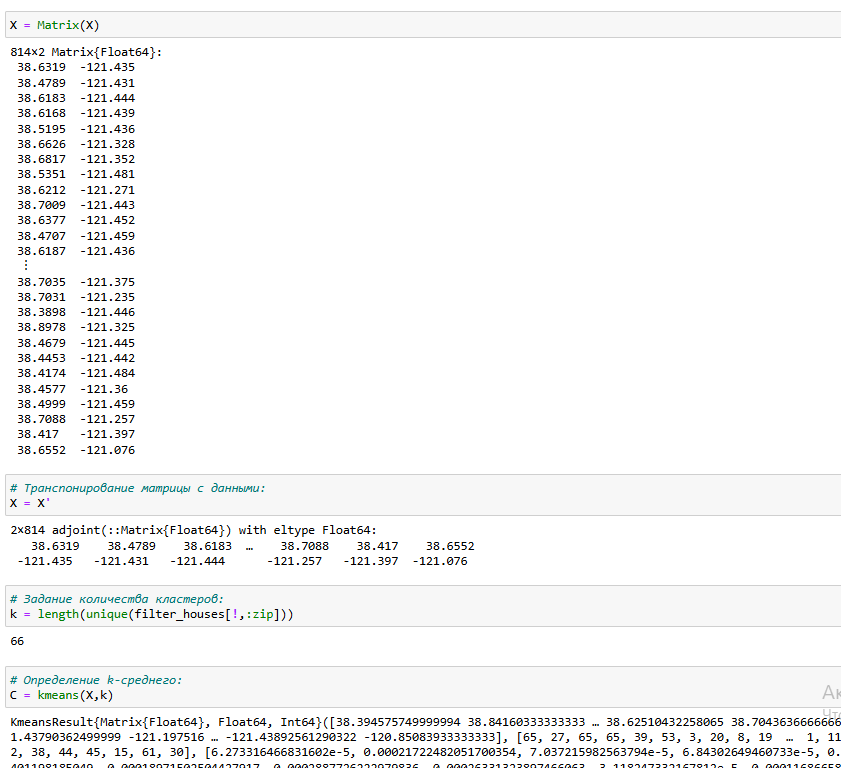{#fig:018 width=40%}

## Кластеризация данных. Метод k-средних

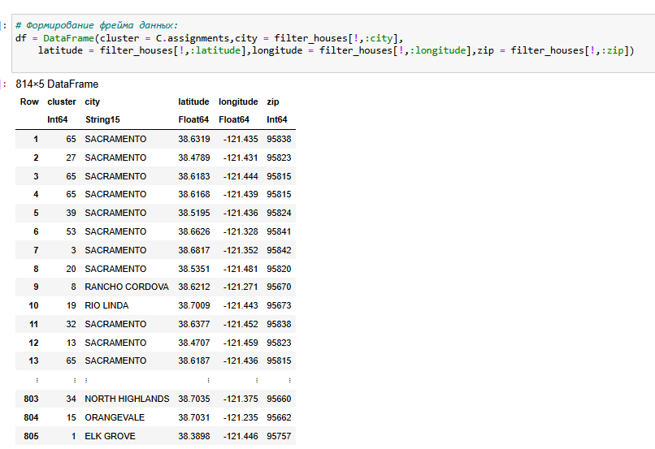{#fig:019 width=40%}

## Кластеризация данных. Метод k-средних

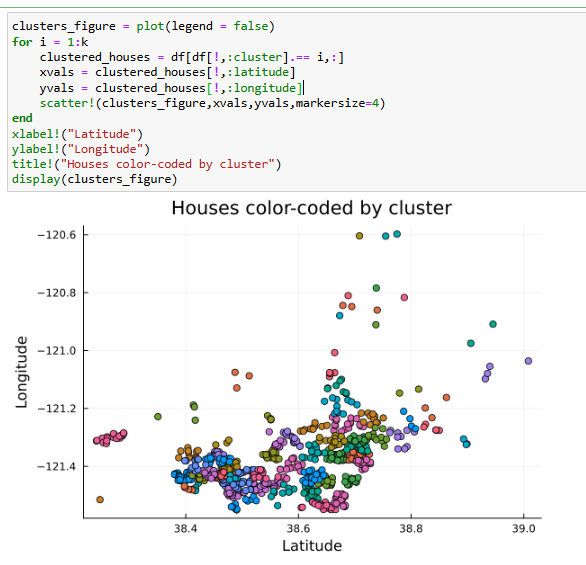{#fig:020 width=40%}

## Кластеризация данных. Метод k-средних

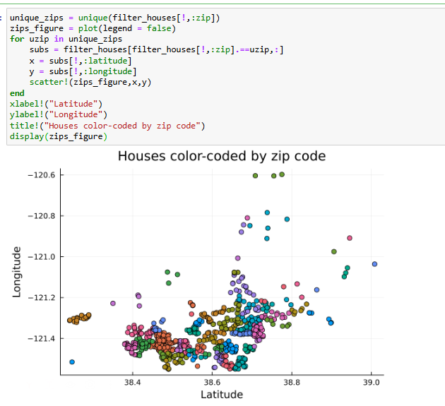{#fig:021 width=40%}

## Кластеризация данных. Метод k ближайших соседей

Данный метод заключается в отнесении объекта к тому из известных классов, который является наиболее распространённым среди $k$ соседей данного элемента. В случае
использования метода для регрессии, объекту присваивается среднее значение по $k$
ближайшим к нему объектам.
Рассмотрим использование метода $k$ ближайших соседей на примере того же файла
с данными об объектах недвижимости в Сакраменто.Подключим необходимый пакет, найдем $k$-среднее и определим ближайших соседей.

## Кластеризация данных. Метод k ближайших соседей

{#fig:022 width=40%}

## Кластеризация данных. Метод k ближайших соседей

{#fig:023 width=25%}

## Обработка данных. Метод главных компонент

Метод главных компонент (Principal Components Analysis, PCA) позволяет уменьшить
размерность данных, потеряв наименьшее количество полезной информации. Метод
имеет широкое применение в различных областях знаний, например, при визуализации
данных, компрессии изображений, в эконометрике, некоторых гуманитарных предмет-
ных областях, например, в социологии или в политологии.

## Обработка данных. Метод главных компонент

{#fig:024 width=40%}

## Обработка данных. Метод главных компонент

{#fig:025 width=40%}

## Обработка данных. Линейная регрессия

Регрессионный анализ представляет собой набор статистических методов иссле-
дования влияния одной или нескольких независимых переменных (регрессоров) на
зависимую (критериальная) переменную. Терминология зависимых и независимых
переменных отражает лишь математическую зависимость переменных, а не причинно-следственные отношения.

Наиболее распространённый вид регрессионного анализа — линейная регрессия, когда
находят линейную функцию, которая согласно определённым математическим критериям наиболее соответствует данным.

## Обработка данных. Линейная регрессия

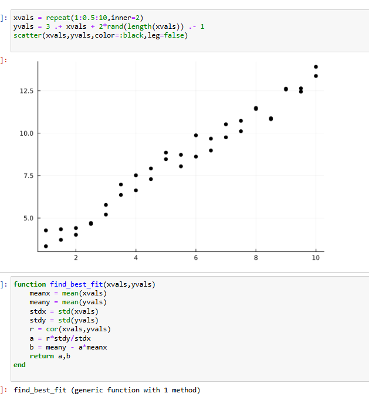{#fig:026 width=40%}

## Обработка данных. Линейная регрессия

{#fig:027 width=40%}

## Обработка данных. Линейная регрессия

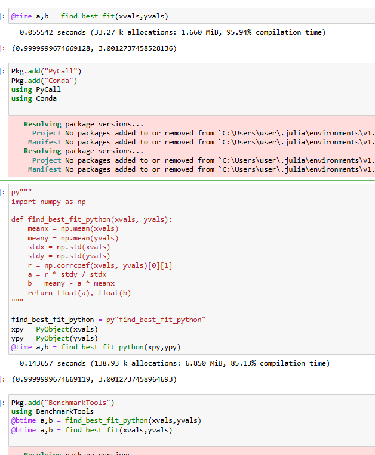{#fig:028 width=40%}

## Задания для самостоятельного выполнения


1. Загрузите

```Julia
using RDatasets
iris = dataset("datasets", "iris")
```

Используйте `Clustering.jl` для кластеризации на основе k-средних. Сделайте точечную диаграмму полученных кластеров.
Подсказка: вам нужно будет проиндексировать фрейм данных, преобразовать его
в массив и транспонировать.

## Задания для самостоятельного выполнения

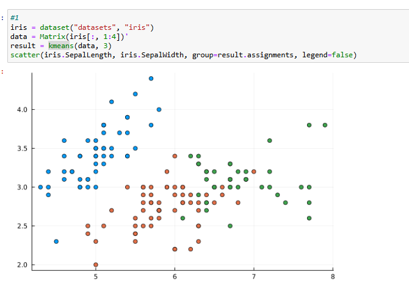{#fig:029 width=40%}


## Задания для самостоятельного выполнения

2. 

```Julia
# Часть 1
X = randn(1000, 3)
a0 = rand(3)
y = X * a0 + 0.1 * randn(1000);
# Часть 2
X = rand(100);
y = 2X + 0.1 * randn(100);
```

## Задания для самостоятельного выполнения

**Часть 1**
Пусть регрессионная зависимость является линейной. Матрица наблюдений факторов $X$ имеет размерность $N \times 3$ randn (N, 3), массив результатов $N \times 1$, регрессионная зависимость является линейной. Найдите МНК-оценку для линейной модели.

- Сравните свои результаты с результатами использования `llsq` из `MultivariateStats.jl` (просмотрите документацию).

- Сравните свои результаты с результатами использования регулярной регрессии наименьших квадратов из `GLN.jl`.

Подсказка. Создайте матрицу данных `X2`, которая добавляет столбец единиц в начало матрицы данных, и решите систему линейных уравнений. Объясните с помощью теоретических выкладок.

## Задания для самостоятельного выполнения

**Часть 2**
Найдите линию регрессии, используя данные $(X, y)$. Постройте график $(X, y)$, используя точечный график. Добавьте линию регрессии, используя `abline!`. Добавьте заголовок «График регрессии» и подпишите оси $x$ и $y$.

## Задания для самостоятельного выполнения

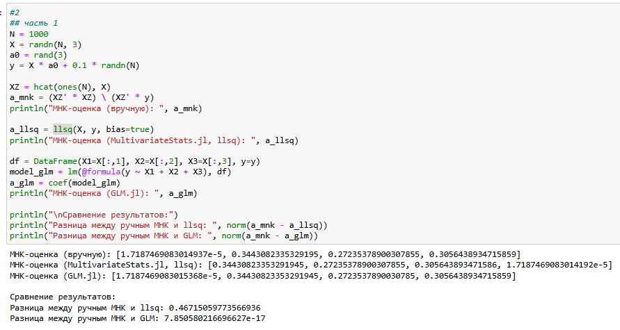{#fig:030 width=40%}

## Задания для самостоятельного выполнения

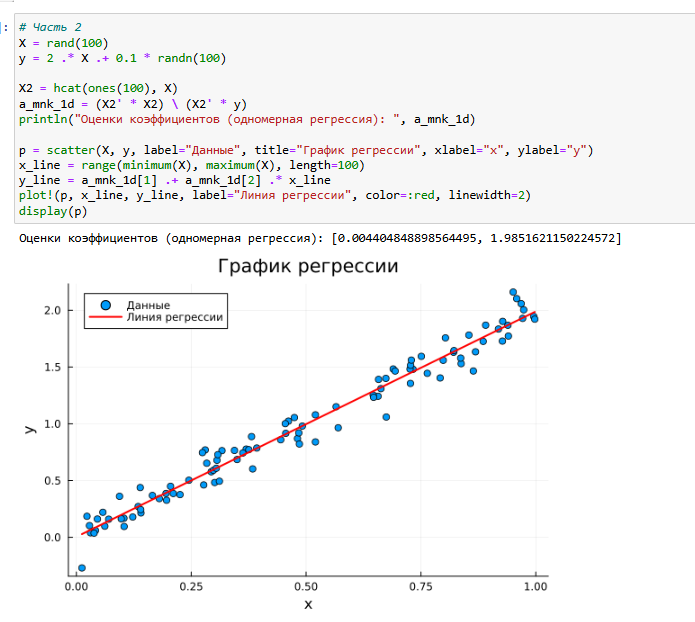{#fig:031 width=40%}

## Задания для самостоятельного выполнения

3. Постройте траекторию возможных цен на акции:
  
- $S$ — начальная цена акции; 
 
- $T$ — длина биномиального дерева в годах;  

- $n$ — количество периодов;  

- $h = \frac{T}{n}$ — длина одного периода;  

## Задания для самостоятельного выполнения

- $\sigma$ — волатильность акции;  

- $r$ — годовая процентная ставка;  

- $u = \exp(rh + \sigma\sqrt{h})$;  

- $d = \exp(rh - \sigma\sqrt{h})$;  

- $p^* = \frac{\exp(rh) - d}{u - d}$.  

## Задания для самостоятельного выполнения

**a)** Пусть $S = 100$, $T = 1$, $n = 10000$, $\sigma = 0.3$ и $r = 0.08$. Попробуйте построить траекторию курса акций. Функция `rand()` генерирует случайное число от 0 до 1. Вы можете использовать функцию построения графика из библиотеки графиков.  

**b)** Создайте функцию `createPath(S::Float64, r::Float64, sigma::Float64, T::Float64, n::Int64)`, которая создает траекторию цены акции с учетом начальных параметров. Используйте `createPath`, чтобы создать 10 разных траекторий и построить их все на одном графике.  

## Задания для самостоятельного выполнения

**c)** Распараллельте генерацию траектории. Можете использовать `Threads.@threads`, `pmap` и `@parallel`.  

**d)** Пусть $S = 100$, $T = 1$, $n = 10000$, $\sigma = 0.3$ и $r = 0.08$. Попробуйте построить траекторию курса акций. Функция `rand()` генерирует случайное число от 0 до 1. Вы можете использовать функцию построения графика из библиотеки графиков.

## Задания для самостоятельного выполнения

{#fig:032 width=40%}

## Задания для самостоятельного выполнения

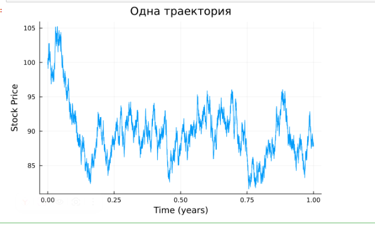{#fig:033 width=40%}

## Задания для самостоятельного выполнения

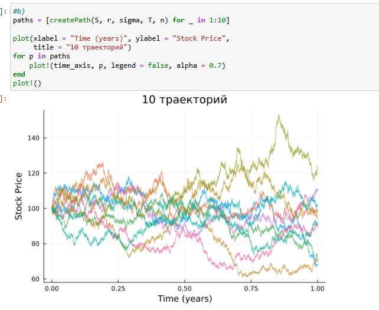{#fig:034 width=40%}

## Задания для самостоятельного выполнения

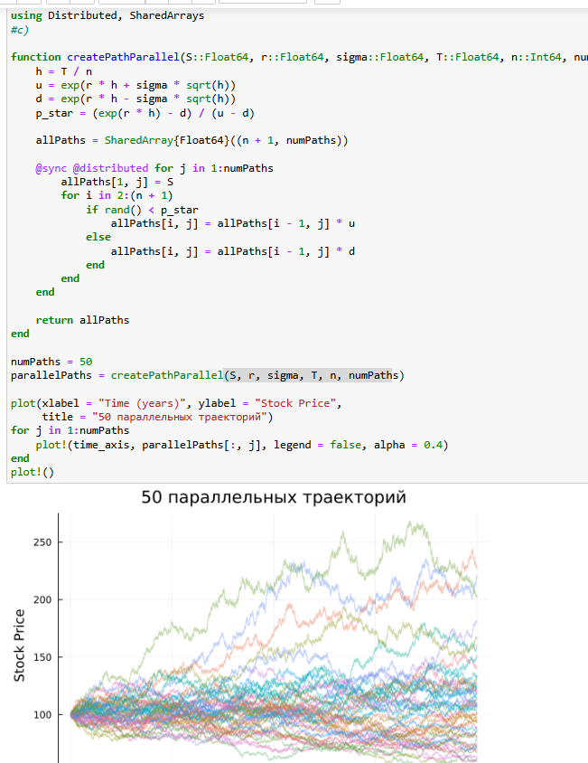{#fig:035 width=30%}

## Задания для самостоятельного выполнения

{#fig:036 width=40%}


# Выводы

В результате выполнения данной лабораторной работы я освоила специализированные пакеты для решения задач в непрерывном и дискретном времени.
