---
## Front matter
title: "Лабораторная работа № 7. Введение в работу с данными"
author: "Абакумова Олеся Максимовна, НФИбд-02-22"

## Generic otions
lang: ru-RU
toc-title: "Содержание"

## Bibliography
bibliography: bib/cite.bib
csl: pandoc/csl/gost-r-7-0-5-2008-numeric.csl

## Pdf output format
toc: true # Table of contents
toc-depth: 2
lof: true # List of figures
lot: true # List of tables
fontsize: 12pt
linestretch: 1.5
papersize: a4
documentclass: scrreprt
## I18n polyglossia
polyglossia-lang:
  name: russian
  options:
	- spelling=modern
	- babelshorthands=true
polyglossia-otherlangs:
  name: english
## I18n babel
babel-lang: russian
babel-otherlangs: english
## Fonts
mainfont: IBM Plex Serif
romanfont: IBM Plex Serif
sansfont: IBM Plex Sans
monofont: IBM Plex Mono
mathfont: STIX Two Math
mainfontoptions: Ligatures=Common,Ligatures=TeX,Scale=0.94
romanfontoptions: Ligatures=Common,Ligatures=TeX,Scale=0.94
sansfontoptions: Ligatures=Common,Ligatures=TeX,Scale=MatchLowercase,Scale=0.94
monofontoptions: Scale=MatchLowercase,Scale=0.94,FakeStretch=0.9
mathfontoptions:
## Biblatex
biblatex: true
biblio-style: "gost-numeric"
biblatexoptions:
  - parentracker=true
  - backend=biber
  - hyperref=auto
  - language=auto
  - autolang=other*
  - citestyle=gost-numeric
## Pandoc-crossref LaTeX customization
figureTitle: "Рис."
tableTitle: "Таблица"
listingTitle: "Листинг"
lofTitle: "Список иллюстраций"
lotTitle: "Список таблиц"
lolTitle: "Листинги"
## Misc options
indent: true
header-includes:
  - \usepackage{indentfirst}
  - \usepackage{float} # keep figures where there are in the text
  - \floatplacement{figure}{H} # keep figures where there are in the text
---


# Цель работы

Основной целью работы является освоение специализированных пакетов Julia для обработки
данных.

# Задание

1. Выполнить примеры, приведенные в лабораторной работе.

2. Выполнить задания для самостоятельного выполнения

# Выполнение лабораторной работы

## Предварительные сведения

Обработка и анализ данных, полученных в результате проведения исследований, —
важная и неотъемлемая часть исследовательской деятельности. Большое значение имеет выявление определённых связей и закономерностей в имеющихся неструктурированных
данных, особенно в данных больших размерностей. Выявленные в данных связей и закономерностей позволяет строить прогнозные модели с предполагаемым результатом. Для решения таких задач применяют методы из таких областей знаний как математическая статистика, программирование, искусственный интеллект, машинное обучение.

## Julia для науки о данных

В Julia для обработки данных используются наработки из других языков программирования, в частности, из R и Python.

## Считывание данных

Перед тем, как начать проводить какие-либо операции над данными, необходимо их откуда-то считать и возможно сохранить в определённой структуре.
Довольно часто данные для обработки содержаться в csv-файле, имеющим текстовый формат, в котором данные в строке разделены, например, запятыми, и соответствуют
ячейкам таблицы, а строки данных соответствуют строкам таблицы. Также данные могут быть представлены в виде фреймов или множеств.
В Julia для работы с такого рода структурами данных используют пакеты CSV,
`DataFrames`, `RDatasets`, `FileIO` (рис. [-@fig:001]):

{#fig:001 width=70%}

Предположим, что у вас в рабочем каталоге с проектом есть файл с данными
programminglanguages.csv, содержащий перечень языков программирования и год их создания. Тогда для заполнения массива данными для последующей обработки требуется
считать данные из исходного файла и записать их в соответствующую структуру (рис. [-@fig:002]):

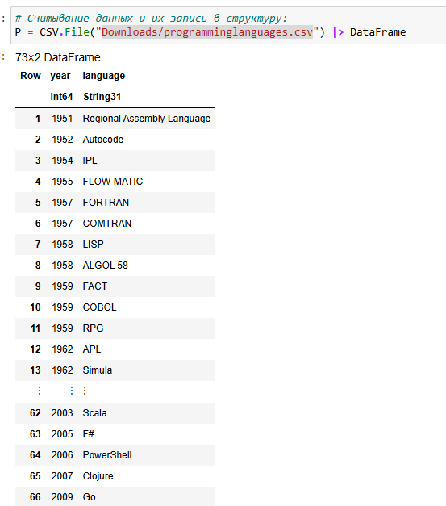{#fig:002 width=40%}

Далее приведём пример функции, в которой на входе указывается название языка
программирования, а на выходе — год его создания (рис. [-@fig:003]):

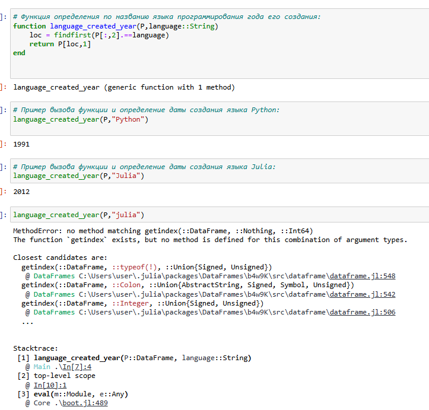{#fig:003 width=70%}

В следующем примере (рис. [-@fig:003]) при вызове функции, в качестве аргумента которой указано слово julia, написанное со строчной буквы будет выдана ошибка, так как список не содержит таких данных.

Для того, чтобы убрать в функции зависимость данных от регистра, необходимо изменить исходную функцию следующим образом (рис. [-@fig:004]):

{#fig:004 width=70%}

Можно считывать данные построчно, с элементами, разделенными заданным разделителем (рис. [-@fig:004]).

## Запись данных в файл

Предположим, что требуется записать имеющиеся данные в файл. Для записи данных в формате CSV можно воспользоваться следующим вызовом (рис. [-@fig:005]):

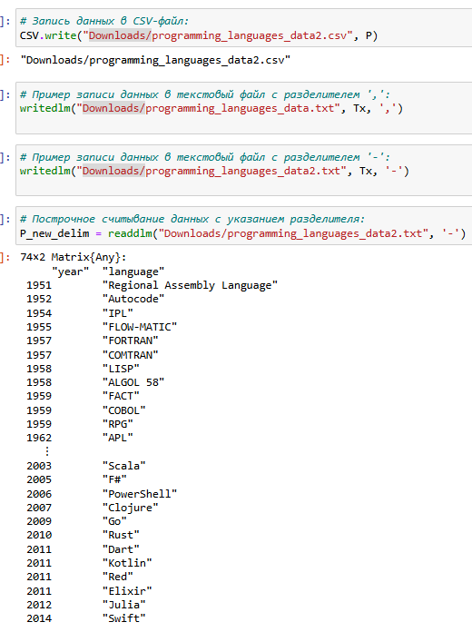{#fig:005 width=70%}

Можно проверить, используя `readdlm`, корректность считывания созданного текстового файла (рис. [-@fig:005]).

## Словари

При работе с данными бывает удобно записать их в формате словаря.
Предположим, что словарь должен содержать перечень всех языков программирования и года их создания, при этом при указании года выводить все языки программирования, созданные в этом году.
При инициализации словаря можно задать конкретные типы данных для ключей
и значений (рис. [-@fig:006]):

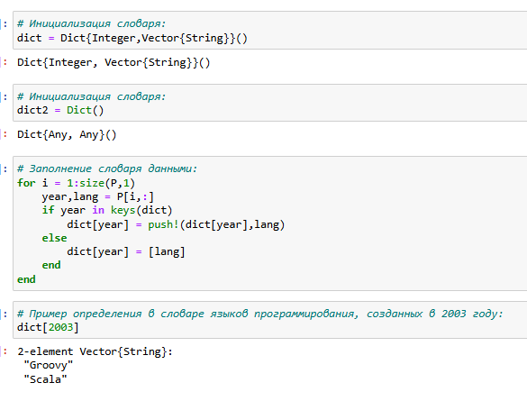{#fig:006 width=70%}

Можно также инициировать пустой словарь, не задавая строго структуру (рис. [-@fig:006]).

В последнем случае словарь принимает ключи и значения любого типа.
Далее требуется заполнить словарь ключами и годами, которые содержат все языки программирования, созданные в каждом году, в качестве значений, как показано на рис. [-@fig:006].

В результате при вызове словаря можно, выбрав любой год, узнать, какие языки программирования были созданы в этом году.

## DataFrames

Работа с данными, записанными в структуре DataFrame, позволяет использовать индексацию и получить доступ к столбцам по заданному имени заголовка или по индексу столбца.
На примере с данными о языках программирования и годах их создания зададим
структуру DataFrame (рис. [-@fig:007]):

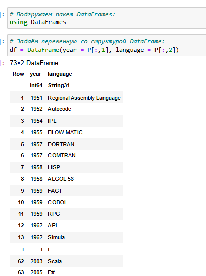{#fig:007 width=70%}

Если требуется получить доступ к столбцам по имени заголовка, то необходимо добавить к имени заголовка двоеточие (рис. [-@fig:008]):

{#fig:008 width=70%}

В Julia это означает, что имена заголовков обрабатываются как символы. Также следует
иметь в виду, что вызов `df[1]` эквивалентен вызову df `[:year]`.
Пакет `DataFrames` предоставляет возможность с помощью description получить основные статистические сведения о каждом столбце во фрейме данных (рис. [-@fig:008]).

## RDatasets

С данными можно работать также как с наборами данных через пакет `RDatasets`
языка R (рис. [-@fig:009]):

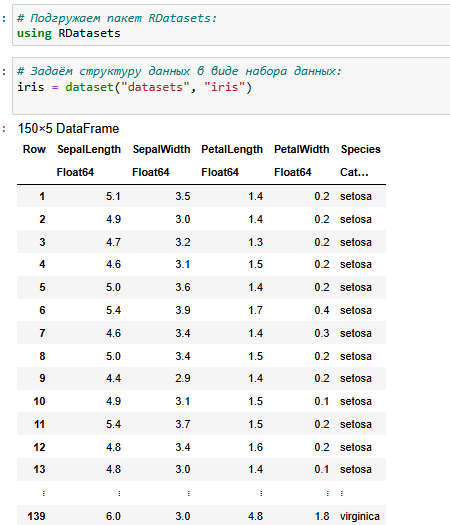{#fig:009 width=70%}

В данном случает набор данных содержит сведения о цветах. При этом следует иметь
в виду, что данные, загруженные с помощью набора данных, хранятся в виде `DataFrame`. Пакет `RDatasets` также предоставляет возможность с помощью `description` получить
основные статистические сведения о каждом столбце в наборе данных (рис. [-@fig:010]):

{#fig:010 width=70%}

## Работа с переменными отсутствующего типа (Missing Values)

Пакет `DataFrames` позволяет использовать так называемый «отсутствующий» тип.
В операции сложения числа и переменной с отсутствующим типом значение также
будет иметь отсутствующий тип. Приведём пример работы с данными, среди которых есть данные с отсутствующим
типом (рис. [-@fig:011]):

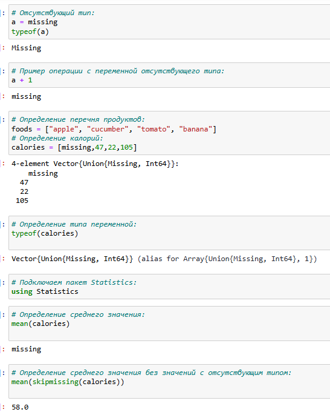{#fig:011 width=70%}

При попытке получить среднее значение калорий, ничего не получится из-за наличия переменной с отсутствующим типом. Для решения этой проблемы необходимо игнорировать отсутствующий тип (рис. [-@fig:011]).

Далее показано, как можно сформировать таблицы данных и объединить их в один
фрейм (рис. [-@fig:012]):

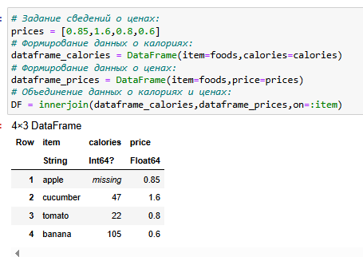{#fig:012 width=70%}

## FileIO

В Julia можно работать с так называемыми «сырыми» данными, используя пакет
`FileIO`. Julia хранит изображение в виде множества цветов, можно определить тип и размер данных (рис. [-@fig:013]):

{#fig:013 width=70%}

## Обработка данных: стандартные алгоритмы машинного обучения в Julia

### Кластеризация данных. Метод k-средних

Задача кластеризации данных заключается в формировании однородной группы упо-
рядоченных по какому-то признаку данных.
Метод k-средних позволяет минимизировать суммарное квадратичное отклонение
точек кластеров от центров этих кластеров:

$$
V = \sum_{i=1}^{k} \sum_{x \in S_i} (x - \mu_i)^2
$$

где $S_i, i = 1, 2, ..., k$ — полученные кластеры, $k$ — число кластеров, $\mu_i$ — центры масс (главные точки или объекты кластера) всех векторов $x$ из кластера $S_i$.

Рассмотрим задачу кластеризации данных на примере данных о недвижимости. Файл с данными houses $S_i$ с SV содержит список транзакций с недвижимостью в районе Сакраменто, о которых было сообщено в течение определённого числа дней.

Сначала подключим необходимые для работы пакеты и подгрузим данные (рис. [-@fig:014]):

{#fig:014 width=70%}

Построим графики:

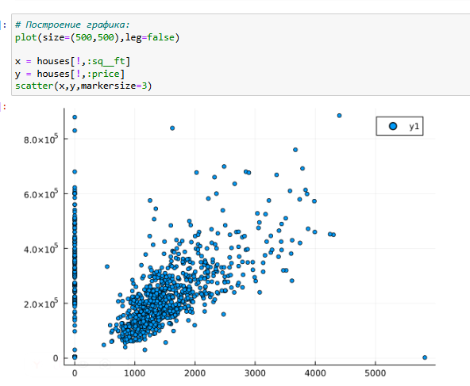{#fig:015 width=70%}

Как видно из графика на рис. [-@fig:015], имеются так называемые «артефакты», т.е. проявляются отсутствующие или невозможные сведения в исходных данных, например, цены на
недвижимость нулевой площади.

Для того чтобы избавиться от такого эффекта, можно отфильтровать и исключить такие
значения, получить более корректный график цен (рис. [-@fig:016]):

{#fig:016 width=70%}

Используя для фильтрации значений функцию `by` пакета `DataFrames` и для вычисления
среднего значения функцию mean пакета `Statistics`, можно посмотреть среднюю цену
домов определённого типа (рис. [-@fig:017]):

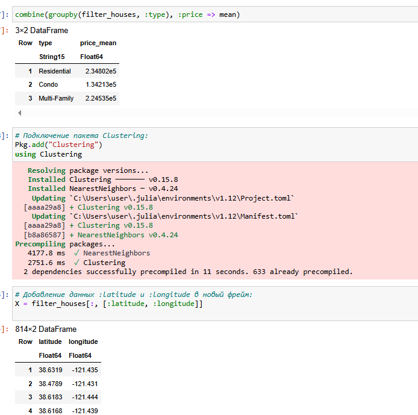{#fig:017 width=70%}

Каждая функция хранится в виде строки X, но можно транспонировать получившуюся
матрицу, чтобы иметь возможность работать с столбцами данных X.В качестве критерия для формирования кластеров данных и определения количества
кластеров попробуем использовать количество почтовых индексов.Для определения k-среднего можно воспользоваться соответствующей функцией пакета Statistics (рис. [-@fig:018]):

{#fig:018 width=70%}

Далее сформируем новый фрейм, включающий исходные данные о недвижимости
и столбец с данными о назначенном каждому дому кластере (рис. [-@fig:019]):

{#fig:019 width=70%}

Построим график, обозначив каждый кластер отдельным цветом (рис. [-@fig:020]):

{#fig:020 width=70%}

Построим график, раскрасив кластеры по почтовому индексу (рис. [-@fig:021]):

{#fig:021 width=70%}

### Кластеризация данных. Метод k ближайших соседей

Данный метод заключается в отнесении объекта к тому из известных классов, который является наиболее распространённым среди $k$ соседей данного элемента. В случае
использования метода для регрессии, объекту присваивается среднее значение по $k$
ближайшим к нему объектам.
Рассмотрим использование метода $k$ ближайших соседей на примере того же файла
с данными об объектах недвижимости в Сакраменто.Подключим необходимый пакет, найдем $k$-среднее и определим ближайших соседей (рис. [-@fig:022]):

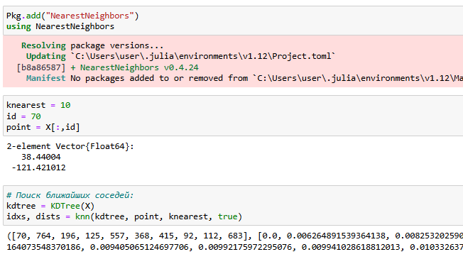{#fig:022 width=70%}

Отобразим на графике соседей выбранного объекта недвижимости и отфильтруем  по районам соседних домов (рис. [-@fig:023]):

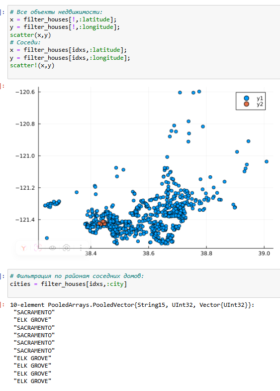{#fig:023 width=70%}

### Обработка данных. Метод главных компонент

Метод главных компонент (Principal Components Analysis, PCA) позволяет уменьшить
размерность данных, потеряв наименьшее количество полезной информации. Метод
имеет широкое применение в различных областях знаний, например, при визуализации
данных, компрессии изображений, в эконометрике, некоторых гуманитарных предмет-
ных областях, например, в социологии или в политологии.

На примере с данными о недвижимости попробуем уменьшить размеры данных о цене
и площади из набора данных домов. Далее подключим пакет MultivariateStats, чтобы использовать метод главных компонент (рис. [-@fig:024]):

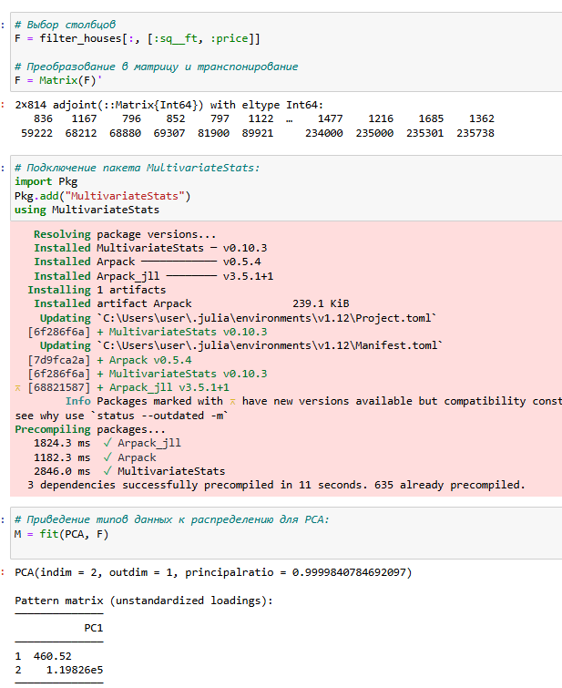{#fig:024 width=70%}

Использована функция `fit` и приведём имеющийся набор данных
к распределению, к которому можно применить метод главных компонент (PCA).

Далее воспользуемся функцией `reconstruct`, чтобы выделить данные с главными
компонентами в отдельную переменную `Xr`, значения которой в последствии можно
вывести на графике (рис. [-@fig:025]):

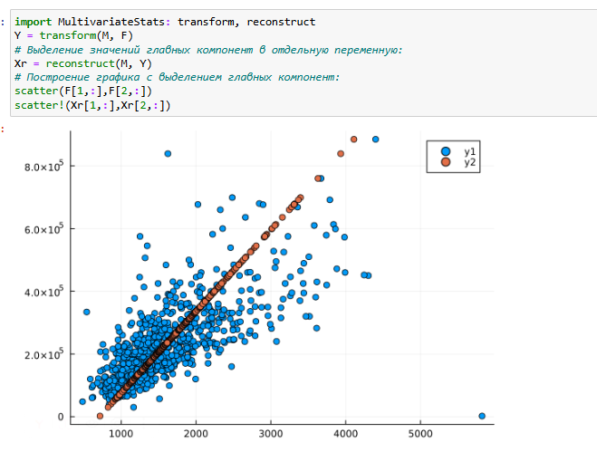{#fig:025 width=70%}

### Обработка данных. Линейная регрессия

Регрессионный анализ представляет собой набор статистических методов иссле-
дования влияния одной или нескольких независимых переменных (регрессоров) на
зависимую (критериальная) переменную. Терминология зависимых и независимых
переменных отражает лишь математическую зависимость переменных, а не причинно-следственные отношения.

Наиболее распространённый вид регрессионного анализа — линейная регрессия, когда
находят линейную функцию, которая согласно определённым математическим критериям наиболее соответствует данным.

Зададим случайный набор данных (можно использовать и полученные экспериментальным путём какие-то данные). Попробуем найти для данных лучшее соответствие (рис. [-@fig:026]):

{#fig:026 width=70%}

Выше также определена функция линейной регрессии (рис. [-@fig:026]).

Применим функцию линейной регрессии для построения соответствующего графика
значений, сгенерируем больший набор данных (рис. [-@fig:027]):

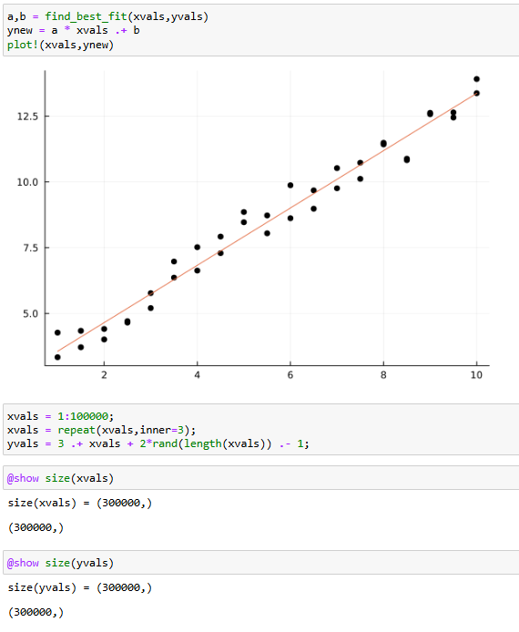{#fig:027 width=70%}

Определим, сколько времени потребуется, чтобы найти соответствие этим данным,для сравнения реализуем подобный код на языке Python (рис. [-@fig:028]):

{#fig:028 width=70%}

## Задания для самостоятельного выполнения


1. Загрузите

```Julia
using RDatasets
iris = dataset("datasets", "iris")
```

Используйте `Clustering.jl` для кластеризации на основе k-средних. Сделайте точечную диаграмму полученных кластеров.
Подсказка: вам нужно будет проиндексировать фрейм данных, преобразовать его
в массив и транспонировать.

{#fig:029 width=70%}


2. 

```Julia
# Часть 1
X = randn(1000, 3)
a0 = rand(3)
y = X * a0 + 0.1 * randn(1000);
# Часть 2
X = rand(100);
y = 2X + 0.1 * randn(100);
```

**Часть 1**
Пусть регрессионная зависимость является линейной. Матрица наблюдений факторов $X$ имеет размерность $N \times 3$ randn (N, 3), массив результатов $N \times 1$, регрессионная зависимость является линейной. Найдите МНК-оценку для линейной модели.

- Сравните свои результаты с результатами использования `llsq` из `MultivariateStats.jl` (просмотрите документацию).

- Сравните свои результаты с результатами использования регулярной регрессии наименьших квадратов из `GLN.jl`.

Подсказка. Создайте матрицу данных `X2`, которая добавляет столбец единиц в начало матрицы данных, и решите систему линейных уравнений. Объясните с помощью теоретических выкладок.

**Часть 2**
Найдите линию регрессии, используя данные $(X, y)$. Постройте график $(X, y)$, используя точечный график. Добавьте линию регрессии, используя `abline!`. Добавьте заголовок «График регрессии» и подпишите оси $x$ и $y$.


{#fig:030 width=70%}

{#fig:031 width=70%}


3. Постройте траекторию возможных цен на акции:
  
- $S$ — начальная цена акции; 
 
- $T$ — длина биномиального дерева в годах;  

- $n$ — количество периодов;  

- $h = \frac{T}{n}$ — длина одного периода;  

- $\sigma$ — волатильность акции;  

- $r$ — годовая процентная ставка;  

- $u = \exp(rh + \sigma\sqrt{h})$;  

- $d = \exp(rh - \sigma\sqrt{h})$;  

- $p^* = \frac{\exp(rh) - d}{u - d}$.  

**a)** Пусть $S = 100$, $T = 1$, $n = 10000$, $\sigma = 0.3$ и $r = 0.08$. Попробуйте построить траекторию курса акций. Функция `rand()` генерирует случайное число от 0 до 1. Вы можете использовать функцию построения графика из библиотеки графиков.  

**b)** Создайте функцию `createPath(S::Float64, r::Float64, sigma::Float64, T::Float64, n::Int64)`, которая создает траекторию цены акции с учетом начальных параметров. Используйте `createPath`, чтобы создать 10 разных траекторий и построить их все на одном графике.  

**c)** Распараллельте генерацию траектории. Можете использовать `Threads.@threads`, `pmap` и `@parallel`.  

**d)** Пусть $S = 100$, $T = 1$, $n = 10000$, $\sigma = 0.3$ и $r = 0.08$. Попробуйте построить траекторию курса акций. Функция `rand()` генерирует случайное число от 0 до 1. Вы можете использовать функцию построения графика из библиотеки графиков.

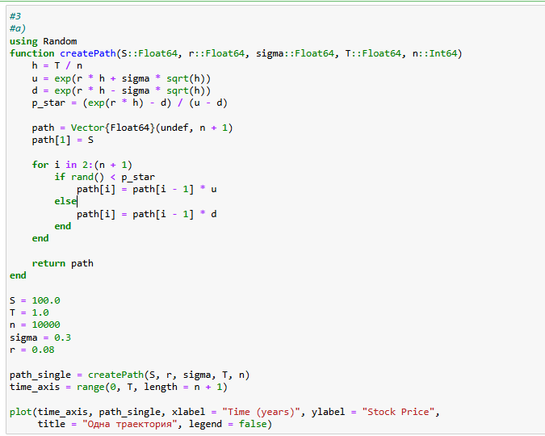{#fig:032 width=70%}

{#fig:033 width=70%}

{#fig:034 width=70%}

{#fig:035 width=70%}

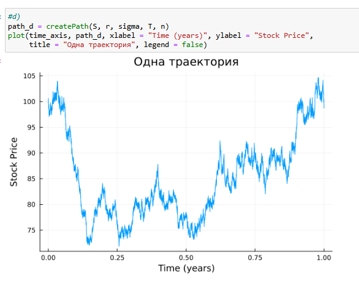{#fig:036 width=70%}


# Выводы

В результате выполнения данной лабораторной работы я освоила специализированные пакеты Julia для обработки
данных.
