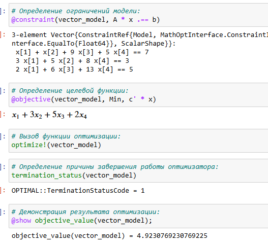
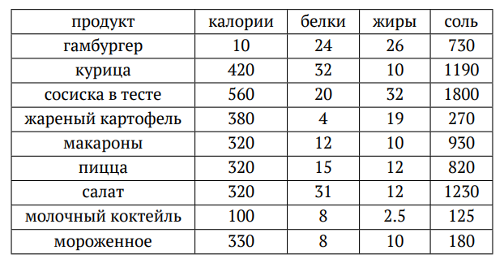
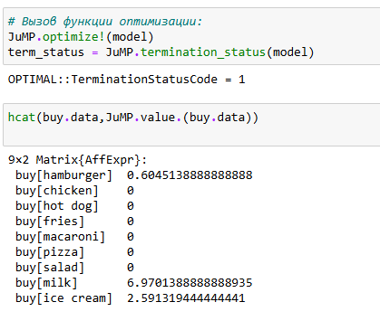
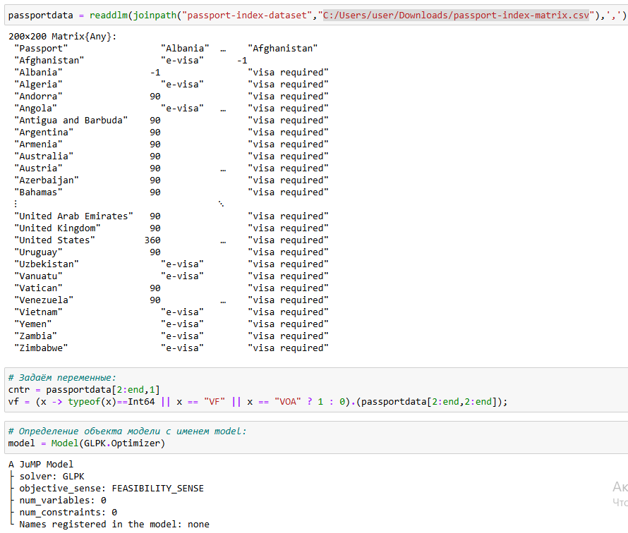
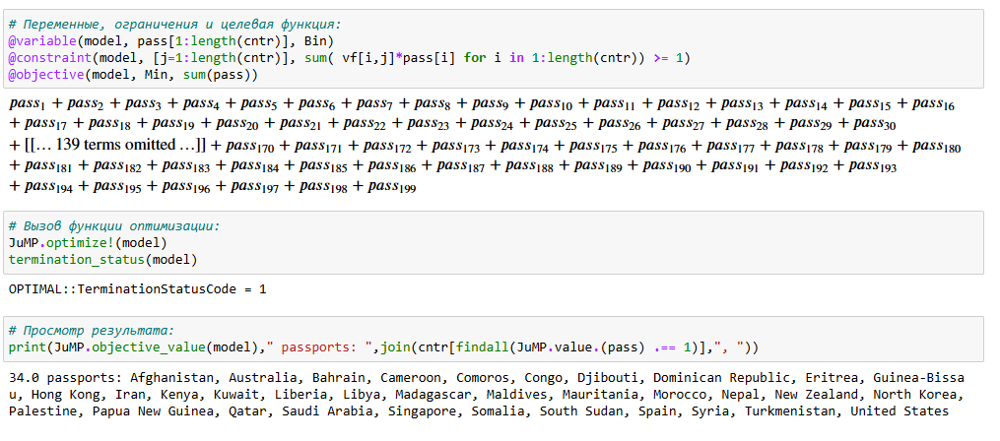
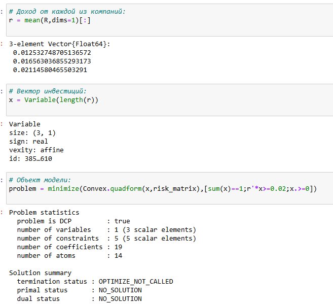
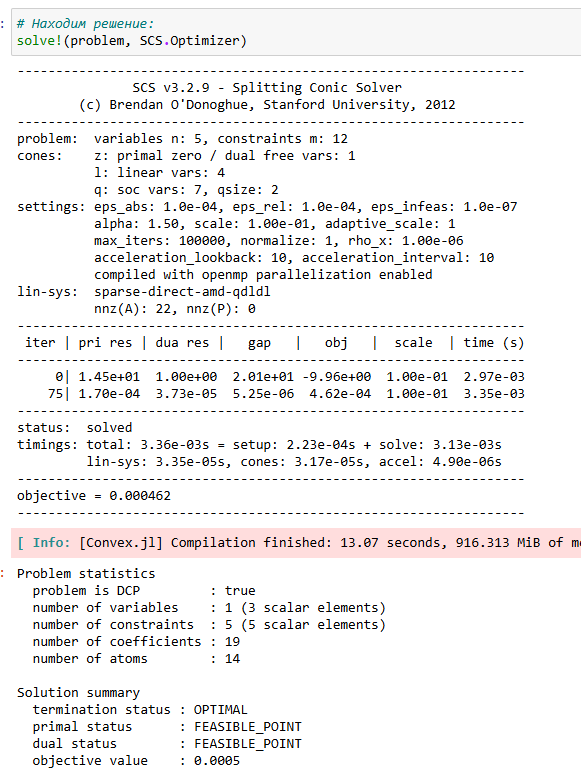
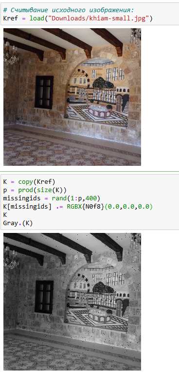

---
## Front matter
lang: ru-RU
title: Лабораторная работа № 8. Оптимизация
author:
  - Абакумова О. М.
institute:
  - Российский университет дружбы народов, Москва, Россия


## i18n babel
babel-lang: russian
babel-otherlangs: english

## Formatting pdf
toc: false
toc-title: Содержание
slide_level: 2
aspectratio: 169
section-titles: true
theme: metropolis
header-includes:
 - \metroset{progressbar=frametitle,sectionpage=progressbar,numbering=fraction}
mainfont: Open Sans Light
---

# Информация

## Докладчик

:::::::::::::: {.columns align=center}
::: {.column width="70%"}

  * Абакумова Олеся Максимовна
  * Студентка
  * Российский университет дружбы народов
  * 1132220832@pfur.ru
  * <https://github.com/omabakumova>

:::
::: {.column width="30%"}


:::
::::::::::::::

# Цель работы

Основная цель работа — освоить пакеты Julia для решения задач оптимизации.

# Задание

1. Выполнить примеры, приведенные в лабораторной работе.

2. Выполнить задания для самостоятельного выполнения

# Выполнение лабораторной работы

## Предварительные сведения

Под оптимизацией в математике и информатике понимается решение задачи нахождения экстремума (минимума или максимума) целевой функции в некоторой области
конечномерного векторного пространства, ограниченной набором линейных и/или нелинейных равенств и/или неравенств.

Оптимизационной задачей называется задача определения наилучших с точки зрения
структуры или значений параметров объектов.

## Линейное программирование

В Julia для обработки данных используются наработки из других языков программирования, в частности, из R и Python.

Линейное программирование рассматривает решения экстремальных задач на множествах $n$-мерного векторного пространства, задаваемых системами линейных уравнений
и неравенств.

Общей (стандартной) задачей линейного программирования называется задача нахождения минимума линейной целевой функции вида:

$$f(\vec{x}) = \sum_{j=1}^{n} c_j x_j,$$

где $\vec{c}$ — коэффициенты, $\vec{x} \in \mathbb{R}^n$.

## Линейное программирование

Основной задачей линейного программирования называется задача, в которой есть
ограничения в форме неравенств:

$$\sum_{j=1}^{n} a_{ij} x_j \geq b_i, \quad i = 1, 2, ..., m,$$

$$x_j \geq 0, \quad j = 1, 2, ..., n.$$

## Линейное программирование

Задачи линейного программирования со смешанными ограничениями, такими как
равенства и неравенства, с наличием переменных, свободных от ограничений, могут быть
сведены к эквивалентным с тем же множеством решений путём замены переменных
и замены равенств на пару неравенств.

## Линейное программирование

JuMP включает пакет `Convex.jl` (https://jump.dev/Convex.jl/stable/), позволяющий описать задачу оптимизации, используя естественный математический синтаксис,
и решать её с помощью одного из решателей (COSMO, ECOS, SCS, GLPK, MathOptInterface).
Предположим, что требуется решить следующую задачу линейного программирования:

$$12x + 20y \rightarrow \min$$

при ограничениях:

$$6x + 8y \geq 100,$$

$$7x + 12y \geq 120,$$

$$x \geq 0, \quad y \geq 0.$$

## Линейное программирование

Воспользуемся JuMP и решателем линейного и смешанного целочисленного програм-
мирования GLPK:

```Julia
# Подключение пакетов:
import Pkg
Pkg.add("JuMP")
Pkg.add("GLPK")
using JuMP
using GLPK
```

## Линейное программирование

{#fig:001 width=40%}


## Линейное программирование


{#fig:002 width=40%}

## Векторизованные ограничения и целевая функция оптимизации

Часто бывает полезно создавать коллекции переменных JuMP внутри более сложных
структур данных. Можно добавить ограничения и цель в JuMP, используя векторизован-
ную линейную алгебру.

Предположим, что требуется решить следующую задачу:

$$c^T \vec{x} \rightarrow \min$$

при заданных ограничениях:

$$A \vec{x} = \vec{b}, \quad \vec{x} \geq 0, \quad \vec{x} \in \mathbb{R}^n,$$

## Векторизованные ограничения и целевая функция оптимизации

где:

$$A = \begin{pmatrix}
1 & 1 & 9 & 5 \\
3 & 5 & 0 & 8 \\
2 & 0 & 6 & 13
\end{pmatrix}, \quad \vec{b} = \begin{pmatrix} 7 \\ 3 \\ 5 \end{pmatrix}, \quad \vec{c} = \begin{pmatrix} 1 \\ 3 \\ 5 \\ 2 \end{pmatrix}.$$

## Векторизованные ограничения и целевая функция оптимизации

```Julia
# Подключение пакетов:
import Pkg
Pkg.add("JuMP")
Pkg.add("GLPK")
using JuMP
using GLPK
```

## Векторизованные ограничения и целевая функция оптимизации

{#fig:003 width=40%}

## Векторизованные ограничения и целевая функция оптимизации

{#fig:004 width=40%}

## Оптимизация рациона питания

В некоторых задачах требуется использование массивов, в которых индексы не являются целыми диапазонами с отсчётом от единицы. Например, требуется использовать переменную, индексируемую по названию продукта или местоположению. Тогда необходимо в качестве индекса использовать произвольный вектор. В Julia это можно реализовать с помощью `DenseAxisArrays`.

Рассмотрим применение `DenseAxisArrays` на примере решения задачи оптимизации рациона питания в заведении быстрого питания при условии, что задано ограничение на количество потребляемых калорий (1800–2200), белков (\(\geq 91\)), жиров (0–65) и соли (0–1779), а также перечень определённых продуктов питания с указанием их стоимости

## Оптимизация рациона питания

{#fig:005 width=40%}

## Оптимизация рациона питания

```Julia
# Подключение пакетов:
import Pkg
Pkg.add("JuMP")
Pkg.add("GLPK")
using JuMP
using GLPK
```

## Оптимизация рациона питания

{#fig:006 width=40%}

## Оптимизация рациона питания

{#fig:007 width=40%}

## Оптимизация рациона питания

{#fig:008 width=40%}

## Оптимизация рациона питания

{#fig:009 width=40%}


## Путешествие по миру

Рассмотрим решение задачи определения оптимального числа паспортов, требующихся, чтобы объехать весь мир. При этом будем учитывать сведения о паспортах
и ограничениях, указанных на ресурсе `https://www.passportindex.org/`. В табличной форме данные можно получить с ресурса `https://github.com/ilyankou/
passport-index-dataset`. Для решения задачи представляют интерес данные, указанные в файле `passport-index-matrix.csv`, в котором в первым столбце (Passport)
указана страна отбытия (= от), в остальных столбцах указаны страны назначения (= до),
на пересечении строк и столбцов указаны условия по наличию или отсутствию визы или
другие ограничения.

## Путешествие по миру

{#fig:010 width=40%}

## Путешествие по миру

```Julia
# Подключение пакетов:
import Pkg
Pkg.add("DelimitedFiles")
Pkg.add("CSV")
using DelimitedFiles
using CSV
```

## Путешествие по миру

{#fig:011 width=40%}

## Путешествие по миру

{#fig:012 width=40%}

## Портфельные инвестиции

Предположим требуется решить оптимизационную задачу в следующей формулировке.
Имеется капитал в 1000 ден. ед., который планируется инвестировать в три компании —
Microsoft, Facebook, Apple. При этом есть данные еженедельных значений цен на акции
этих компаний за определённый период времени. Необходимо определить доходность
акций каждой компании за рассматриваемый период времени, после чего инвестировать
в эти три компании так, чтобы получить возврат в размере не менее 2% от вложенной
суммы.

## Портфельные инвестиции

Для решения оптимизационной задачи будем использовать пакет `Convex.jl` и оптимизатор (решатель) SCS. Кроме того, понадобится пакет `Statistics.jl` для получения
матрицы рисков на основе расчёта ковариационных значений по доходности.

Сначала требуется подгрузить имеющиеся данные о еженедельных значениях цен
на акции рассматриваемых компаний, отобразить данные на графике. Предположим
данные размещены в файле `stock_prices.xlsx` в каталоге `data` в проекте.

## Портфельные инвестиции

```Julia
# Подключение необходимых пакетов:
using DataFrames
using XLSX
using Plots
pyplot()
using Convex
using SCS
using Statistics
```

## Портфельные инвестиции

{#fig:013 width=40%}

## Портфельные инвестиции

{#fig:014 width=40%}

## Портфельные инвестиции

Для дальнейших расчётов данные по ценам на акции переформируем из фрейма
в матрицу. Следует опираться не следующие формулы:

1. Доходность акций:  

$$R(i, t) = \frac{pr(i, t) - pr(i, t - 1)}{pr(i, t - 1)}.$$

2. Целевая функция (минимизация риска):  

$$\vec{x}^T \cdot \text{cov}(R) \cdot \vec{x} \rightarrow \min.$$

3. Ограничения:  

$$\sum_{i=1}^{3} x_i = 1,$$  

$$\text{dot}(\vec{r}, \vec{x}) \geq 0.02,$$  

$$x_i \geq 0, \quad i = 1, 2, 3.$$


## Портфельные инвестиции

{#fig:015 width=25%}

## Портфельные инвестиции

Доход от каждой из компаний получим из матрицы доходности как вектор средних
значений. Далее нужно собственно сформулировать оптимизационную задачу. Пусть вектор $\vec{x} = (x_1, x_2, x_3)$ — вектор инвестиций, вектор $\vec{r} = (r_1, r_2, r_3)$ — вектор доходов от компаний. Тогда задача оптимизации будет иметь вид:

$$
\vec{x}^T \text{cov}(R) \vec{x} \to \text{min}
$$

при условии:

$$
\sum_{i=1}^{3} x_i = 1, \quad \text{dot}(\vec{r}, \vec{x}) \geq 0,02, \quad x_i \geq 0, \, i = 1, 2, 3,
$$

## Портфельные инвестиции

где $\text{dot}(\vec{r}, \vec{x})$ — функция, определяющая возврат инвестиций.
Формируем вектор инвестиций и определяем объект модели в соответствии с формулировкой оптимизационной задачи (при этом делаем задачу совместимой с DCP в соответствии с требованием пакета `Convex.jl`

## Портфельные инвестиции

{#fig:016 width=40%}

## Портфельные инвестиции

{#fig:017 width=25%}

## Портфельные инвестиции


Выводим значения компонент вектора инвестиций и проверяем выполнение условия $\sum_{i=1}^{3} x_i = 1$. Также проверяем выполнение условия на уровень доходности от 2%, переводим процентные значения компонент вектора инвестиций в фактические денежные единицы. Далее сформируем новый фрейм, включающий исходные данные о недвижимости
и столбец с данными о назначенном каждому дому кластере.

## Портфельные инвестиции

{#fig:018 width=40%}


## Восстановление изображения

Предположим есть изображение, на котором были изменены некоторые пиксели. Требуется восстановить неизвестные пиксели путём решения задачи оптимизации.
Будем использовать пакет `Convex.jl` и оптимизатор (решатель) SCS, пакет
`ImageMagick.jl` для работы с изображениями.

## Восстановление изображения

```Julia
# Подключение необходимых пакетов:
import Pkg
Pkg.add("ImageMagick")
Pkg.add("Convex")
Pkg.add("SCS")
using Images
using Convex
using SCS
```

## Восстановление изображения

{#fig:019 width=25%}

## Восстановление изображения

{#fig:020 width=40%}

## Восстановление изображения

{#fig:021 width=40%}


## Задания для самостоятельного выполнения


1. Решите задачу линейного программирования

$x_1 + 2x_2 + 5x_3 \rightarrow \text{max}$,

при заданных ограничениях:

$-x_1 + x_2 + 3x_3 \leq -5, \quad x_1 + 3x_2 - 7x_3 \leq 10, \quad 0 \leq x_1 \leq 10, \quad x_2 \geq 0, \quad x_3 \geq 0.$

## Задания для самостоятельного выполнения

{#fig:022 width=40%}

## Задания для самостоятельного выполнения

2. Решите предыдущее задание, используя массивы вместо скалярных переменных

Рекомендация. Запишите систему ограничений в виде $A\vec{x} = \vec{b}$, а целевую функцию как $c^T\vec{x}$.

## Задания для самостоятельного выполнения

{#fig:023 width=40%}

## Задания для самостоятельного выполнения

3. Решите задачу оптимизации

$|A\vec{x} - \vec{b}|_2^2 \rightarrow \text{min}$

при заданных ограничениях:

$\vec{x} \geq 0,$

где $\vec{x} \in \mathbb{R}^n, , A \in \mathbb{R}^{m \times n}, , \vec{b} \in \mathbb{R}^m$.

Матрицу $A$ и вектор $\vec{b}$ задайте случайным образом.
Для решения задачи используйте пакет `Convex` и решатель `SCS`.

## Задания для самостоятельного выполнения

{#fig:024 width=40%}

## Задания для самостоятельного выполнения

4. Проводится конференция с 5 разными секциями. Забронировано 5 залов различной вместимости: в каждом зале не должно быть меньше 180 и больше 250 человек, а на третьей секции активность подразумевает, что должно быть точно 220 человек.
В заявке участник указывает приоритет посещения секции: 1 — максимальный приоритет, 3 — минимальный, а значение 10000 означает, что человек не пойдёт на эту секцию.
Организаторам удалось собрать 1000 заявок с указанием приоритета посещения трёх секций. Необходимо дать рекомендацию слушателю, на какую же секцию ему пойти, чтобы хватило места всем.
Для решения задачи используйте пакет `Convex` и решатель `GLPK`.
Приоритеты по слушателям распределите случайным образом

## Задания для самостоятельного выполнения

Решение в виде полного листинга предоставлено в отчете.

## Задания для самостоятельного выполнения


{#fig:025 width=40%}

## Задания для самостоятельного выполнения

{#fig:026 width=40%}

## Задания для самостоятельного выполнения

{#fig:027 width=40%}

# Выводы

В результате выполнения данной лабораторной работы я освоила спакеты Julia для решения задач оптимизации.
