---
## Front matter
title: "Лабораторная работа № 8. Оптимизация"
author: "Абакумова Олеся Максимовна, НФИбд-02-22"

## Generic otions
lang: ru-RU
toc-title: "Содержание"

## Bibliography
bibliography: bib/cite.bib
csl: pandoc/csl/gost-r-7-0-5-2008-numeric.csl

## Pdf output format
toc: true # Table of contents
toc-depth: 2
lof: true # List of figures
lot: true # List of tables
fontsize: 12pt
linestretch: 1.5
papersize: a4
documentclass: scrreprt
## I18n polyglossia
polyglossia-lang:
  name: russian
  options:
	- spelling=modern
	- babelshorthands=true
polyglossia-otherlangs:
  name: english
## I18n babel
babel-lang: russian
babel-otherlangs: english
## Fonts
mainfont: IBM Plex Serif
romanfont: IBM Plex Serif
sansfont: IBM Plex Sans
monofont: IBM Plex Mono
mathfont: STIX Two Math
mainfontoptions: Ligatures=Common,Ligatures=TeX,Scale=0.94
romanfontoptions: Ligatures=Common,Ligatures=TeX,Scale=0.94
sansfontoptions: Ligatures=Common,Ligatures=TeX,Scale=MatchLowercase,Scale=0.94
monofontoptions: Scale=MatchLowercase,Scale=0.94,FakeStretch=0.9
mathfontoptions:
## Biblatex
biblatex: true
biblio-style: "gost-numeric"
biblatexoptions:
  - parentracker=true
  - backend=biber
  - hyperref=auto
  - language=auto
  - autolang=other*
  - citestyle=gost-numeric
## Pandoc-crossref LaTeX customization
figureTitle: "Рис."
tableTitle: "Таблица"
listingTitle: "Листинг"
lofTitle: "Список иллюстраций"
lotTitle: "Список таблиц"
lolTitle: "Листинги"
## Misc options
indent: true
header-includes:
  - \usepackage{indentfirst}
  - \usepackage{float} # keep figures where there are in the text
  - \floatplacement{figure}{H} # keep figures where there are in the text
---


# Цель работы

Основная цель работа — освоить пакеты Julia для решения задач оптимизации.

# Задание

1. Выполнить примеры, приведенные в лабораторной работе.

2. Выполнить задания для самостоятельного выполнения

# Выполнение лабораторной работы

## Предварительные сведения

Под оптимизацией в математике и информатике понимается решение задачи нахождения экстремума (минимума или максимума) целевой функции в некоторой области
конечномерного векторного пространства, ограниченной набором линейных и/или нелинейных равенств и/или неравенств.

Оптимизационной задачей называется задача определения наилучших с точки зрения
структуры или значений параметров объектов.

### Линейное программирование

В Julia для обработки данных используются наработки из других языков программирования, в частности, из R и Python.


Линейное программирование рассматривает решения экстремальных задач на множествах $n$-мерного векторного пространства, задаваемых системами линейных уравнений
и неравенств.

Общей (стандартной) задачей линейного программирования называется задача нахождения минимума линейной целевой функции вида:

$$f(\vec{x}) = \sum_{j=1}^{n} c_j x_j,$$

где $\vec{c}$ — коэффициенты, $\vec{x} \in \mathbb{R}^n$.

Основной задачей линейного программирования называется задача, в которой есть
ограничения в форме неравенств:

$$\sum_{j=1}^{n} a_{ij} x_j \geq b_i, \quad i = 1, 2, ..., m,$$

$$x_j \geq 0, \quad j = 1, 2, ..., n.$$

Задачи линейного программирования со смешанными ограничениями, такими как
равенства и неравенства, с наличием переменных, свободных от ограничений, могут быть
сведены к эквивалентным с тем же множеством решений путём замены переменных
и замены равенств на пару неравенств.

В Julia есть несколько средств, предназначенных для решения оптимизационных задач.
Одним из таких средств является JuMP (https://jump.dev/) — язык моделирования
и вспомогательные пакеты для формулирования и решения задач математической опти-
мизации в Julia.

JuMP включает пакет `Convex.jl` (https://jump.dev/Convex.jl/stable/), позволяющий описать задачу оптимизации, используя естественный математический синтаксис,
и решать её с помощью одного из решателей (COSMO, ECOS, SCS, GLPK, MathOptInterface).
Предположим, что требуется решить следующую задачу линейного программирования:

$$12x + 20y \rightarrow \min$$

при ограничениях:

$$6x + 8y \geq 100,$$

$$7x + 12y \geq 120,$$

$$x \geq 0, \quad y \geq 0.$$

Воспользуемся JuMP и решателем линейного и смешанного целочисленного програм-
мирования GLPK:

```Julia
# Подключение пакетов:
import Pkg
Pkg.add("JuMP")
Pkg.add("GLPK")
using JuMP
using GLPK
```

Объект модели (контейнер для переменных, ограничений, параметров решателя и т. д.)
в JuMP создаётся при помощи функции `Model()`, в которой в качестве аргумента указывается оптимизатор (решатель).

Переменные задаются с помощью конструкции `@variable` (имя объекта модели, имя
и привязка переменной, тип переменной). Здесь же задаются граничные условия на
переменные (если тип переменной не определён, он считается действительным) (рис. [-@fig:001]):

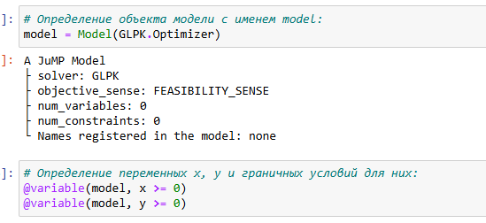{#fig:001 width=70%}

В качестве первого аргумента указан объект модели `model`, затем переменные $x$ и $y$,
связанные с этой моделью (причём указанные переменные не могут использоваться
в другой модели).

Ограничения модели задаются с помощью конструкции `@constraint` (имя объекта
модели, ограничение. Далее следует задать собственно целевую функцию с помощью конструкции
`@objective` (имя объекта модели, `Min` или `Max`, функция для оптимизации).
Для решения задачи оптимизации необходимо вызывать функцию оптимизации. Следует проверять причину прекращения работы оптимизатора, используя конструк-
цию termination_status(Объект модели). Процесс решения мог быть прекращён по ряду причин. Во-первых, решатель мог
найти оптимальное решение или доказать, что проблема невозможна. Однако он также
мог столкнуться с численными трудностями или прерваться из-за таких настроек, как
ограничение по времени. Если возвращено значение `OPTIMAL`, найдено оптимальное
решение (рис. [-@fig:002]):

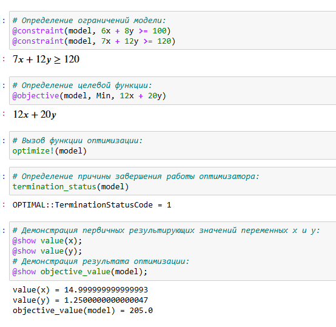{#fig:002 width=40%}

### Векторизованные ограничения и целевая функция оптимизации

Часто бывает полезно создавать коллекции переменных JuMP внутри более сложных
структур данных. Можно добавить ограничения и цель в JuMP, используя векторизован-
ную линейную алгебру.

Предположим, что требуется решить следующую задачу:

$$c^T \vec{x} \rightarrow \min$$

при заданных ограничениях:

$$A \vec{x} = \vec{b}, \quad \vec{x} \geq 0, \quad \vec{x} \in \mathbb{R}^n,$$

где:

$$A = \begin{pmatrix}
1 & 1 & 9 & 5 \\
3 & 5 & 0 & 8 \\
2 & 0 & 6 & 13
\end{pmatrix}, \quad \vec{b} = \begin{pmatrix} 7 \\ 3 \\ 5 \end{pmatrix}, \quad \vec{c} = \begin{pmatrix} 1 \\ 3 \\ 5 \\ 2 \end{pmatrix}.$$

Воспользуемся JuMP и решателем линейного и смешанного целочисленного програм-
мирования GLPK:

```Julia
# Подключение пакетов:
import Pkg
Pkg.add("JuMP")
Pkg.add("GLPK")
using JuMP
using GLPK
```

Определим объект модели и зададим исходные значения матрицы $A$ и векторов $\vec{b}$, $\vec{c}$.
Далее зададим массив переменных для компонент вектора $\vec{x}$ (рис. [-@fig:003]):

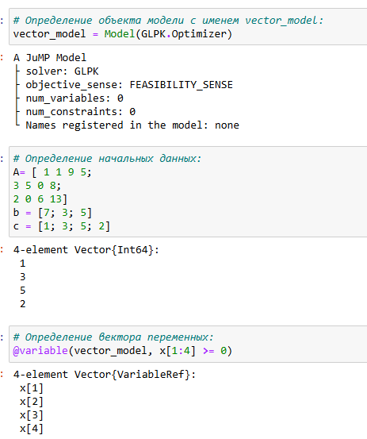{#fig:003 width=70%}

Затем зададим ограничения в соответствии с условиями модели, определим ограничений модели, целевую функцию, вызовем функцию оптимизации, проверим наличие оптимального решения и просмотрим результат решения оптимизационной задачи (рис. [-@fig:004]):

{#fig:004 width=70%}

### Оптимизация рациона питания

В некоторых задачах требуется использование массивов, в которых индексы не являются целыми диапазонами с отсчётом от единицы. Например, требуется использовать переменную, индексируемую по названию продукта или местоположению. Тогда необходимо в качестве индекса использовать произвольный вектор. В Julia это можно реализовать с помощью `DenseAxisArrays`.

Рассмотрим применение `DenseAxisArrays` на примере решения задачи оптимизации рациона питания в заведении быстрого питания при условии, что задано ограничение на количество потребляемых калорий (1800–2200), белков (\(\geq 91\)), жиров (0–65) и соли (0–1779), а также перечень определённых продуктов питания с указанием их стоимости:

- гамбургер (2.49 ден.ед.),

- курица (2.89 ден.ед.),

- сосиска в тесте (1.50 ден.ед.),

- жареный картофель (1.89 ден.ед.),

- макароны (2.09 ден.ед.),

- пицца (1.99 ден.ед.),

- салат (2.49 ден.ед.),

- молочный коктейль (0.89 ден.ед.),

- мороженое (1.59 ден.ед.).

Также известно содержание калорий, белков, жиров и соли в указанных продуктах (рис. [-@fig:005]):

{#fig:005 width=70%}

Воспользуемся JuMP и решателем линейного и смешанного целочисленного програм-
мирования GLPK :

```Julia
# Подключение пакетов:
import Pkg
Pkg.add("JuMP")
Pkg.add("GLPK")
using JuMP
using GLPK
```

Создадим контейнер JuMP для хранения информации об ограничениях (минимальное,
максимальное) на количество потребляемых калорий, белков, жиров и соли. Введём массив данных с наименованиями продуктов и стоимости продуктов: (рис. [-@fig:006]):

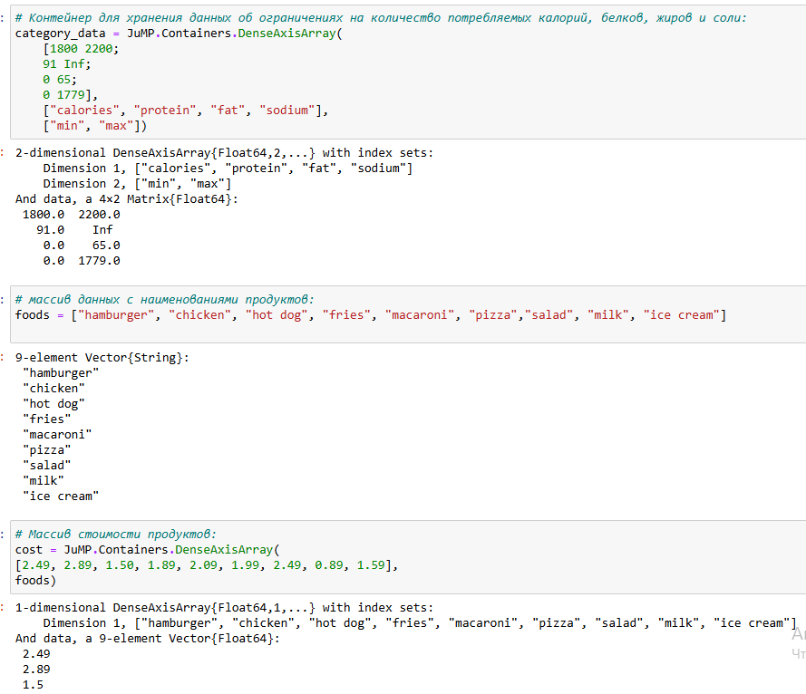{#fig:006 width=70%}

Введём сведения о содержании калорий, белков, жиров и соли в продуктах питания, определим объект модели, массив  (рис. [-@fig:007]):

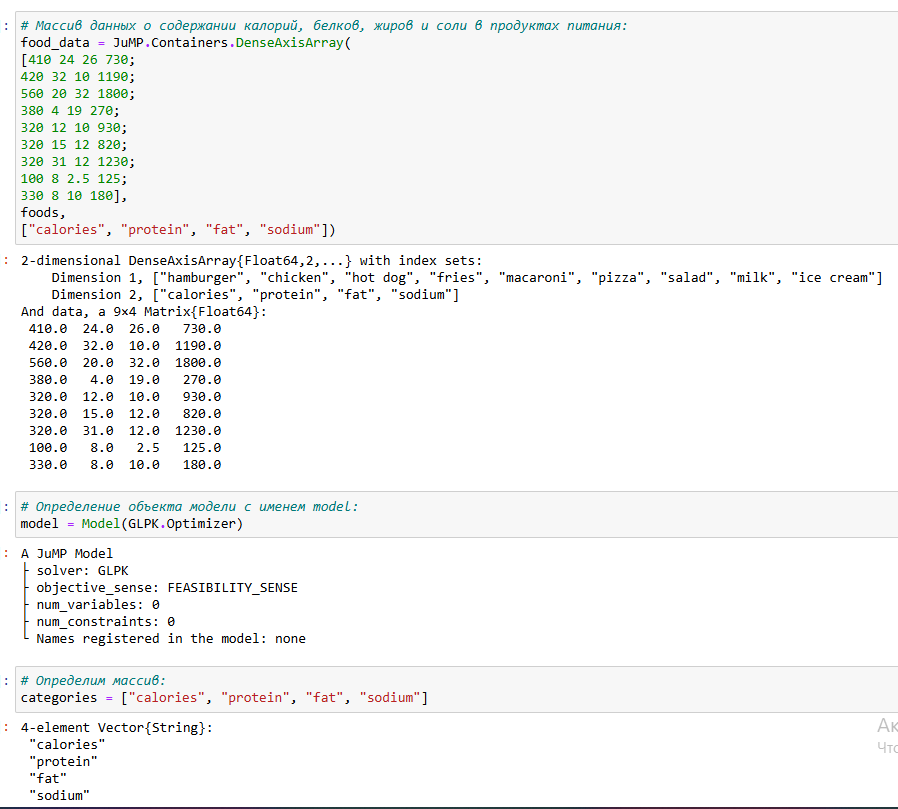{#fig:007 width=70%}

Далее зададим переменные, зададим целевую функцию минимизации цены, ограничения в соотвтетствии с условиями модели (рис. [-@fig:008]):

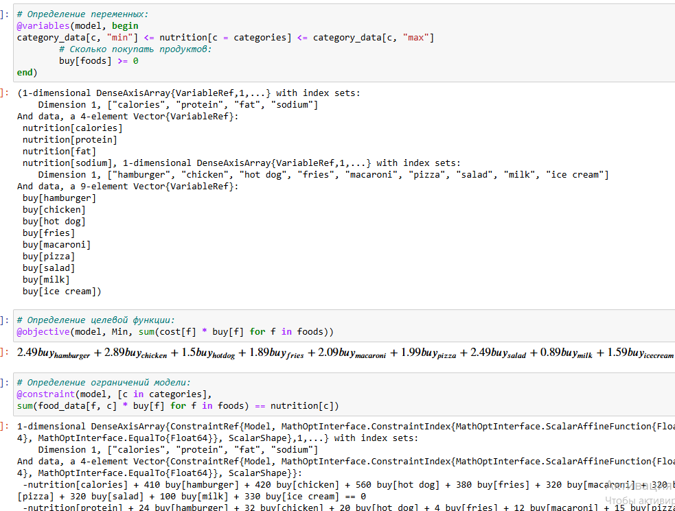{#fig:008 width=70%}

Для решения задачи оптимизации вызовем функцию оптимизации, для просмотра результата решения модно вывести значение переменной buy (рис. [-@fig:009]):

{#fig:009 width=70%}

В результате оптимальным по цене и пищевой ценности будет предложено купить
гамбургер, молочный коктейль и мороженное.

### Путешествие по миру

Рассмотрим решение задачи определения оптимального числа паспортов, требующихся, чтобы объехать весь мир. При этом будем учитывать сведения о паспортах
и ограничениях, указанных на ресурсе `https://www.passportindex.org/`. В табличной форме данные можно получить с ресурса `https://github.com/ilyankou/
passport-index-dataset`. Для решения задачи представляют интерес данные, указанные в файле `passport-index-matrix.csv`, в котором в первым столбце (Passport)
указана страна отбытия (= от), в остальных столбцах указаны страны назначения (= до),
на пересечении строк и столбцов указаны условия по наличию или отсутствию визы или
другие ограничения (рис. [-@fig:010]):

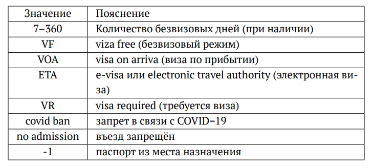{#fig:010 width=70%}

Итак, попробуем решить задачу средствами Julia:

```Julia
# Подключение пакетов:
import Pkg
Pkg.add("DelimitedFiles")
Pkg.add("CSV")
using DelimitedFiles
using CSV
```

Можем считать данные из имеющегося файла. Далее просматриваем файл, задаём переменную для подсчёта числа паспортов, задаём
переменную vf, в которую заносим сведения при отсутствии необходимости получать
визу (если в поле указано число, «VF» или «VOA») и определяем объект модели (рис. [-@fig:011]):

{#fig:011 width=70%}

Добавляем переменные, ограничения и целевую функцию. Для решения задачи оптимизации вызываем функцию оптимизации, просматриваем результат (рис. [-@fig:012]):

{#fig:012 width=70%}

### Портфельные инвестиции

Портфельные инвестиции — размещение капитала в ценные бумаги, формируемые
в виде портфеля ценных бумаг, с целью получения прибыли.

Инвестиционный портфель — процесс стратегического управления капиталом как
оптимизированной, единой системой инвестиционных ценностей.

Предположим требуется решить оптимизационную задачу в следующей формулировке.
Имеется капитал в 1000 ден. ед., который планируется инвестировать в три компании —
Microsoft, Facebook, Apple. При этом есть данные еженедельных значений цен на акции
этих компаний за определённый период времени. Необходимо определить доходность
акций каждой компании за рассматриваемый период времени, после чего инвестировать
в эти три компании так, чтобы получить возврат в размере не менее 2% от вложенной
суммы.

Для решения оптимизационной задачи будем использовать пакет `Convex.jl` и оптимизатор (решатель) SCS. Кроме того, понадобится пакет `Statistics.jl` для получения
матрицы рисков на основе расчёта ковариационных значений по доходности.

Сначала требуется подгрузить имеющиеся данные о еженедельных значениях цен
на акции рассматриваемых компаний, отобразить данные на графике. Предположим
данные размещены в файле `stock_prices.xlsx` в каталоге `data` в проекте.

Подключаем пакеты:

```Julia
# Подключение необходимых пакетов:
import Pkg
Pkg.add("DataFrames")
Pkg.add("XLSX")
Pkg.add("Plots")
Pkg.add("PyPlot")
Pkg.add("Convex")
Pkg.add("SCS")
Pkg.add("Statistics")
using DataFrames
using XLSX
using Plots
pyplot()
using Convex
using SCS
using Statistics
```

Подгружаем данные еженедельных значений цен на акции компаний за определённый
период времени во фрейм (рис. [-@fig:013]):

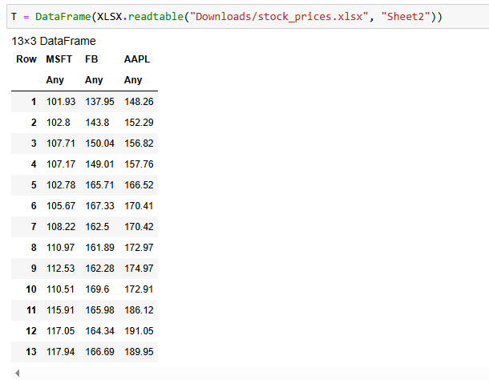{#fig:013 width=70%}

Отображаем данные на графике (рис. [-@fig:014]):

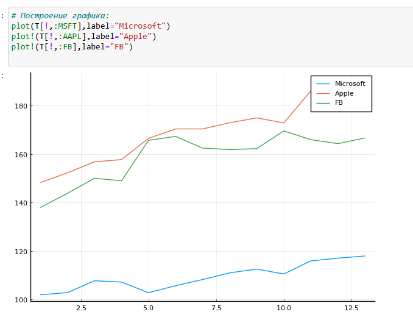{#fig:014 width=70%}

Для дальнейших расчётов данные по ценам на акции переформируем из фрейма
в матрицу. Следует опираться не следующие формулы:

1. Доходность акций:  

$$R(i, t) = \frac{pr(i, t) - pr(i, t - 1)}{pr(i, t - 1)}.$$

2. Целевая функция (минимизация риска):  

$$\vec{x}^T \cdot \text{cov}(R) \cdot \vec{x} \rightarrow \min.$$

3. Ограничения:  

$$\sum_{i=1}^{3} x_i = 1,$$  

$$\text{dot}(\vec{r}, \vec{x}) \geq 0.02,$$  

$$x_i \geq 0, \quad i = 1, 2, 3.$$


Далее необходимо сформировать матрицу рисков — ковариационную матрицу рассчи-
танных цен доходности (рис. [-@fig:015]):

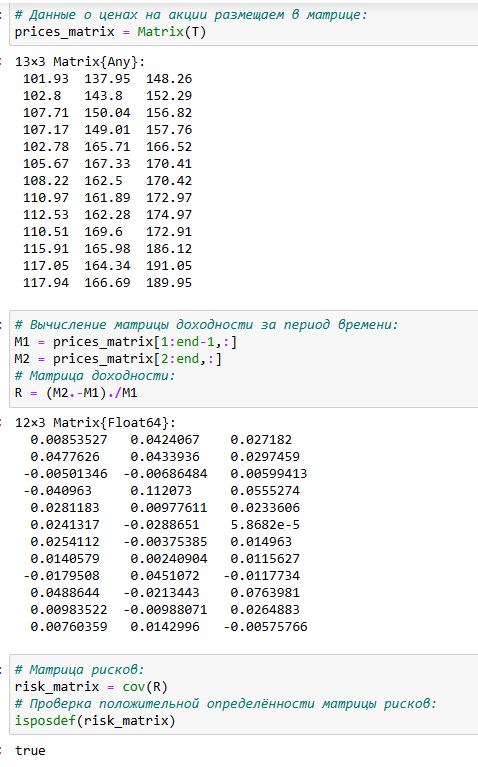{#fig:015 width=70%}

Доход от каждой из компаний получим из матрицы доходности как вектор средних
значений. Далее нужно собственно сформулировать оптимизационную задачу. Пусть вектор $\vec{x} = (x_1, x_2, x_3)$ — вектор инвестиций, вектор $\vec{r} = (r_1, r_2, r_3)$ — вектор доходов от компаний. Тогда задача оптимизации будет иметь вид:

$$
\vec{x}^T \text{cov}(R) \vec{x} \to \text{min}
$$

при условии:

$$
\sum_{i=1}^{3} x_i = 1, \quad \text{dot}(\vec{r}, \vec{x}) \geq 0,02, \quad x_i \geq 0, \, i = 1, 2, 3,
$$

где $\text{dot}(\vec{r}, \vec{x})$ — функция, определяющая возврат инвестиций.
Формируем вектор инвестиций и определяем объект модели в соответствии с формулировкой оптимизационной задачи (при этом делаем задачу совместимой с DCP в соответствии с требованием пакета `Convex.jl` (рис. [-@fig:016]):

{#fig:016 width=70%}

Решаем поставленную задачу (рис. [-@fig:017]):

{#fig:017 width=70%}

Выводим значения компонент вектора инвестиций и проверяем выполнение условия $\sum_{i=1}^{3} x_i = 1$. Также проверяем выполнение условия на уровень доходности от 2%, переводим процентные значения компонент вектора инвестиций в фактические денежные единицы. Далее сформируем новый фрейм, включающий исходные данные о недвижимости
и столбец с данными о назначенном каждому дому кластере (рис. [-@fig:018]):

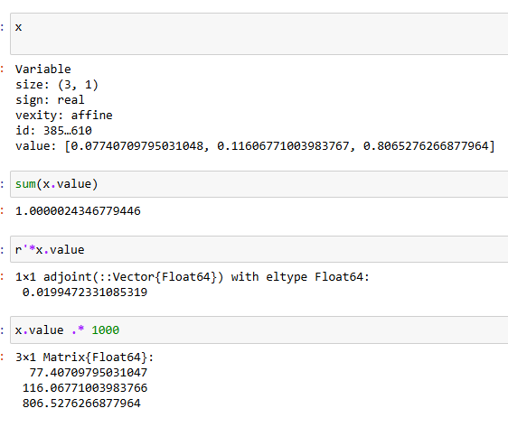{#fig:018 width=70%}

В результате, получаем: надо инвестировать 77.4 ден. ед. в Microsoft, 116.1 ден. ед.
в Facebook, 809.5 ден. ед. в Apple.

### Восстановление изображения

Предположим есть изображение, на котором были изменены некоторые пиксели. Требуется восстановить неизвестные пиксели путём решения задачи оптимизации.
Будем использовать пакет `Convex.jl` и оптимизатор (решатель) SCS, пакет
`ImageMagick.jl` для работы с изображениями:

```Julia
# Подключение необходимых пакетов:
import Pkg
Pkg.add("ImageMagick")
Pkg.add("Convex")
Pkg.add("SCS")
using Images
using Convex
using SCS
```

Загрузим изображение для последующей обработки, преобразуем изображение в оттенки серого и испортим некоторые пиксели(рис. [-@fig:019]):

{#fig:019 width=70%}

Формируем матрицу со значениями цветов, далее необходимо сформировать новую матрицу `X`, в которой минимизируется норма ядра матрицы (т.е. сумма сингулярных чисел элементов матрицы) так, что элементы,
которые уже известны в матрице `Y`, остаются теми же самыми в матрице `X`.Решаем поставленную задачу (рис. [-@fig:020]):

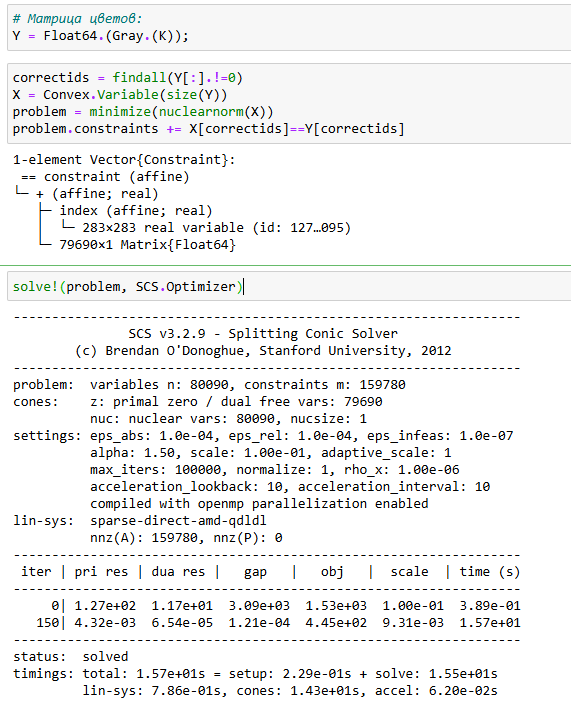{#fig:020 width=70%}

Выводим значение нормы и исправленное изображение (рис. [-@fig:021]):

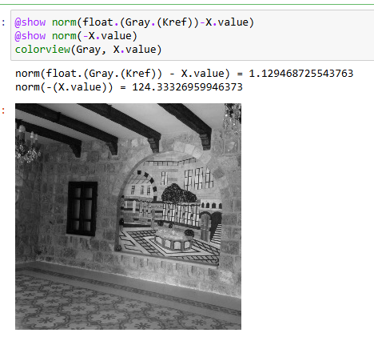{#fig:021 width=70%}


## Задания для самостоятельного выполнения


1. Решите задачу линейного программирования (рис. [-@fig:022]):

$x_1 + 2x_2 + 5x_3 \rightarrow \text{max}$,

при заданных ограничениях:

$-x_1 + x_2 + 3x_3 \leq -5, \quad x_1 + 3x_2 - 7x_3 \leq 10, \quad 0 \leq x_1 \leq 10, \quad x_2 \geq 0, \quad x_3 \geq 0.$


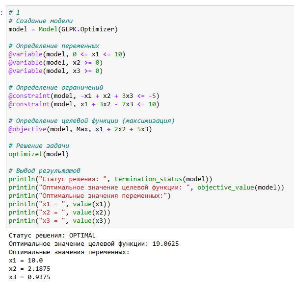{#fig:022 width=70%}

2. Решите предыдущее задание, используя массивы вместо скалярных переменных (рис. [-@fig:023]).

Рекомендация. Запишите систему ограничений в виде $A\vec{x} = \vec{b}$, а целевую функцию как $c^T\vec{x}$.

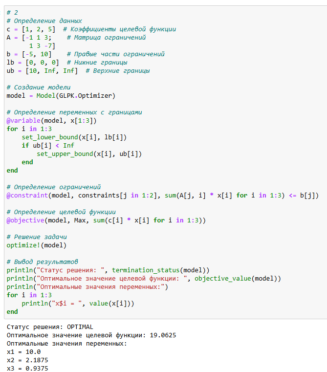{#fig:023 width=70%}

3. Решите задачу оптимизации (рис. [-@fig:024]):

$|A\vec{x} - \vec{b}|_2^2 \rightarrow \text{min}$

при заданных ограничениях:

$\vec{x} \geq 0,$

где $\vec{x} \in \mathbb{R}^n, , A \in \mathbb{R}^{m \times n}, , \vec{b} \in \mathbb{R}^m$.

Матрицу $A$ и вектор $\vec{b}$ задайте случайным образом.
Для решения задачи используйте пакет `Convex` и решатель `SCS`.

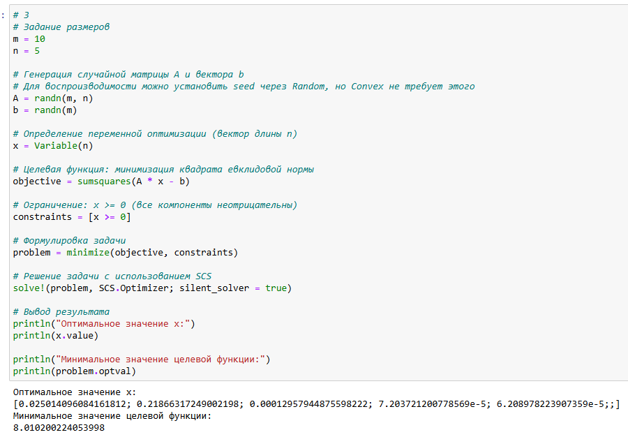{#fig:024 width=70%}

4. Проводится конференция с 5 разными секциями. Забронировано 5 залов различной вместимости: в каждом зале не должно быть меньше 180 и больше 250 человек, а на третьей секции активность подразумевает, что должно быть точно 220 человек.
В заявке участник указывает приоритет посещения секции: 1 — максимальный приоритет, 3 — минимальный, а значение 10000 означает, что человек не пойдёт на эту секцию.
Организаторам удалось собрать 1000 заявок с указанием приоритета посещения трёх секций. Необходимо дать рекомендацию слушателю, на какую же секцию ему пойти, чтобы хватило места всем.
Для решения задачи используйте пакет `Convex` и решатель `GLPK`.
Приоритеты по слушателям распределите случайным образом (рис. [-@fig:025]).

Решение:

```Julia
# 4
# Настройка генератора случайных чисел
Random.seed!(123)

# Параметры задачи
num_sections = 5
num_participants = 1000
hall_capacities = [180, 190, 220, 200, 210]  # Вместимость залов
hall_max = fill(250, num_sections)           # Максимальная вместимость

# Генерация случайных приоритетов
# 1 - максимальный приоритет, 3 - минимальный, 10000 - не пойдет
priorities = Array{Int}(undef, num_participants, num_sections)
for i in 1:num_participants
    for j in 1:num_sections
        if rand() < 0.8  # 80% вероятности, что пойдет на секцию
            priorities[i, j] = rand(1:3)
        else
            priorities[i, j] = 10000
        end
    end
end

# Создание модели
model = Model(GLPK.Optimizer)

# Переменные решения: x[i,j] = 1, если участник i идет на секцию j
model, x[1:num_participants, 1:num_sections, Bin]

# Целевая функция: минимизация суммы приоритетов
model, Min, sum(priorities[i, j * x[i, j] 
    for i in 1:num_participants for j in 1:num_sections])

# Ограничения:
# 1. Каждый участник идет ровно на одну секцию
for i in 1:num_participants
    model, sum(x[i, j for j in 1:num_sections] == 1)
end

# 2. Ограничения по вместимости залов
for j in 1:num_sections
    model, sum(x[i, j for i in 1:num_participants] >= hall_capacities[j])
    model, sum(x[i, j for i in 1:num_participants] <= hall_max[j])
end

# 3. Особое требование для третьей секции
model, sum(x[i, 3 for i in 1:num_participants] == 220)

# Решение задачи
optimize!(model)

# Анализ результатов
println("Статус решения: ", termination_status(model))
println("Оптимальное значение целевой функции: ", objective_value(model))

# Распределение по секциям
distribution = zeros(Int, num_sections)
for j in 1:num_sections
    distribution[j] = sum(round.(Int, value.(x[:, j])))
end

println("\nРаспределение участников по секциям:")
for j in 1:num_sections
    println("Секция $j: $(distribution[j]) человек")
end

println("\nПример рекомендаций для первых 5 участников:")
for i in 1:5
    assigned_section = findfirst(j -> value(x[i, j]) > 0.5, 1:num_sections)
    println("Участник $i: Секция $assigned_section (приоритет: $(priorities[i, assigned_section]))")
end
```
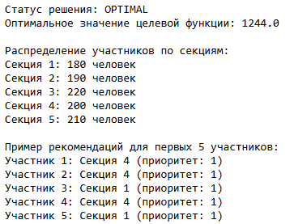{#fig:025 width=70%}


5. Кофейня готовит два вида кофе «Раф кофе» за 400 рублей и «Капучино» за 300. Чтобы сварить 1 чашку «Раф кофе» необходимо: 40 гр. зёрен, 140 гр. молока и 5 гр. ванильного сахара. Для того чтобы получить одну чашку «Капучино» необходимо потратить: 30 гр. зёрен, 120 гр. молока. На складе есть: 500 гр. зёрен, 2000 гр. молока и 40 гр. ванильного сахара.

Необходимо найти план варки кофе, обеспечивающий максимальную выручку от их реализации. При этом необходимо потратить весь ванильный сахар.
Для решения задачи используйте пакет `JuMP` и решатель `GLPK` (рис. [-@fig:026]):

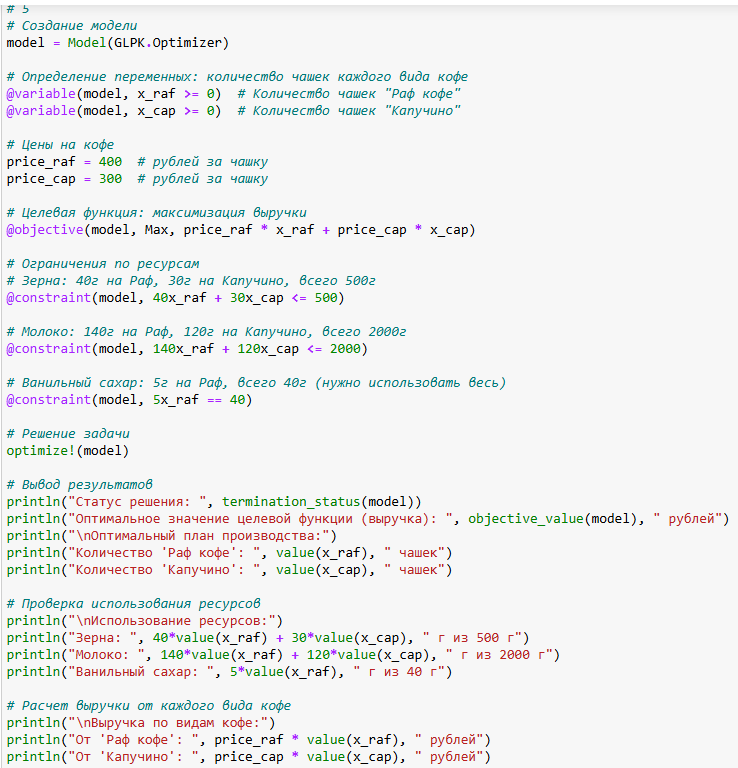{#fig:026 width=70%}

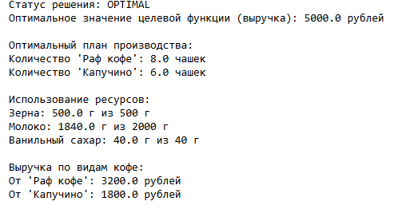{#fig:027 width=70%}

# Выводы

В результате выполнения данной лабораторной работы я освоила спакеты Julia для решения задач оптимизации.
